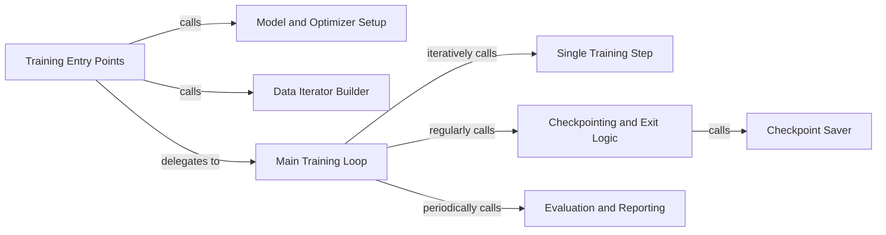

## Details

The Training Orchestration subsystem in Megatron-LM is responsible for managing the entire lifecycle of a training or fine-tuning run, from initial setup to iterative execution, evaluation, and checkpointing. It acts as the central coordinator, ensuring data flows correctly, models are updated, and progress is monitored and saved.

### Training Entry Points
These components (`megatron.training.training.pretrain`, `tasks.finetune_utils.finetune`) serve as the high-level initiators for either pre-training or fine-tuning. They handle initial environment setup, configuration loading, and delegate control to the main training loop.

**Related Classes/Methods**:

- <a href="https://github.com/NVIDIA/Megatron-LM/blob/main/megatron/training/training.py#L779-L1051" target="_blank" rel="noopener noreferrer">`megatron.training.training.pretrain`:779-1051</a>
- <a href="https://github.com/NVIDIA/Megatron-LM/blob/main/tasks/finetune_utils.py#L239-L305" target="_blank" rel="noopener noreferrer">`tasks.finetune_utils.finetune`:239-305</a>

### Model and Optimizer Setup
Responsible for the instantiation and initial configuration of the neural network model and its associated optimizer. This includes setting up various parallelism strategies (e.g., Tensor Parallelism, Pipeline Parallelism) and mixed-precision training.

**Related Classes/Methods**:

- <a href="https://github.com/NVIDIA/Megatron-LM/blob/main/megatron/training/training.py#L1296-L1440" target="_blank" rel="noopener noreferrer">`megatron.training.training.setup_model_and_optimizer`:1296-1440</a>

### Data Iterator Builder
Manages the preparation and provision of data iterators for training, validation, and testing datasets. It ensures efficient and distributed data loading to feed the models during training and evaluation.

**Related Classes/Methods**:

- <a href="https://github.com/NVIDIA/Megatron-LM/blob/main/megatron/training/training.py#L2928-L2996" target="_blank" rel="noopener noreferrer">`megatron.training.training.build_train_valid_test_data_iterators`:2928-2996</a>

### Main Training Loop
The core iterative component that drives the entire training process. It manages the overall training iterations, coordinates the execution of individual training steps, and periodically triggers evaluation and checkpointing routines.

**Related Classes/Methods**:

- <a href="https://github.com/NVIDIA/Megatron-LM/blob/main/megatron/training/training.py#L2148-L2576" target="_blank" rel="noopener noreferrer">`megatron.training.training.train`:2148-2576</a>

### Single Training Step
Encapsulates a single atomic unit of computation within the training loop. This includes the forward pass, backward pass (gradient computation), and potentially the optimizer step, abstracting the details of parallelism.

**Related Classes/Methods**:

- <a href="https://github.com/NVIDIA/Megatron-LM/blob/main/megatron/training/training.py#L1454-L1604" target="_blank" rel="noopener noreferrer">`megatron.training.training.train_step`:1454-1604</a>

### Checkpointing and Exit Logic
A control component that determines the frequency of model state saving (checkpointing) and manages the conditions for terminating the training process based on predefined criteria.

**Related Classes/Methods**:

- <a href="https://github.com/NVIDIA/Megatron-LM/blob/main/megatron/training/training.py#L2042-L2145" target="_blank" rel="noopener noreferrer">`megatron.training.training.checkpoint_and_decide_exit`:2042-2145</a>

### Checkpoint Saver
Handles the actual persistence of the model's state, optimizer state, and other relevant training metadata to disk, often involving distributed file operations and synchronization.

**Related Classes/Methods**:

- <a href="https://github.com/NVIDIA/Megatron-LM/blob/main/megatron/training/training.py#L1923-L1982" target="_blank" rel="noopener noreferrer">`megatron.training.training.save_checkpoint_and_time`:1923-1982</a>

### Evaluation and Reporting
Executes periodic model evaluations on validation or test datasets and reports performance metrics. This provides crucial feedback on training progress and model quality.

**Related Classes/Methods**:

- <a href="https://github.com/NVIDIA/Megatron-LM/blob/main/megatron/training/training.py#L2736-L2820" target="_blank" rel="noopener noreferrer">`megatron.training.training.evaluate_and_print_results`:2736-2820</a>

### [FAQ](https://github.com/CodeBoarding/GeneratedOnBoardings/tree/main?tab=readme-ov-file#faq)