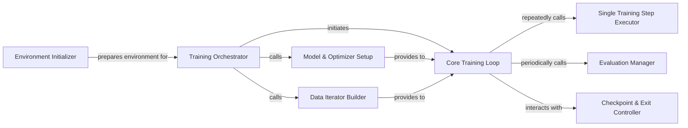

## Details

The Training Orchestration & System Control subsystem is the central nervous system for distributed training within Megatron-LM. It manages the entire lifecycle of a training run, from initial environment setup and configuration to the iterative execution of the training loop, data handling, model/optimizer initialization, and robust checkpointing and evaluation. Its core responsibility is to coordinate all high-level training activities to ensure efficient and scalable execution on distributed hardware.

### Environment Initializer
Sets up the distributed training environment, including Model Parallel Unit (MPU) configuration, random seed initialization, auto-resume functionality, and logging. It also parses command-line arguments and establishes global variables for the framework.

**Related Classes/Methods**:

- <a href="https://github.com/NVIDIA/Megatron-LM/blob/main/megatron/training/initialize.py" target="_blank" rel="noopener noreferrer">`megatron.training.initialize`</a>

### Training Orchestrator
The high-level orchestrator that manages the entire pre-training process. It coordinates the setup of models, optimizers, data iterators, and initiates the main training loop, overseeing the end-to-end execution flow.

**Related Classes/Methods**:

- <a href="https://github.com/NVIDIA/Megatron-LM/blob/main/megatron/training/training.py" target="_blank" rel="noopener noreferrer">`megatron.training.training`</a>

### Model & Optimizer Setup
Responsible for initializing the neural network model and its corresponding optimizer, often involving distributed setup specific to Megatron-LM's parallelism strategies.

**Related Classes/Methods**:

- <a href="https://github.com/NVIDIA/Megatron-LM/blob/main/megatron/training/training.py" target="_blank" rel="noopener noreferrer">`megatron.training.training:setup_model_and_optimizer`</a>

### Data Iterator Builder
Prepares and configures the data iterators for training, validation, and testing datasets, ensuring data is correctly sharded and accessible within the distributed environment.

**Related Classes/Methods**:

- <a href="https://github.com/NVIDIA/Megatron-LM/blob/main/megatron/training/training.py" target="_blank" rel="noopener noreferrer">`megatron.training.training:build_train_valid_test_data_iterators`</a>

### Core Training Loop
Manages the iterative training process, including the execution of individual training steps, handling logging, and making decisions regarding checkpointing and evaluation frequency. This is the heart of the training execution.

**Related Classes/Methods**:

- <a href="https://github.com/NVIDIA/Megatron-LM/blob/main/megatron/training/training.py" target="_blank" rel="noopener noreferrer">`megatron.training.training`</a>

### Single Training Step Executor
Executes a single forward and backward pass for a batch of data, including gradient computation and potentially leveraging performance optimizations like CUDA graph capture. It represents the atomic unit of training.

**Related Classes/Methods**:

- <a href="https://github.com/NVIDIA/Megatron-LM/blob/main/megatron/training/training.py" target="_blank" rel="noopener noreferrer">`megatron.training.training`</a>

### Evaluation Manager
Triggers the evaluation process on validation datasets at specified intervals and formats/prints the performance results to monitor training progress.

**Related Classes/Methods**:

- <a href="https://github.com/NVIDIA/Megatron-LM/blob/main/megatron/training/training.py" target="_blank" rel="noopener noreferrer">`megatron.training.training`</a>

### Checkpoint & Exit Controller
Manages the logic for saving model checkpoints (frequency, conditions) and determines if the training process should terminate based on configured criteria (e.g., max iterations, convergence). It delegates the actual saving operation.

**Related Classes/Methods**:

- <a href="https://github.com/NVIDIA/Megatron-LM/blob/main/megatron/training/training.py" target="_blank" rel="noopener noreferrer">`megatron.training.training`</a>

### [FAQ](https://github.com/CodeBoarding/GeneratedOnBoardings/tree/main?tab=readme-ov-file#faq)