```mermaid
graph LR
    Distributed_System_Orchestration["Distributed System Orchestration"]
    Data_Management_Input_Pipeline["Data Management & Input Pipeline"]
    Core_Model_Architecture["Core Model Architecture"]
    Optimization_Performance_Engine["Optimization & Performance Engine"]
    Checkpointing_Persistence["Checkpointing & Persistence"]
    Training_Orchestration["Training Orchestration"]
    Inference_Deployment["Inference & Deployment"]
    Evaluation_Metrics["Evaluation & Metrics"]
    Distributed_System_Orchestration -- "Configures" --> Data_Management_Input_Pipeline
    Distributed_System_Orchestration -- "Initializes" --> Optimization_Performance_Engine
    Data_Management_Input_Pipeline -- "Provides Data To" --> Core_Model_Architecture
    Data_Management_Input_Pipeline -- "Supplies Data Iterators To" --> Training_Orchestration
    Data_Management_Input_Pipeline -- "Provides Preprocessing For" --> Inference_Deployment
    Data_Management_Input_Pipeline -- "Offers Data To" --> Evaluation_Metrics
    Core_Model_Architecture -- "Generates Gradients For" --> Optimization_Performance_Engine
    Core_Model_Architecture -- "Provides Model State For" --> Checkpointing_Persistence
    Core_Model_Architecture -- "Provides Trained Model For" --> Inference_Deployment
    Optimization_Performance_Engine -- "Processes Gradients From" --> Core_Model_Architecture
    Optimization_Performance_Engine -- "Applies Optimizations To" --> Core_Model_Architecture
    Optimization_Performance_Engine -- "Provides Optimizer State For" --> Checkpointing_Persistence
    Optimization_Performance_Engine -- "Provides Optimized Components For" --> Inference_Deployment
    Checkpointing_Persistence -- "Loads Weights Into" --> Core_Model_Architecture
    Checkpointing_Persistence -- "Loads States Into" --> Optimization_Performance_Engine
    Checkpointing_Persistence -- "Provides Checkpoints For" --> Inference_Deployment
    Training_Orchestration -- "Relies On" --> Distributed_System_Orchestration
    Training_Orchestration -- "Drives Passes Through" --> Core_Model_Architecture
    Training_Orchestration -- "Triggers Updates In" --> Optimization_Performance_Engine
    Training_Orchestration -- "Manages Checkpoints With" --> Checkpointing_Persistence
    Training_Orchestration -- "Manages Evaluation With" --> Evaluation_Metrics
    Inference_Deployment -- "Uses Model From" --> Core_Model_Architecture
    Inference_Deployment -- "Utilizes Preprocessing From" --> Data_Management_Input_Pipeline
    Inference_Deployment -- "Leverages Optimizations From" --> Optimization_Performance_Engine
    Inference_Deployment -- "Loads Weights From" --> Checkpointing_Persistence
    Inference_Deployment -- "Generates Outputs For" --> Evaluation_Metrics
    Evaluation_Metrics -- "Consumes Data From" --> Data_Management_Input_Pipeline
    Evaluation_Metrics -- "Evaluates Models From" --> Core_Model_Architecture
    Evaluation_Metrics -- "Receives Outputs From" --> Training_Orchestration
    Evaluation_Metrics -- "Receives Outputs From" --> Inference_Deployment
    click Distributed_System_Orchestration href "https://github.com/CodeBoarding/GeneratedOnBoardings/blob/main/Megatron-LM/Distributed_System_Orchestration.md" "Details"
    click Data_Management_Input_Pipeline href "https://github.com/CodeBoarding/GeneratedOnBoardings/blob/main/Megatron-LM/Data_Management_Input_Pipeline.md" "Details"
    click Core_Model_Architecture href "https://github.com/CodeBoarding/GeneratedOnBoardings/blob/main/Megatron-LM/Core_Model_Architecture.md" "Details"
    click Optimization_Performance_Engine href "https://github.com/CodeBoarding/GeneratedOnBoardings/blob/main/Megatron-LM/Optimization_Performance_Engine.md" "Details"
    click Checkpointing_Persistence href "https://github.com/CodeBoarding/GeneratedOnBoardings/blob/main/Megatron-LM/Checkpointing_Persistence.md" "Details"
    click Training_Orchestration href "https://github.com/CodeBoarding/GeneratedOnBoardings/blob/main/Megatron-LM/Training_Orchestration.md" "Details"
    click Inference_Deployment href "https://github.com/CodeBoarding/GeneratedOnBoardings/blob/main/Megatron-LM/Inference_Deployment.md" "Details"
    click Evaluation_Metrics href "https://github.com/CodeBoarding/GeneratedOnBoardings/blob/main/Megatron-LM/Evaluation_Metrics.md" "Details"
```

## Details

One paragraph explaining the functionality which is represented by this graph. What the main flow is and what is its purpose.

### Distributed System Orchestration [[Expand]](./Distributed_System_Orchestration.md)
Manages the foundational setup for distributed training, including argument parsing, global variable initialization, and the orchestration of various parallelism strategies (Tensor, Pipeline, Data, Context, Expert Parallelism) across distributed ranks. This component is critical for scaling models across multiple GPUs.

**Related Classes/Methods**:

- <a href="https://github.com/NVIDIA/Megatron-LM/blob/main/megatron/training/initialize.py" target="_blank" rel="noopener noreferrer">`megatron/training/initialize.py`</a>
- <a href="https://github.com/NVIDIA/Megatron-LM/blob/main/megatron/training/arguments.py" target="_blank" rel="noopener noreferrer">`megatron/training/arguments.py`</a>
- <a href="https://github.com/NVIDIA/Megatron-LM/blob/main/megatron/core/parallel_state.py" target="_blank" rel="noopener noreferrer">`megatron/core/parallel_state.py`</a>
- <a href="https://github.com/NVIDIA/Megatron-LM/blob/main/megatron/core/tensor_parallel/" target="_blank" rel="noopener noreferrer">`megatron/core/tensor_parallel/`</a>
- <a href="https://github.com/NVIDIA/Megatron-LM/blob/main/megatron/core/pipeline_parallel/" target="_blank" rel="noopener noreferrer">`megatron/core/pipeline_parallel/`</a>
- <a href="https://github.com/NVIDIA/Megatron-LM/blob/main/megatron/core/distributed/" target="_blank" rel="noopener noreferrer">`megatron/core/distributed/`</a>

### Data Management & Input Pipeline [[Expand]](./Data_Management_Input_Pipeline.md)
Handles the entire data pipeline, from raw data ingestion, tokenization, and dataset creation to specialized processing for multimodal inputs (images, audio) and retrieval-augmented generation (Retro). It ensures efficient data delivery to the models.

**Related Classes/Methods**:

- <a href="https://github.com/NVIDIA/Megatron-LM/blob/main/megatron/training/tokenizer/tokenizer.py" target="_blank" rel="noopener noreferrer">`megatron/training/tokenizer/tokenizer.py`</a>
- <a href="https://github.com/NVIDIA/Megatron-LM/blob/main/megatron/core/datasets/" target="_blank" rel="noopener noreferrer">`megatron/core/datasets/`</a>
- <a href="https://github.com/NVIDIA/Megatron-LM/blob/main/megatron/core/datasets/retro/" target="_blank" rel="noopener noreferrer">`megatron/core/datasets/retro/`</a>
- <a href="https://github.com/NVIDIA/Megatron-LM/blob/main/tools/retro/" target="_blank" rel="noopener noreferrer">`tools/retro/`</a>

### Core Model Architecture [[Expand]](./Core_Model_Architecture.md)
Provides the fundamental building blocks and high-level definitions for large language models. This includes core transformer layers (self-attention, MLPs, normalization), MoE layers, and specific model implementations like GPT, T5, BERT, and their multimodal extensions. It's the blueprint for constructing various LLMs.

**Related Classes/Methods**:

- <a href="https://github.com/NVIDIA/Megatron-LM/blob/main/megatron/core/transformer/" target="_blank" rel="noopener noreferrer">`megatron/core/transformer/`</a>
- <a href="https://github.com/NVIDIA/Megatron-LM/blob/main/megatron/core/models/" target="_blank" rel="noopener noreferrer">`megatron/core/models/`</a>

### Optimization & Performance Engine [[Expand]](./Optimization_Performance_Engine.md)
Manages the optimization process, including parameter updates, gradient accumulation, efficient gradient synchronization, and low-level performance optimizations. This includes highly optimized fused CUDA kernels, CUDA graph implementations, and FP8 utilities to maximize training and inference throughput on NVIDIA GPUs.

**Related Classes/Methods**:

- <a href="https://github.com/NVIDIA/Megatron-LM/blob/main/megatron/core/optimizer/" target="_blank" rel="noopener noreferrer">`megatron/core/optimizer/`</a>
- <a href="https://github.com/NVIDIA/Megatron-LM/blob/main/megatron/core/fusions/" target="_blank" rel="noopener noreferrer">`megatron/core/fusions/`</a>
- <a href="https://github.com/NVIDIA/Megatron-LM/blob/main/megatron/core/fp8_utils.py" target="_blank" rel="noopener noreferrer">`megatron/core/fp8_utils.py`</a>
- <a href="https://github.com/NVIDIA/Megatron-LM/blob/main/megatron/core/transformer/cuda_graphs.py" target="_blank" rel="noopener noreferrer">`megatron/core/transformer/cuda_graphs.py`</a>

### Checkpointing & Persistence [[Expand]](./Checkpointing_Persistence.md)
Provides robust mechanisms for saving and loading model and optimizer states. It supports distributed and sharded checkpoints, crucial for fault tolerance, resuming training, and transfer learning with very large models.

**Related Classes/Methods**:

- <a href="https://github.com/NVIDIA/Megatron-LM/blob/main/megatron/training/checkpointing.py" target="_blank" rel="noopener noreferrer">`megatron/training/checkpointing.py`</a>
- <a href="https://github.com/NVIDIA/Megatron-LM/blob/main/megatron/core/dist_checkpointing/" target="_blank" rel="noopener noreferrer">`megatron/core/dist_checkpointing/`</a>

### Training Orchestration [[Expand]](./Training_Orchestration.md)
Controls the overall training loop within the Megatron-LM framework. This includes managing iterations, data flow, forward/backward passes, optimization steps, and periodic evaluation and logging. It orchestrates the interaction between core components during training.

**Related Classes/Methods**:

- <a href="https://github.com/NVIDIA/Megatron-LM/blob/main/megatron/training/training.py" target="_blank" rel="noopener noreferrer">`megatron/training/training.py`</a>
- <a href="https://github.com/NVIDIA/Megatron-LM/blob/main/tasks/finetune_utils.py" target="_blank" rel="noopener noreferrer">`tasks/finetune_utils.py`</a>
- <a href="https://github.com/NVIDIA/Megatron-LM/blob/main/pretrain_retro.py" target="_blank" rel="noopener noreferrer">`pretrain_retro.py`</a>

### Inference & Deployment [[Expand]](./Inference_Deployment.md)
Provides the necessary infrastructure for running inference on trained models, including efficient text generation, request scheduling, and dynamic batching. It also encompasses post-training optimizations like quantization, distillation, and conversion to specialized inference formats (e.g., TensorRT-LLM) for deployment.

**Related Classes/Methods**:

- <a href="https://github.com/NVIDIA/Megatron-LM/blob/main/megatron/core/inference/" target="_blank" rel="noopener noreferrer">`megatron/core/inference/`</a>
- <a href="https://github.com/NVIDIA/Megatron-LM/blob/main/megatron/inference/text_generation/api.py" target="_blank" rel="noopener noreferrer">`megatron/inference/text_generation/api.py`</a>
- <a href="https://github.com/NVIDIA/Megatron-LM/blob/main/examples/post_training/modelopt/quantize.py" target="_blank" rel="noopener noreferrer">`examples/post_training/modelopt/quantize.py`</a>
- <a href="https://github.com/NVIDIA/Megatron-LM/blob/main/megatron/core/export/trtllm/trtllm_helper.py" target="_blank" rel="noopener noreferrer">`megatron/core/export/trtllm/trtllm_helper.py`</a>

### Evaluation & Metrics [[Expand]](./Evaluation_Metrics.md)
Offers utilities and scripts for evaluating model performance on various benchmarks and computing relevant metrics to assess model quality. This component is used to validate the effectiveness of trained models.

**Related Classes/Methods**:

- <a href="https://github.com/NVIDIA/Megatron-LM/blob/main/tasks/eval_utils.py" target="_blank" rel="noopener noreferrer">`tasks/eval_utils.py`</a>
- <a href="https://github.com/NVIDIA/Megatron-LM/blob/main/examples/multimodal/evaluation/evaluate_vqav2.py" target="_blank" rel="noopener noreferrer">`examples/multimodal/evaluation/evaluate_vqav2.py`</a>

### [FAQ](https://github.com/CodeBoarding/GeneratedOnBoardings/tree/main?tab=readme-ov-file#faq)