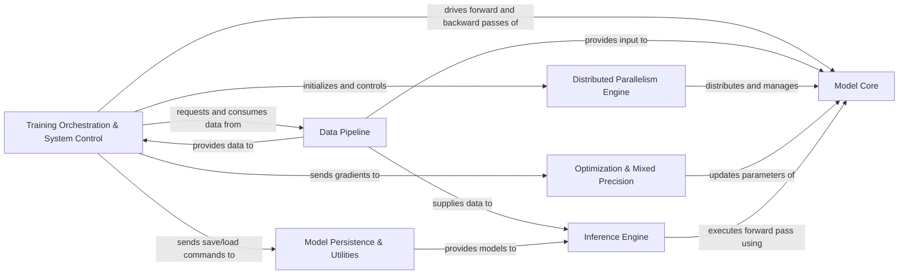

## Details

The Megatron-LM architecture is structured around a set of highly specialized components designed for large-scale language model training and inference. The **Training Orchestration & System Control** component acts as the central coordinator, initializing the distributed environment and managing the entire training lifecycle. It interacts with the **Data Pipeline** to fetch and process data, which in turn provides input to the **Model Core** for forward and backward passes. The **Distributed Parallelism Engine** is fundamental, enabling efficient scaling by distributing and managing the **Model Core** across multiple devices using various parallelism techniques. During training, gradients from the **Model Core** are sent to the **Optimization & Mixed Precision** component, which handles parameter updates and performance enhancements like FP8 training and quantization. For deployment, the **Inference Engine** leverages the **Model Core** to execute forward passes, often receiving pre-processed data from the **Data Pipeline**. Finally, the **Model Persistence & Utilities** component ensures model checkpoints can be saved, loaded, and converted for various deployment scenarios, providing trained models to the **Inference Engine**. This modular design facilitates clear data flow and allows for independent development and optimization of each critical aspect of the large language model lifecycle.

### Training Orchestration & System Control [[Expand]](./Training_Orchestration_System_Control.md)
Manages the initial setup of the distributed environment, parses command-line arguments, configures global variables, and orchestrates the end-to-end training loop, including iteration over data, executing forward and backward passes, and handling evaluation.

**Related Classes/Methods**:

- <a href="https://github.com/NVIDIA/Megatron-LM/blob/main/megatron/training/initialize.py" target="_blank" rel="noopener noreferrer">`megatron.training.initialize`</a>
- <a href="https://github.com/NVIDIA/Megatron-LM/blob/main/megatron/training/training.py" target="_blank" rel="noopener noreferrer">`megatron.training.training`</a>

### Data Pipeline
Handles the loading, processing, tokenization, and preparation of diverse datasets (text, image, multimodal) for training and inference. This component includes specialized handling for various data formats and preprocessing steps, including querying for Retro-specific datasets.

**Related Classes/Methods**:

- <a href="https://github.com/NVIDIA/Megatron-LM/blob/main/megatron/core/datasets/blended_megatron_dataset_builder.py" target="_blank" rel="noopener noreferrer">`megatron.core.datasets.blended_megatron_dataset_builder`</a>
- <a href="https://github.com/NVIDIA/Megatron-LM/blob/main/tools/preprocess_data.py" target="_blank" rel="noopener noreferrer">`tools.preprocess_data`</a>
- <a href="https://github.com/NVIDIA/Megatron-LM/blob/main/megatron/core/datasets/retro/db/build.py" target="_blank" rel="noopener noreferrer">`megatron.core.datasets.retro.db.build`</a>
- <a href="https://github.com/NVIDIA/Megatron-LM/blob/main/examples/multimodal/dataloader_provider.py" target="_blank" rel="noopener noreferrer">`examples.multimodal.dataloader_provider`</a>
- <a href="https://github.com/NVIDIA/Megatron-LM/blob/main/megatron/core/datasets/retro/query/query.py" target="_blank" rel="noopener noreferrer">`megatron.core.datasets.retro.query.query`</a>

### Model Core [[Expand]](./Model_Core.md)
Contains the fundamental, reusable building blocks of large language models, including transformer layers, attention mechanisms, MLPs, and Mixture-of-Experts (MoE) layers. This forms the "Megatron Core" foundation, designed for extensibility to support models like Retro and Multimodal architectures.

**Related Classes/Methods**:

- <a href="https://github.com/NVIDIA/Megatron-LM/blob/main/megatron/core/transformer/transformer_block.py" target="_blank" rel="noopener noreferrer">`megatron.core.transformer.transformer_block`</a>
- <a href="https://github.com/NVIDIA/Megatron-LM/blob/main/megatron/core/models/gpt/gpt_model.py" target="_blank" rel="noopener noreferrer">`megatron.core.models.gpt.gpt_model`</a>
- <a href="https://github.com/NVIDIA/Megatron-LM/blob/main/megatron/core/models/multimodal/llava_model.py" target="_blank" rel="noopener noreferrer">`megatron.core.models.multimodal.llava_model`</a>

### Distributed Parallelism Engine [[Expand]](./Distributed_Parallelism_Engine.md)
Implements and orchestrates various distributed training parallelism techniques: Tensor Parallelism (TP), Pipeline Parallelism (PP), Data Parallelism (DP), Context Parallelism (CP), and Expert Parallelism (EP). This is a central and defining feature of Megatron-LM, enabling large-scale model training.

**Related Classes/Methods**:

- <a href="https://github.com/NVIDIA/Megatron-LM/blob/main/megatron/core/parallel_state.py" target="_blank" rel="noopener noreferrer">`megatron.core.parallel_state`</a>
- <a href="https://github.com/NVIDIA/Megatron-LM/blob/main/megatron/core/pipeline_parallel/schedules.py" target="_blank" rel="noopener noreferrer">`megatron.core.pipeline_parallel.schedules`</a>
- <a href="https://github.com/NVIDIA/Megatron-LM/blob/main/megatron/core/tensor_parallel/mappings.py" target="_blank" rel="noopener noreferrer">`megatron.core.tensor_parallel.mappings`</a>
- <a href="https://github.com/NVIDIA/Megatron-LM/blob/main/megatron/core/distributed/distributed_data_parallel.py" target="_blank" rel="noopener noreferrer">`megatron.core.distributed.distributed_data_parallel`</a>
- <a href="https://github.com/NVIDIA/Megatron-LM/blob/main/megatron/core/distributed/custom_fsdp/fully_sharded_data_parallel.py" target="_blank" rel="noopener noreferrer">`megatron.core.distributed.custom_fsdp.fully_sharded_data_parallel`</a>

### Optimization & Mixed Precision [[Expand]](./Optimization_Mixed_Precision.md)
Manages model parameter updates, gradient clipping, and implements various optimization algorithms. Includes functionalities for mixed-precision training (e.g., FP8) and post-training quantization to enhance performance and reduce memory footprint.

**Related Classes/Methods**:

- <a href="https://github.com/NVIDIA/Megatron-LM/blob/main/megatron/core/optimizer/distrib_optimizer.py" target="_blank" rel="noopener noreferrer">`megatron.core.optimizer.distrib_optimizer`</a>
- <a href="https://github.com/NVIDIA/Megatron-LM/blob/main/megatron/core/fp8_utils.py" target="_blank" rel="noopener noreferrer">`megatron.core.fp8_utils`</a>
- <a href="https://github.com/NVIDIA/Megatron-LM/blob/main/megatron/core/quantization/quant_config.py" target="_blank" rel="noopener noreferrer">`megatron.core.quantization.quant_config`</a>
- <a href="https://github.com/NVIDIA/Megatron-LM/blob/main/examples/post_training/modelopt/quantize.py" target="_blank" rel="noopener noreferrer">`megatron.post_training.modelopt.quantize`</a>

### Inference Engine [[Expand]](./Inference_Engine.md)
Provides the capabilities for running trained models in inference mode, supporting both static and dynamic batching for text generation and other tasks. It leverages optimized model representations for efficient deployment.

**Related Classes/Methods**:

- <a href="https://github.com/NVIDIA/Megatron-LM/blob/main/megatron/inference/text_generation/api.py" target="_blank" rel="noopener noreferrer">`megatron.inference.text_generation.api`</a>
- <a href="https://github.com/NVIDIA/Megatron-LM/blob/main/megatron/core/inference/engines/dynamic_engine.py" target="_blank" rel="noopener noreferrer">`megatron.core.inference.engines.dynamic_engine`</a>
- <a href="https://github.com/NVIDIA/Megatron-LM/blob/main/megatron/core/inference/engines/static_engine.py" target="_blank" rel="noopener noreferrer">`megatron.core.inference.engines.static_engine`</a>
- <a href="https://github.com/NVIDIA/Megatron-LM/blob/main/megatron/core/inference/text_generation_controllers/text_generation_controller.py" target="_blank" rel="noopener noreferrer">`megatron.core.inference.text_generation_controllers.text_generation_controller`</a>

### Model Persistence & Utilities [[Expand]](./Model_Persistence_Utilities.md)
Provides tools for saving and loading model checkpoints, converting model checkpoints between different formats (e.g., Megatron-LM to HuggingFace, or for TensorRT-LLM export), and other general-purpose utilities like validation.

**Related Classes/Methods**:

- <a href="https://github.com/NVIDIA/Megatron-LM/blob/main/megatron/training/checkpointing.py" target="_blank" rel="noopener noreferrer">`megatron.training.checkpointing`</a>
- <a href="https://github.com/NVIDIA/Megatron-LM/blob/main/tools/checkpoint/convert.py" target="_blank" rel="noopener noreferrer">`tools.checkpoint.convert`</a>
- <a href="https://github.com/NVIDIA/Megatron-LM/blob/main/megatron/core/export/trtllm/trtllm_helper.py" target="_blank" rel="noopener noreferrer">`megatron.core.export.trtllm.trtllm_helper`</a>
- <a href="https://github.com/NVIDIA/Megatron-LM/blob/main/megatron/core/utils.py#L164-L261" target="_blank" rel="noopener noreferrer">`megatron.core.utils.validator`:164-261</a>

### [FAQ](https://github.com/CodeBoarding/GeneratedOnBoardings/tree/main?tab=readme-ov-file#faq)