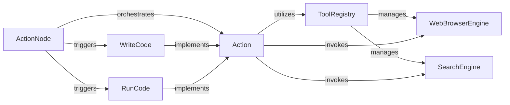

## Details

Final Component Overview: Action & Tooling Execution Subsystem

### Action
Serves as the foundational abstract base class for all executable operations within the MetaGPT framework. It defines the common interface and lifecycle for any task an agent can perform, ensuring consistency across diverse actions. It also provides the mechanism for actions to utilize and invoke external tools.

**Related Classes/Methods**:

- <a href="https://github.com/geekan/MetaGPT/blob/main/metagpt/actions/action.py#L29-L119" target="_blank" rel="noopener noreferrer">`metagpt.actions.action.Action`:29-119</a>

### ActionNode
Represents a single step or a node within a larger workflow or plan. It encapsulates an `Action` instance and manages its execution within a sequence or graph of operations, facilitating complex task orchestration.

**Related Classes/Methods**:

- <a href="https://github.com/geekan/MetaGPT/blob/main/metagpt/actions/action_node.py#L135-L876" target="_blank" rel="noopener noreferrer">`metagpt.actions.action_node.ActionNode`:135-876</a>

### WriteCode
A concrete implementation of `Action` specifically designed to generate or write code. This action is crucial for agents involved in software development tasks, allowing them to produce executable artifacts.

**Related Classes/Methods**:

- <a href="https://github.com/geekan/MetaGPT/blob/main/metagpt/actions/write_code.py#L88-L228" target="_blank" rel="noopener noreferrer">`metagpt.actions.write_code.WriteCode`:88-228</a>

### RunCode
Another concrete `Action` implementation focused on executing generated or existing code. It handles the execution environment and captures outputs, errors, or side effects of the code.

**Related Classes/Methods**:

- <a href="https://github.com/geekan/MetaGPT/blob/main/metagpt/actions/run_code.py#L78-L173" target="_blank" rel="noopener noreferrer">`metagpt.actions.run_code.RunCode`:78-173</a>

### ToolRegistry
Acts as a central catalog and manager for all available external tools and utilities that agents can leverage. It handles the registration, discovery, and invocation of these tools.

**Related Classes/Methods**:

- <a href="https://github.com/geekan/MetaGPT/blob/main/metagpt/tools/tool_registry.py#L27-L87" target="_blank" rel="noopener noreferrer">`metagpt.tools.tool_registry.ToolRegistry`:27-87</a>

### SearchEngine
A specific tool managed by the `ToolRegistry`. It enables agents to perform search queries against external search providers to retrieve relevant information or data.

**Related Classes/Methods**:

- <a href="https://github.com/geekan/MetaGPT/blob/main/metagpt/tools/search_engine.py#L18-L145" target="_blank" rel="noopener noreferrer">`metagpt.tools.search_engine.SearchEngine`:18-145</a>

### WebBrowserEngine
A specific tool registered with the `ToolRegistry`. Its responsibility is to provide agents with the capability to interact with web browsers, enabling tasks like web browsing, data extraction, or form submission.

**Related Classes/Methods**:

- <a href="https://github.com/geekan/MetaGPT/blob/main/metagpt/tools/web_browser_engine.py#L15-L119" target="_blank" rel="noopener noreferrer">`metagpt.tools.web_browser_engine.WebBrowserEngine`:15-119</a>

### [FAQ](https://github.com/CodeBoarding/GeneratedOnBoardings/tree/main?tab=readme-ov-file#faq)