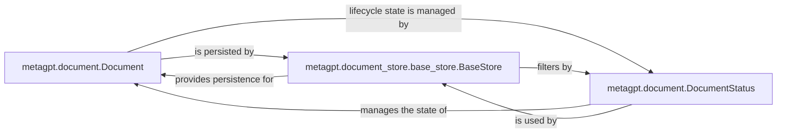

## Details

The `Code & Artifact Management` subsystem is responsible for the structured representation, persistence, and retrieval of all project-related artifacts and information within the MetaGPT system. It enables agents to effectively manage, interact with, and maintain a consistent view of the codebase and other project outputs. This subsystem acts as the foundational layer for handling all forms of project data, from source code to design documents and reports.

### metagpt.document.Document
This is the core data model that encapsulates any project artifact (e.g., code files, design specifications, reports, test results) along with its content, metadata, and unique identifier. It serves as the universal representation for all managed information within the system.

**Related Classes/Methods**:

- <a href="https://github.com/geekan/MetaGPT/blob/main/metagpt/document.py#L59-L108" target="_blank" rel="noopener noreferrer">`metagpt.document.Document`:59-108</a>

### metagpt.document_store.base_store.BaseStore
An abstract interface that defines the contract for persistent storage and retrieval operations of `Document` objects. It provides methods for adding, retrieving, updating, and deleting documents, acting as the gateway to the underlying storage mechanism.

**Related Classes/Methods**:

- <a href="https://github.com/geekan/MetaGPT/blob/main/metagpt/document_store/base_store.py#L12-L25" target="_blank" rel="noopener noreferrer">`metagpt.document_store.base_store.BaseStore`:12-25</a>

### metagpt.document.DocumentStatus
An enumeration or class that defines and tracks the lifecycle states of a `Document`. This allows for managing the progression of artifacts through various stages (e.g., draft, approved, completed, archived) and enables conditional actions based on their current status.

**Related Classes/Methods**:

- <a href="https://github.com/geekan/MetaGPT/blob/main/metagpt/document.py#L50-L56" target="_blank" rel="noopener noreferrer">`metagpt.document.DocumentStatus`:50-56</a>

### [FAQ](https://github.com/CodeBoarding/GeneratedOnBoardings/tree/main?tab=readme-ov-file#faq)