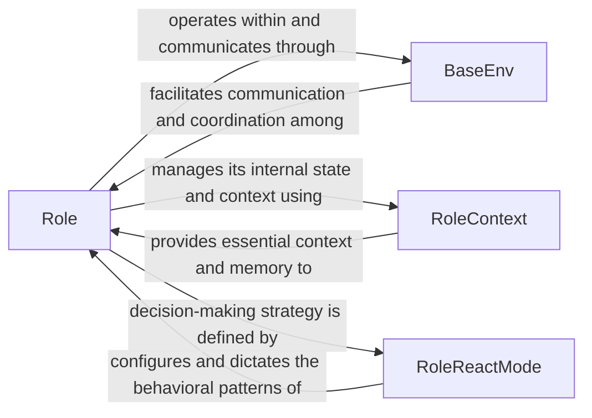

## Details

Core Orchestration & Agent Management: This subsystem is responsible for the lifecycle, behavior, and coordination of all AI agents within a shared environment, defining their specialized roles and the overall project execution flow.

### Role
The fundamental abstraction for an AI agent. It encapsulates an agent's identity (name, profile, goal), manages its internal state and context, orchestrates its decision-making (`_think`), action execution (`_act`), and observation (`_observe`) cycles, and handles communication with the environment and other agents. It serves as the primary interface for an agent's lifecycle and behavior.

**Related Classes/Methods**:

- <a href="https://github.com/geekan/MetaGPT/blob/main/metagpt/roles/role.py" target="_blank" rel="noopener noreferrer">`Role:_think`</a>
- <a href="https://github.com/geekan/MetaGPT/blob/main/metagpt/roles/role.py" target="_blank" rel="noopener noreferrer">`Role:_act`</a>
- <a href="https://github.com/geekan/MetaGPT/blob/main/metagpt/roles/role.py" target="_blank" rel="noopener noreferrer">`Role:_observe`</a>

### BaseEnv
Represents the shared operational environment where multiple `Role` instances coexist and interact. It acts as a central message bus, facilitating communication and coordination among agents by routing messages and providing a common context for their operations.

**Related Classes/Methods**:

- <a href="https://github.com/geekan/MetaGPT/blob/main/metagpt/environment/base_env.py" target="_blank" rel="noopener noreferrer">`BaseEnv`</a>

### RoleContext
Manages the contextual information and internal state essential for a `Role`'s operation. This includes the agent's memory, message buffers (for incoming and outgoing messages), current task state, and configuration settings. It acts as the `Role`'s working memory and interface to its immediate operational data.

**Related Classes/Methods**:

- <a href="https://github.com/geekan/MetaGPT/blob/main/metagpt/roles/role.py#L92-L122" target="_blank" rel="noopener noreferrer">`RoleContext`:92-122</a>

### RoleReactMode
Defines the strategic approach a `Role` employs for reacting to observed messages and deciding on subsequent actions. It dictates the "thinking" or "decision-making" module of an agent, allowing for different behavioral patterns like a standard think-act loop ("react"), sequential action execution ("by_order"), or a plan-then-act approach ("plan_and_act").

**Related Classes/Methods**:

- <a href="https://github.com/geekan/MetaGPT/blob/main/metagpt/roles/role.py#L82-L89" target="_blank" rel="noopener noreferrer">`RoleReactMode`:82-89</a>

### [FAQ](https://github.com/CodeBoarding/GeneratedOnBoardings/tree/main?tab=readme-ov-file#faq)