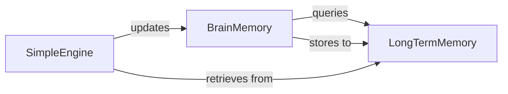

## Details

The `Knowledge & Memory System` subsystem is responsible for managing the persistent and contextual memory of agents, storing historical data, learned insights, and retrieved information, and facilitating learning from past experiences.

### BrainMemory
Represents the agent's immediate, short-term memory, holding the current conversational context, recent observations, and active task-related information. This is essential for maintaining coherence and continuity in agent operations.

**Related Classes/Methods**:

- <a href="https://github.com/geekan/MetaGPT/blob/main/metagpt/memory/brain_memory.py" target="_blank" rel="noopener noreferrer">`metagpt/memory/brain_memory.py`</a>

### LongTermMemory
Serves as the agent's persistent memory, storing historical data, learned facts, and a cumulative knowledge base. This component is critical for enabling agents to learn over time, recall past experiences, and access domain-specific information. It typically interfaces with vector databases or other persistent storage solutions.

**Related Classes/Methods**:

- <a href="https://github.com/geekan/MetaGPT/blob/main/metagpt/memory/longterm_memory.py" target="_blank" rel="noopener noreferrer">`metagpt/memory/longterm_memory.py`</a>

### SimpleEngine
Acts as the mechanism for integrating external or stored knowledge into the agent's active context. This component is vital for grounding agent responses in factual information, reducing hallucinations, and allowing agents to leverage vast amounts of data without explicitly memorizing it. Its "Simple" designation suggests it's a foundational RAG implementation, potentially extensible with more complex strategies.

**Related Classes/Methods**:

- <a href="https://github.com/geekan/MetaGPT/blob/main/metagpt/rag/engines/simple.py" target="_blank" rel="noopener noreferrer">`metagpt/rag/engines/simple.py`</a>

### [FAQ](https://github.com/CodeBoarding/GeneratedOnBoardings/tree/main?tab=readme-ov-file#faq)