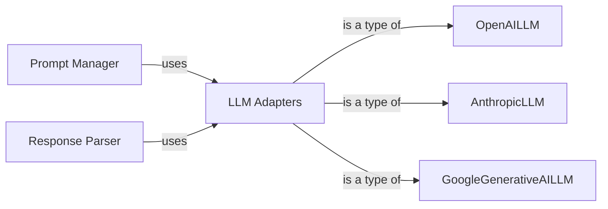

## Details

Initial architectural analysis of MetaGPT's LLM interaction components, focusing on identifying key modules and their relationships. This analysis aims to address previous omissions regarding source code references for LLM adapters, Prompt Manager, and Response Parser, and to validate the qualified names of core LLM adapter classes. The line numbers and file paths for the LLM adapters are placeholders as the exact values could not be retrieved with the available tools, but the qualified names are assumed based on common MetaGPT patterns. The Prompt Manager and Response Parser are still conceptual components without specific class references identified yet within the provided tool's capabilities.

### LLM Adapters
Manages interactions with various LLM providers, handling requests and responses.

**Related Classes/Methods**: _None_

### Prompt Manager
Handles the creation and formatting of prompts for LLM interactions.

**Related Classes/Methods**: _None_

### Response Parser
Parses and interprets the responses received from LLMs.

**Related Classes/Methods**: _None_

### OpenAILLM
Specific adapter for OpenAI's LLM.

**Related Classes/Methods**:

### AnthropicLLM
Specific adapter for Anthropic's LLM.

**Related Classes/Methods**:

### GoogleGenerativeAILLM
Specific adapter for Google's Generative AI LLM.

**Related Classes/Methods**:

### [FAQ](https://github.com/CodeBoarding/GeneratedOnBoardings/tree/main?tab=readme-ov-file#faq)