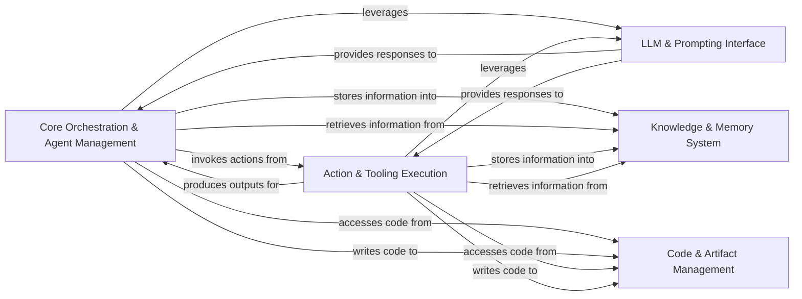

## Details

The MetaGPT architecture is centered around the `Core Orchestration & Agent Management` component, which acts as the central hub for managing various AI agents and their collaborative workflows. This core component delegates specific tasks to the `Action & Tooling Execution` component, enabling agents to perform a wide array of operations, including code generation and execution, web interactions, and project management. Both the core orchestration and the actions heavily rely on the `LLM & Prompting Interface` for all interactions with large language models, ensuring consistent communication and prompt management. To maintain context and facilitate learning, both the orchestrator and the actions interact with the `Knowledge & Memory System`, which serves as a persistent store for historical data and learned insights. Finally, the `Code & Artifact Management` component provides the necessary capabilities for agents to interact with the codebase, allowing them to read, write, and manage project files, thereby closing the loop on a dynamic and adaptive AI development environment.

### Core Orchestration & Agent Management [[Expand]](./Core_Orchestration_Agent_Management.md)
Manages the lifecycle, behavior, and coordination of all AI agents within a shared environment, including their specialized roles and the overall project execution flow.

**Related Classes/Methods**:

- <a href="https://github.com/geekan/MetaGPT/blob/main/metagpt/roles/role.py#L125-L592" target="_blank" rel="noopener noreferrer">`metagpt.roles.role.Role`:125-592</a>
- <a href="https://github.com/geekan/MetaGPT/blob/main/metagpt/environment/base_env.py" target="_blank" rel="noopener noreferrer">`metagpt.environment.base_env.BaseEnv`</a>

### Action & Tooling Execution [[Expand]](./Action_Tooling_Execution.md)
Provides the mechanisms for agents to perform tasks, execute actions, and interact with internal tools and external environments, including code execution, web browsing, and search.

**Related Classes/Methods**:

- <a href="https://github.com/geekan/MetaGPT/blob/main/metagpt/actions/action.py#L29-L119" target="_blank" rel="noopener noreferrer">`metagpt.actions.action.Action`:29-119</a>
- <a href="https://github.com/geekan/MetaGPT/blob/main/metagpt/actions/action_node.py#L135-L876" target="_blank" rel="noopener noreferrer">`metagpt.actions.action_node.ActionNode`:135-876</a>
- <a href="https://github.com/geekan/MetaGPT/blob/main/metagpt/actions/write_code.py#L88-L228" target="_blank" rel="noopener noreferrer">`metagpt.actions.write_code.WriteCode`:88-228</a>
- <a href="https://github.com/geekan/MetaGPT/blob/main/metagpt/actions/run_code.py#L78-L173" target="_blank" rel="noopener noreferrer">`metagpt.actions.run_code.RunCode`:78-173</a>
- <a href="https://github.com/geekan/MetaGPT/blob/main/metagpt/actions/design_api.py" target="_blank" rel="noopener noreferrer">`metagpt.actions.design_api.DesignAPI`</a>
- <a href="https://github.com/geekan/MetaGPT/blob/main/metagpt/actions/project_management.py" target="_blank" rel="noopener noreferrer">`metagpt.actions.project_management.ProjectManagement`</a>
- <a href="https://github.com/geekan/MetaGPT/blob/main/metagpt/tools/tool_registry.py#L27-L87" target="_blank" rel="noopener noreferrer">`metagpt.tools.tool_registry.ToolRegistry`:27-87</a>
- <a href="https://github.com/geekan/MetaGPT/blob/main/metagpt/tools/search_engine.py#L18-L145" target="_blank" rel="noopener noreferrer">`metagpt.tools.search_engine.SearchEngine`:18-145</a>
- <a href="https://github.com/geekan/MetaGPT/blob/main/metagpt/tools/web_browser_engine.py#L15-L119" target="_blank" rel="noopener noreferrer">`metagpt.tools.web_browser_engine.WebBrowserEngine`:15-119</a>

### LLM & Prompting Interface [[Expand]](./LLM_Prompting_Interface.md)
Offers a unified interface for interacting with various Large Language Models, managing prompt templates, and defining data schemas for consistent communication.

**Related Classes/Methods**:

- <a href="https://github.com/geekan/MetaGPT/blob/main/metagpt/provider/base_llm.py#L35-L412" target="_blank" rel="noopener noreferrer">`metagpt.provider.base_llm.BaseLLM`:35-412</a>

### Knowledge & Memory System [[Expand]](./Knowledge_Memory_System.md)
Manages the persistent and contextual memory of agents, storing historical data, learned insights, and retrieved information, and facilitating learning from past experiences.

**Related Classes/Methods**:

- <a href="https://github.com/geekan/MetaGPT/blob/main/metagpt/memory/brain_memory.py#L26-L345" target="_blank" rel="noopener noreferrer">`metagpt.memory.brain_memory.BrainMemory`:26-345</a>
- <a href="https://github.com/geekan/MetaGPT/blob/main/metagpt/memory/longterm_memory.py#L18-L78" target="_blank" rel="noopener noreferrer">`metagpt.memory.longterm_memory.LongTermMemory`:18-78</a>
- <a href="https://github.com/geekan/MetaGPT/blob/main/metagpt/rag/engines/simple.py#L64-L411" target="_blank" rel="noopener noreferrer">`metagpt.rag.engines.simple.SimpleEngine`:64-411</a>

### Code & Artifact Management [[Expand]](./Code_Artifact_Management.md)
Handles interactions with codebases and project artifacts, enabling agents to parse, generate, modify, and manage project files.

**Related Classes/Methods**:

- <a href="https://github.com/geekan/MetaGPT/blob/main/metagpt/document.py#L59-L108" target="_blank" rel="noopener noreferrer">`metagpt.document.Document`:59-108</a>
- <a href="https://github.com/geekan/MetaGPT/blob/main/metagpt/document_store/base_store.py#L12-L25" target="_blank" rel="noopener noreferrer">`metagpt.document_store.base_store.BaseStore`:12-25</a>

### [FAQ](https://github.com/CodeBoarding/GeneratedOnBoardings/tree/main?tab=readme-ov-file#faq)