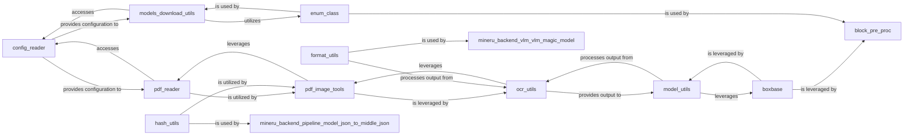

## Component Details

The `Core Utilities & Configuration` subsystem is a foundational collection of modules providing essential services and managing application-wide settings for the `mineru` project. It encompasses utilities for configuration management, PDF and image processing, OCR, geometric calculations, model output handling, data formatting, model downloading, and common enumerations and hashing. These components are critical as they provide the basic building blocks and consistent operational parameters for nearly all other parts of the MinerU system. Together, these components form a robust and indispensable utility layer that supports the higher-level functionalities of the MinerU project.

### config_reader
This component is the central hub for reading and parsing various configuration files, including S3 configurations, LaTeX delimiter configurations, and LLM-aided configurations. It's fundamental because it provides the necessary settings for other parts of the system to operate, ensuring consistent behavior and adaptability.

**Related Classes/Methods**:

- <a href="https://github.com/opendatalab/MinerU/blob/master/mineru/utils/config_reader.py#L1-L1000" target="_blank" rel="noopener noreferrer">`mineru.utils.config_reader` (1:1000)</a>

### pdf_reader
This component handles the core functionality of reading PDF documents and converting their pages into various image formats (bytes, base64 strings). It's crucial for any PDF processing within MinerU, acting as the primary interface for extracting visual data from PDFs.

**Related Classes/Methods**:

- <a href="https://github.com/opendatalab/MinerU/blob/master/mineru/utils/pdf_reader.py#L1-L1000" target="_blank" rel="noopener noreferrer">`mineru.utils.pdf_reader` (1:1000)</a>

### pdf_image_tools
This component builds upon `pdf_reader` to provide more advanced image manipulation capabilities for PDF pages, such as loading images from PDFs and cutting specific sections of images. It's essential for preparing images for OCR or other analysis by providing pre-processing functionalities.

**Related Classes/Methods**:

- <a href="https://github.com/opendatalab/MinerU/blob/master/mineru/utils/pdf_image_tools.py#L1-L1000" target="_blank" rel="noopener noreferrer">`mineru.utils.pdf_image_tools` (1:1000)</a>

### ocr_utils
This component is dedicated to Optical Character Recognition (OCR) related utilities. It handles image preprocessing, merging of detected text boxes and spans, and obtaining OCR results. This is a core component for extracting text from images, forming the basis for further text-based analysis.

**Related Classes/Methods**:

- <a href="https://github.com/opendatalab/MinerU/blob/master/mineru/utils/ocr_utils.py#L1-L1000" target="_blank" rel="noopener noreferrer">`mineru.utils.ocr_utils` (1:1000)</a>

### model_utils
This component focuses on utilities related to model output processing, particularly for handling bounding boxes and tables. It includes functions for calculating Intersection over Union (IoU), merging and filtering tables, and cleaning VRAM. This is vital for post-processing results from detection models, ensuring data quality and efficiency.

**Related Classes/Methods**:

- <a href="https://github.com/opendatalab/MinerU/blob/master/mineru/utils/model_utils.py#L1-L1000" target="_blank" rel="noopener noreferrer">`mineru.utils.model_utils` (1:1000)</a>

### boxbase
This component provides fundamental utilities for bounding box operations, such as calculating distances and determining overlaps. It serves as a foundational module for other components that deal with spatial relationships, especially `model_utils`, `block_pre_proc`, and `span_block_fix`.

**Related Classes/Methods**:

- <a href="https://github.com/opendatalab/MinerU/blob/master/mineru/utils/boxbase.py#L1-L1000" target="_blank" rel="noopener noreferrer">`mineru.utils.boxbase` (1:1000)</a>

### format_utils
This component handles text formatting and conversion, specifically for "Open Table Structure Language" (OTSL) to HTML. It's important for presenting extracted data in a structured and readable format, making the output of the system consumable.

**Related Classes/Methods**:

- <a href="https://github.com/opendatalab/MinerU/blob/master/mineru/utils/format_utils.py#L1-L1000" target="_blank" rel="noopener noreferrer">`mineru.utils.format_utils` (1:1000)</a>

### models_download_utils
This component provides utilities for downloading models, likely interacting with external repositories or internal storage based on configuration. It's crucial for managing the lifecycle of machine learning models used throughout the application.

**Related Classes/Methods**:

- <a href="https://github.com/opendatalab/MinerU/blob/master/mineru/utils/models_download_utils.py#L1-L1000" target="_blank" rel="noopener noreferrer">`mineru.utils.models_download_utils` (1:1000)</a>

### enum_class
This component defines various enumeration classes used throughout the MinerU project to standardize values and improve code readability and maintainability. It acts as a central repository for common constants and types.

**Related Classes/Methods**:

- <a href="https://github.com/opendatalab/MinerU/blob/master/mineru/utils/enum_class.py#L1-L1000" target="_blank" rel="noopener noreferrer">`mineru.utils.enum_class` (1:1000)</a>

### hash_utils
This component provides utility functions for hashing, likely used for data integrity checks, caching, or unique identification of resources.

**Related Classes/Methods**:

- <a href="https://github.com/opendatalab/MinerU/blob/master/mineru/utils/hash_utils.py#L1-L1000" target="_blank" rel="noopener noreferrer">`mineru.utils.hash_utils` (1:1000)</a>

### [FAQ](https://github.com/CodeBoarding/GeneratedOnBoardings/tree/main?tab=readme-ov-file#faq)