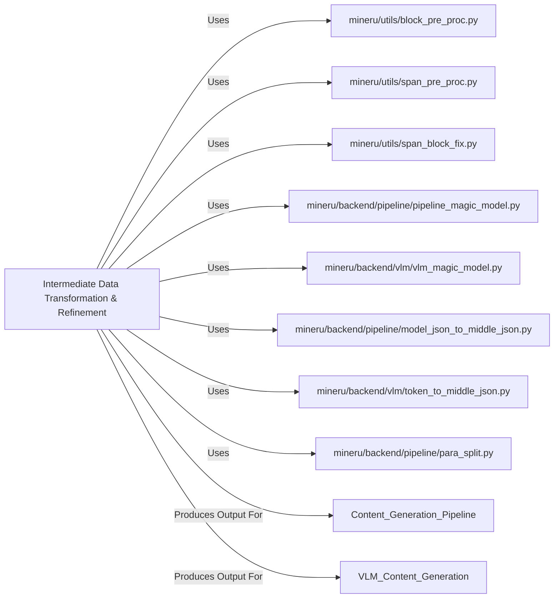

## Component Details

The Intermediate Data Transformation & Refinement component is a critical intermediary in the document processing pipeline, responsible for transforming raw outputs from AI models into a structured, standardized intermediate JSON format. This component ensures data consistency and prepares the content for subsequent generation tasks.

### Intermediate Data Transformation & Refinement
This component acts as the central hub for processing and refining raw model outputs. Its core responsibilities include: Block and Span Pre-processing, Heuristic-based Refinement ("Magic Models"), Standardization to Intermediate JSON, Structural Element Identification.

**Related Classes/Methods**:

- <a href="https://github.com/opendatalab/MinerU/blob/master/mineru/utils/block_pre_proc.py#L0-L0" target="_blank" rel="noopener noreferrer">`mineru.utils.block_pre_proc` (0:0)</a>
- <a href="https://github.com/opendatalab/MinerU/blob/master/mineru/utils/span_pre_proc.py#L0-L0" target="_blank" rel="noopener noreferrer">`mineru.utils.span_pre_proc` (0:0)</a>
- <a href="https://github.com/opendatalab/MinerU/blob/master/mineru/utils/span_block_fix.py#L0-L0" target="_blank" rel="noopener noreferrer">`mineru.utils.span_block_fix` (0:0)</a>
- <a href="https://github.com/opendatalab/MinerU/blob/master/mineru/backend/pipeline/pipeline_magic_model.py#L0-L0" target="_blank" rel="noopener noreferrer">`mineru.backend.pipeline.pipeline_magic_model` (0:0)</a>
- <a href="https://github.com/opendatalab/MinerU/blob/master/mineru/backend/vlm/vlm_magic_model.py#L0-L0" target="_blank" rel="noopener noreferrer">`mineru.backend.vlm.vlm_magic_model` (0:0)</a>
- <a href="https://github.com/opendatalab/MinerU/blob/master/mineru/backend/pipeline/model_json_to_middle_json.py#L0-L0" target="_blank" rel="noopener noreferrer">`mineru.backend.pipeline.model_json_to_middle_json` (0:0)</a>
- <a href="https://github.com/opendatalab/MinerU/blob/master/mineru/backend/vlm/token_to_middle_json.py#L0-L0" target="_blank" rel="noopener noreferrer">`mineru.backend.vlm.token_to_middle_json` (0:0)</a>
- <a href="https://github.com/opendatalab/MinerU/blob/master/mineru/backend/pipeline/para_split.py#L354-L368" target="_blank" rel="noopener noreferrer">`mineru.backend.pipeline.para_split` (354:368)</a>

### mineru/utils/block_pre_proc.py
Handles the initial pre-processing of detected blocks. It focuses on resolving overlaps between different block types (text, title, image, table, equation) and removing redundant or low-priority blocks. It also identifies and processes groups of related blocks (e.g., image body with its caption and footnote).

**Related Classes/Methods**:

- <a href="https://github.com/opendatalab/MinerU/blob/master/mineru/utils/block_pre_proc.py#L33-L95" target="_blank" rel="noopener noreferrer">`mineru.utils.block_pre_proc:prepare_block_bboxes` (33:95)</a>
- <a href="https://github.com/opendatalab/MinerU/blob/master/mineru/utils/block_pre_proc.py#L114-L139" target="_blank" rel="noopener noreferrer">`mineru.utils.block_pre_proc:fix_text_overlap_title_blocks` (114:139)</a>
- <a href="https://github.com/opendatalab/MinerU/blob/master/mineru/utils/block_pre_proc.py#L142-L160" target="_blank" rel="noopener noreferrer">`mineru.utils.block_pre_proc:remove_need_drop_blocks` (142:160)</a>
- <a href="https://github.com/opendatalab/MinerU/blob/master/mineru/utils/block_pre_proc.py#L163-L188" target="_blank" rel="noopener noreferrer">`mineru.utils.block_pre_proc:fix_interline_equation_overlap_text_blocks_with_hi_iou` (163:188)</a>
- <a href="https://github.com/opendatalab/MinerU/blob/master/mineru/utils/block_pre_proc.py#L191-L208" target="_blank" rel="noopener noreferrer">`mineru.utils.block_pre_proc:find_blocks_under_footnote` (191:208)</a>
- <a href="https://github.com/opendatalab/MinerU/blob/master/mineru/utils/block_pre_proc.py#L211-L246" target="_blank" rel="noopener noreferrer">`mineru.utils.block_pre_proc:remove_overlaps_min_blocks` (211:246)</a>

### mineru/utils/span_pre_proc.py
Focuses on pre-processing individual "spans" (text fragments, inline equations, images, tables) within the document. It filters out irrelevant spans, resolves overlaps among them based on confidence or size, and extracts/fills content into text spans, potentially using OCR for missing text.

**Related Classes/Methods**:

- <a href="https://github.com/opendatalab/MinerU/blob/master/mineru/utils/span_pre_proc.py#L15-L54" target="_blank" rel="noopener noreferrer">`mineru.utils.span_pre_proc:remove_outside_spans` (15:54)</a>
- <a href="https://github.com/opendatalab/MinerU/blob/master/mineru/utils/span_pre_proc.py#L57-L82" target="_blank" rel="noopener noreferrer">`mineru.utils.span_pre_proc:remove_overlaps_low_confidence_spans` (57:82)</a>
- <a href="https://github.com/opendatalab/MinerU/blob/master/mineru/utils/span_pre_proc.py#L85-L104" target="_blank" rel="noopener noreferrer">`mineru.utils.span_pre_proc:remove_overlaps_min_spans` (85:104)</a>
- <a href="https://github.com/opendatalab/MinerU/blob/master/mineru/utils/span_pre_proc.py#L121-L207" target="_blank" rel="noopener noreferrer">`mineru.utils.span_pre_proc:txt_spans_extract` (121:207)</a>

### mineru/utils/span_block_fix.py
Bridges the gap between blocks and spans by associating spans with their respective blocks and then organizing these spans into logical lines within each block. It also handles type conversions (e.g., interline equation to inline equation within text blocks).

**Related Classes/Methods**:

- <a href="https://github.com/opendatalab/MinerU/blob/master/mineru/utils/span_block_fix.py#L6-L36" target="_blank" rel="noopener noreferrer">`mineru.utils.span_block_fix:fill_spans_in_blocks` (6:36)</a>
- <a href="https://github.com/opendatalab/MinerU/blob/master/mineru/utils/span_block_fix.py#L80-L116" target="_blank" rel="noopener noreferrer">`mineru.utils.span_block_fix:merge_spans_to_line` (80:116)</a>
- <a href="https://github.com/opendatalab/MinerU/blob/master/mineru/utils/span_block_fix.py#L120-L135" target="_blank" rel="noopener noreferrer">`mineru.utils.span_block_fix:line_sort_spans_by_left_to_right` (120:135)</a>
- <a href="https://github.com/opendatalab/MinerU/blob/master/mineru/utils/span_block_fix.py#L68-L77" target="_blank" rel="noopener noreferrer">`mineru.utils.span_block_fix:fix_text_block` (68:77)</a>
- <a href="https://github.com/opendatalab/MinerU/blob/master/mineru/utils/span_block_fix.py#L156-L161" target="_blank" rel="noopener noreferrer">`mineru.utils.span_block_fix:fix_interline_block` (156:161)</a>

### mineru/backend/pipeline/pipeline_magic_model.py
Implements heuristic-based refinement for the general processing pipeline. It applies "magic models" to correct or enhance the extracted data, often based on contextual rules or patterns.

**Related Classes/Methods**:

- <a href="https://github.com/opendatalab/MinerU/blob/master/mineru/backend/pipeline/pipeline_magic_model.py#L0-L0" target="_blank" rel="noopener noreferrer">`mineru.backend.pipeline.pipeline_magic_model:pipeline_magic_model` (0:0)</a>

### mineru/backend/vlm/vlm_magic_model.py
Similar to `pipeline_magic_model`, but specifically tailored for refining outputs from Vision-Language Models (VLM). It applies VLM-specific heuristics to improve the quality of VLM-generated content.

**Related Classes/Methods**:

- <a href="https://github.com/opendatalab/MinerU/blob/master/mineru/backend/vlm/vlm_magic_model.py#L0-L0" target="_blank" rel="noopener noreferrer">`mineru.backend.vlm.vlm_magic_model:vlm_magic_model` (0:0)</a>

### mineru/backend/pipeline/model_json_to_middle_json.py
Converts the raw JSON output from the general processing pipeline into the standardized intermediate JSON format. This involves mapping and restructuring data according to the defined intermediate schema.

**Related Classes/Methods**:

- <a href="https://github.com/opendatalab/MinerU/blob/master/mineru/backend/pipeline/model_json_to_middle_json.py#L0-L0" target="_blank" rel="noopener noreferrer">`mineru.backend.pipeline.model_json_to_middle_json:model_json_to_middle_json` (0:0)</a>

### mineru/backend/vlm/token_to_middle_json.py
Converts raw token-based outputs from Vision-Language Models into the standardized intermediate JSON format. This is a specialized conversion for VLM outputs, similar to `model_json_to_middle_json` but handling token-level data.

**Related Classes/Methods**:

- <a href="https://github.com/opendatalab/MinerU/blob/master/mineru/backend/vlm/token_to_middle_json.py#L0-L0" target="_blank" rel="noopener noreferrer">`mineru.backend.vlm.token_to_middle_json:token_to_middle_json` (0:0)</a>

### mineru/backend/pipeline/para_split.py
Responsible for splitting processed text into logical paragraphs. This is a crucial step for structuring the document content into readable and semantically meaningful units.

**Related Classes/Methods**:

- <a href="https://github.com/opendatalab/MinerU/blob/master/mineru/backend/pipeline/para_split.py#L354-L368" target="_blank" rel="noopener noreferrer">`mineru.backend.pipeline.para_split:para_split` (354:368)</a>

### [FAQ](https://github.com/CodeBoarding/GeneratedOnBoardings/tree/main?tab=readme-ov-file#faq)