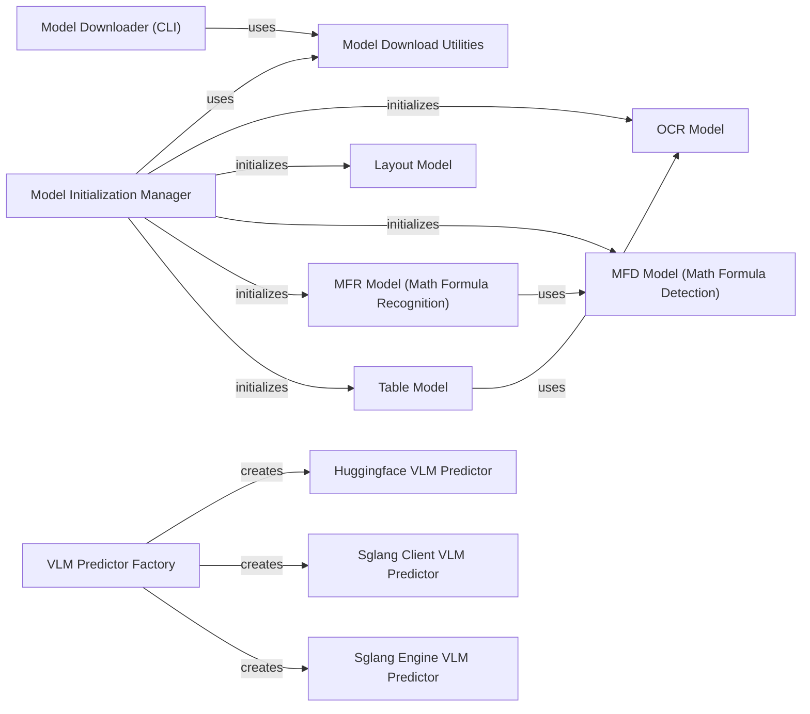

## Component Details

This component is the central hub for managing the entire lifecycle of all AI models within `MinerU`. It encompasses functionalities for downloading, configuring, and locally storing various specialized models (OCR, Layout, MFR, Table, VLM). A key responsibility is the initialization and provision of these models, often as singleton instances to optimize resource utilization. Furthermore, it directly encapsulates the inference capabilities of these "atomic" AI models, providing the core AI processing power for the system.

### Model Downloader (CLI)
This component provides the command-line interface for users to initiate the download of various AI models (pipeline or VLM) from specified sources like HuggingFace or ModelScope. It also handles the initial configuration of model paths in the `mineru.json` file.

**Related Classes/Methods**:

- <a href="https://github.com/opendatalab/MinerU/blob/master/mineru/cli/models_download.py#L1-L1" target="_blank" rel="noopener noreferrer">`mineru.cli.models_download` (1:1)</a>

### Model Download Utilities
This utility component encapsulates the core logic for downloading model files from remote repositories (HuggingFace, ModelScope) and resolving their local cache paths. It abstracts the complexities of different model sources.

**Related Classes/Methods**:

- <a href="https://github.com/opendatalab/MinerU/blob/master/mineru/utils/models_download_utils.py#L1-L1" target="_blank" rel="noopener noreferrer">`mineru.utils.models_download_utils` (1:1)</a>

### Model Initialization Manager
This crucial component is responsible for initializing and managing singleton instances of various "atomic" AI models (OCR, Layout, MFD, MFR, Table). It ensures that models are loaded efficiently, often only once, to optimize resource usage across the application.

**Related Classes/Methods**:

- <a href="https://github.com/opendatalab/MinerU/blob/master/mineru/backend/pipeline/model_init.py#L1-L1" target="_blank" rel="noopener noreferrer">`mineru.backend.pipeline.model_init` (1:1)</a>

### OCR Model
This component provides the Optical Character Recognition (OCR) capabilities, enabling the system to detect and recognize text within images. It supports various languages and handles image preprocessing for optimal OCR performance.

**Related Classes/Methods**:

- <a href="https://github.com/opendatalab/MinerU/blob/master/mineru/model/ocr/paddleocr2pytorch/pytorch_paddle.py#L1-L1" target="_blank" rel="noopener noreferrer">`mineru.model.ocr.paddleocr2pytorch.pytorch_paddle` (1:1)</a>

### Layout Model
This component is responsible for performing document layout analysis. It identifies and categorizes different structural elements within a document image, such as text blocks, images, and tables, which is crucial for understanding document structure.

**Related Classes/Methods**:

- <a href="https://github.com/opendatalab/MinerU/blob/master/mineru/model/layout/doclayout_yolo.py#L1-L1" target="_blank" rel="noopener noreferrer">`mineru.model.layout.doclayout_yolo` (1:1)</a>

### MFD Model (Math Formula Detection)
This component specializes in detecting mathematical formulas present in document images. It identifies the bounding boxes of formulas, preparing them for subsequent recognition.

**Related Classes/Methods**:

- <a href="https://github.com/opendatalab/MinerU/blob/master/mineru/model/mfd/yolo_v8.py#L1-L1" target="_blank" rel="noopener noreferrer">`mineru.model.mfd.yolo_v8` (1:1)</a>

### MFR Model (Math Formula Recognition)
This component takes the detected mathematical formulas and converts them into a structured, machine-readable format, specifically LaTeX. It performs the actual recognition of the mathematical expressions.

**Related Classes/Methods**:

- <a href="https://github.com/opendatalab/MinerU/blob/master/mineru/model/mfr/unimernet/Unimernet.py#L1-L1" target="_blank" rel="noopener noreferrer">`mineru.model.mfr.unimernet.Unimernet` (1:1)</a>

### Table Model
This component is dedicated to the extraction and structuring of tabular data from images. It leverages OCR results to identify cells and reconstruct the table structure, often outputting it in HTML format.

**Related Classes/Methods**:

- <a href="https://github.com/opendatalab/MinerU/blob/master/mineru/model/table/rapid_table.py#L1-L1" target="_blank" rel="noopener noreferrer">`mineru.model.table.rapid_table` (1:1)</a>

### VLM Predictor Factory
This component acts as a factory for creating and providing instances of various Vision-Language Model (VLM) predictors. It abstracts the underlying VLM implementation (e.g., HuggingFace, Sglang client/engine), allowing for flexible VLM integration.

**Related Classes/Methods**:

- <a href="https://github.com/opendatalab/MinerU/blob/master/mineru/backend/vlm/predictor.py#L1-L1" target="_blank" rel="noopener noreferrer">`mineru.backend.vlm.predictor` (1:1)</a>

### Huggingface VLM Predictor
This specific VLM predictor implementation utilizes models from the HuggingFace Transformers library. It handles the loading, inference, and output processing for HuggingFace-based VLMs.

**Related Classes/Methods**:

- <a href="https://github.com/opendatalab/MinerU/blob/master/mineru/backend/vlm/hf_predictor.py#L1-L1" target="_blank" rel="noopener noreferrer">`mineru.backend.vlm.hf_predictor` (1:1)</a>

### Sglang Client VLM Predictor
This component is an implied VLM predictor implementation that utilizes the Sglang client for VLM inference.

**Related Classes/Methods**:

- <a href="https://github.com/opendatalab/MinerU/blob/master/mineru/backend/vlm/sglang_client_predictor.py#L1-L1" target="_blank" rel="noopener noreferrer">`mineru.backend.vlm.sglang_client_predictor` (1:1)</a>

### Sglang Engine VLM Predictor
This component is an implied VLM predictor implementation that utilizes the Sglang engine for VLM inference.

**Related Classes/Methods**:

- <a href="https://github.com/opendatalab/MinerU/blob/master/mineru/backend/vlm/sglang_engine_predictor.py#L1-L1" target="_blank" rel="noopener noreferrer">`mineru.backend.vlm.sglang_engine_predictor` (1:1)</a>

### [FAQ](https://github.com/CodeBoarding/GeneratedOnBoardings/tree/main?tab=readme-ov-file#faq)