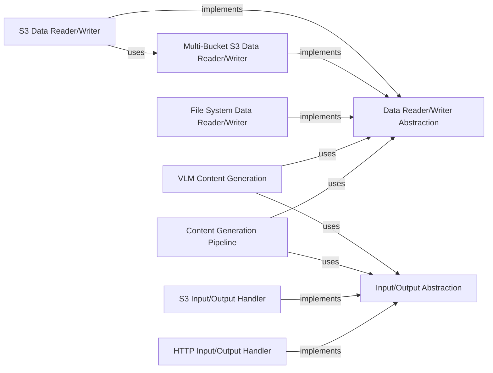

## Component Details

The Output Generation & Persistence subsystem is crucial for transforming standardized intermediate data into final, human-readable content and managing all data input/output operations. It acts as the bridge between internal processing and external consumption or storage.

### Content Generation Pipeline
This component is responsible for converting intermediate JSON representations, typically from general processing pipelines, into final human-readable content formats such as Markdown or structured content lists. It includes functionalities for text merging, formatting, and detecting title levels within the content.

**Related Classes/Methods**:

- <a href="https://github.com/opendatalab/MinerU/blob/master/mineru/backend/pipeline/pipeline_middle_json_mkcontent.py#L1-L1" target="_blank" rel="noopener noreferrer">`mineru/backend/pipeline/pipeline_middle_json_mkcontent.py` (1:1)</a>

### VLM Content Generation
Similar to the Content Generation Pipeline, this component specifically handles the transformation of intermediate JSON outputs originating from Vision-Language Models (VLM) into final content formats like Markdown or structured content lists. It is tailored to the specific structure and needs of VLM outputs.

**Related Classes/Methods**:

- <a href="https://github.com/opendatalab/MinerU/blob/master/mineru/backend/vlm/vlm_middle_json_mkcontent.py#L1-L1" target="_blank" rel="noopener noreferrer">`mineru/backend/vlm/vlm_middle_json_mkcontent.py` (1:1)</a>

### Data Reader/Writer Abstraction
This component defines the abstract interface for high-level reading and writing of structured data. It serves as a foundational contract that concrete data storage implementations must adhere to, ensuring a consistent API for data persistence operations.

**Related Classes/Methods**:

- <a href="https://github.com/opendatalab/MinerU/blob/master/mineru/data/data_reader_writer/base.py#L1-L1" target="_blank" rel="noopener noreferrer">`mineru/data/data_reader_writer/base.py` (1:1)</a>

### File System Data Reader/Writer
Provides a concrete implementation for reading from and writing structured data to the local file system. It handles file-based persistence operations according to the Data Reader/Writer Abstraction.

**Related Classes/Methods**:

- <a href="https://github.com/opendatalab/MinerU/blob/master/mineru/data/data_reader_writer/filebase.py#L1-L1" target="_blank" rel="noopener noreferrer">`mineru/data/data_reader_writer/filebase.py` (1:1)</a>

### Multi-Bucket S3 Data Reader/Writer
Implements robust data reading and writing functionalities specifically for Amazon S3, with support for operations across multiple S3 buckets. This component acts as a versatile and foundational S3 data handler.

**Related Classes/Methods**:

- <a href="https://github.com/opendatalab/MinerU/blob/master/mineru/data/data_reader_writer/multi_bucket_s3.py#L1-L1" target="_blank" rel="noopener noreferrer">`mineru/data/data_reader_writer/multi_bucket_s3.py` (1:1)</a>

### S3 Data Reader/Writer
Offers data reading and writing capabilities for a single Amazon S3 bucket. This component leverages the more general Multi-Bucket S3 Data Reader/Writer for its underlying S3 interactions, providing a simplified interface for single-bucket operations.

**Related Classes/Methods**:

- <a href="https://github.com/opendatalab/MinerU/blob/master/mineru/data/data_reader_writer/s3.py#L1-L1" target="_blank" rel="noopener noreferrer">`mineru/data/data_reader_writer/s3.py` (1:1)</a>

### Input/Output Abstraction
Defines the abstract interface for low-level input/output operations, primarily focused on reading raw data streams from various sources. This component is crucial for handling the initial ingestion of input files (e.g., PDFs, images) before they are processed into structured data.

**Related Classes/Methods**:

- <a href="https://github.com/opendatalab/MinerU/blob/master/mineru/data/io/base.py#L1-L1" target="_blank" rel="noopener noreferrer">`mineru/data/io/base.py` (1:1)</a>

### HTTP Input/Output Handler
Implements low-level input/output functionalities for retrieving raw data over HTTP. This is used for reading input files or other data directly from web URLs.

**Related Classes/Methods**:

- <a href="https://github.com/opendatalab/MinerU/blob/master/mineru/data/io/http.py#L1-L1" target="_blank" rel="noopener noreferrer">`mineru/data/io/http.py` (1:1)</a>

### S3 Input/Output Handler
Implements low-level input/output functionalities for retrieving raw data directly from Amazon S3 buckets. This component is used for reading input files stored in S3.

**Related Classes/Methods**:

- <a href="https://github.com/opendatalab/MinerU/blob/master/mineru/data/io/s3.py#L1-L1" target="_blank" rel="noopener noreferrer">`mineru/data/io/s3.py` (1:1)</a>

### [FAQ](https://github.com/CodeBoarding/GeneratedOnBoardings/tree/main?tab=readme-ov-file#faq)