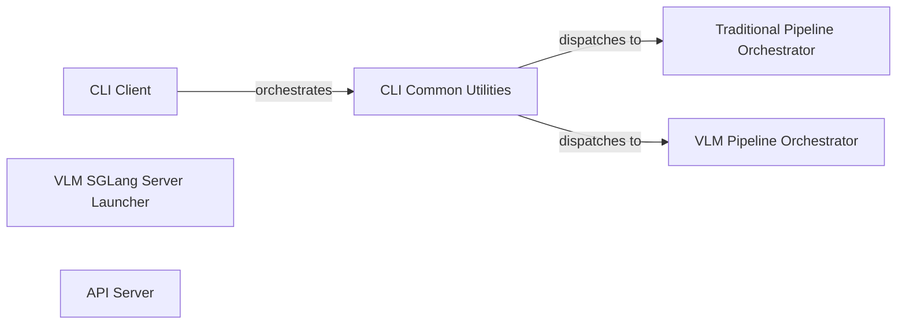

## Component Details

This component serves as the primary entry point for users, handling command-line interface (CLI) interactions and server-side API requests. It is responsible for parsing user inputs, managing file paths, and orchestrating the entire document analysis workflow by selecting and initiating either the traditional (Pipeline Orchestration) or VLM-based (VLM Orchestration) processing pipeline. It acts as the central coordinator for the overall system execution.

### CLI Client
This component serves as the primary command-line interface (CLI) for users to interact with the MinerU system. It is responsible for defining and parsing various command-line arguments, such as input/output file paths, the chosen analysis method (e.g., `auto`, `txt`, `ocr`), the backend to use (`pipeline`, `vlm-transformers`, `vlm-sglang-engine`, `vlm-sglang-client`), language settings, page ranges, and model-related configurations. After parsing, it orchestrates the document analysis by invoking the `CLI Common Utilities` component.

**Related Classes/Methods**:

- `CLI Client` (0:0)
- `CLI Common Utilities` (0:0)

### CLI Common Utilities
This component provides a set of shared utility functions crucial for the CLI operations and acts as a central dispatcher for the document parsing workflow. Its responsibilities include reading input files (handling both PDF and image formats), preparing the necessary output directories, converting PDF bytes for processing, and, most importantly, the `do_parse` function. The `do_parse` function dynamically selects and initiates either the `Traditional Pipeline Orchestrator` or the `VLM Pipeline Orchestrator` based on the `backend` argument received from the `CLI Client`. It also manages the output generation, including markdown, JSON, and debug PDFs.

**Related Classes/Methods**:

- <a href="https://github.com/opendatalab/MinerU/blob/master/mineru/cli/common.py#L75-L223" target="_blank" rel="noopener noreferrer">`mineru/cli/common.py:do_parse` (75:223)</a>
- `Traditional Pipeline Orchestrator` (0:0)
- `VLM Pipeline Orchestrator` (0:0)

### VLM SGLang Server Launcher
This component is a lightweight script whose sole purpose is to launch the SGLang server. The SGLang server is an essential dependency for efficient inference when using the VLM-based backends, specifically `vlm-sglang-engine` and `vlm-sglang-client`. It acts as a wrapper to start the underlying SGLang model server.

**Related Classes/Methods**:

- `VLM SGLang Server Launcher` (0:0)
- <a href="https://github.com/opendatalab/MinerU/blob/master/mineru/model/vlm_sglang_model/server.py#L0-L0" target="_blank" rel="noopener noreferrer">`mineru.model.vlm_sglang_model.server` (0:0)</a>

### Traditional Pipeline Orchestrator
This component is the dedicated entry point and orchestrator for the traditional document analysis pipeline. Its responsibilities include initializing and managing the traditional document processing models (e.g., OCR, layout detection, formula/table recognition) through a `ModelSingleton`. It loads images from PDF documents, classifies PDF types (e.g., text-based vs. image-based for OCR determination), and performs batch inference on the document pages to extract structured information.

**Related Classes/Methods**:

- `Traditional Pipeline Orchestrator` (0:0)
- <a href="https://github.com/opendatalab/MinerU/blob/master/mineru/backend/pipeline/model_init.py#L128-L181" target="_blank" rel="noopener noreferrer">`mineru.backend.pipeline.model_init.MineruPipelineModel` (128:181)</a>

### VLM Pipeline Orchestrator
This component serves as the entry point and orchestrator for the VLM (Vision-Language Model) based document analysis pipeline. It is responsible for initializing and managing various VLM predictors (e.g., Hugging Face Transformers-based models, SGLang client/engine predictors) via a `ModelSingleton` and a `get_predictor` factory. It loads document images, performs batch prediction using the selected VLM, and transforms the VLM's raw output into a standardized middle JSON format for further processing or output. It also supports asynchronous analysis.

**Related Classes/Methods**:

- `VLM Pipeline Orchestrator` (0:0)
- <a href="https://github.com/opendatalab/MinerU/blob/master/mineru/backend/vlm/predictor.py#L37-L110" target="_blank" rel="noopener noreferrer">`mineru.backend.vlm.predictor.get_predictor` (37:110)</a>

### API Server
This component implements a web-based API server for MinerU, built upon the `FastMCP` framework and `Starlette`. It exposes the document conversion and analysis functionalities through API endpoints, allowing external applications and services to programmatically interact with MinerU. It supports different server modes, including standard HTTP and Server-Sent Events (SSE) for streaming results. It also manages a singleton `MinerUClient` instance for internal API calls to the core functionalities.

**Related Classes/Methods**:

- `API Server` (0:0)
- <a href="https://github.com/opendatalab/MinerU/blob/master/projects/mcp/src/mineru/api.py#L0-L0" target="_blank" rel="noopener noreferrer">`mineru.api.MineruClient` (0:0)</a>

### [FAQ](https://github.com/CodeBoarding/GeneratedOnBoardings/tree/main?tab=readme-ov-file#faq)