```mermaid
graph LR
    User_Interface_Workflow_Orchestration["User Interface & Workflow Orchestration"]
    Model_Management_Core_AI_Services["Model Management & Core AI Services"]
    Intermediate_Data_Transformation_Refinement["Intermediate Data Transformation & Refinement"]
    Output_Generation_Persistence["Output Generation & Persistence"]
    Core_Utilities_Configuration["Core Utilities & Configuration"]
    User_Interface_Workflow_Orchestration -- "Initiates processing" --> Model_Management_Core_AI_Services
    User_Interface_Workflow_Orchestration -- "Orchestrates data flow" --> Intermediate_Data_Transformation_Refinement
    User_Interface_Workflow_Orchestration -- "Manages output" --> Output_Generation_Persistence
    Model_Management_Core_AI_Services -- "Provides model outputs" --> Intermediate_Data_Transformation_Refinement
    Intermediate_Data_Transformation_Refinement -- "Sends processed data" --> Output_Generation_Persistence
    Core_Utilities_Configuration -- "Provides configuration" --> User_Interface_Workflow_Orchestration
    Core_Utilities_Configuration -- "Provides utilities" --> Model_Management_Core_AI_Services
    Core_Utilities_Configuration -- "Provides utilities" --> Intermediate_Data_Transformation_Refinement
    Core_Utilities_Configuration -- "Provides utilities" --> Output_Generation_Persistence
    click User_Interface_Workflow_Orchestration href "https://github.com/CodeBoarding/GeneratedOnBoardings/blob/main//MinerU/User_Interface_Workflow_Orchestration.md" "Details"
    click Model_Management_Core_AI_Services href "https://github.com/CodeBoarding/GeneratedOnBoardings/blob/main//MinerU/Model_Management_Core_AI_Services.md" "Details"
    click Intermediate_Data_Transformation_Refinement href "https://github.com/CodeBoarding/GeneratedOnBoardings/blob/main//MinerU/Intermediate_Data_Transformation_Refinement.md" "Details"
    click Output_Generation_Persistence href "https://github.com/CodeBoarding/GeneratedOnBoardings/blob/main//MinerU/Output_Generation_Persistence.md" "Details"
    click Core_Utilities_Configuration href "https://github.com/CodeBoarding/GeneratedOnBoardings/blob/main//MinerU/Core_Utilities_Configuration.md" "Details"
```

## Component Details

Here's the final architecture analysis for `MinerU`, consolidating the insights from the Control Flow Graph (CFG) and Source Code analysis into five fundamental components.

### User Interface & Workflow Orchestration
This component serves as the primary entry point for users, handling command-line interface (CLI) interactions and server-side API requests. It is responsible for parsing user inputs, managing file paths, and orchestrating the entire document analysis workflow by selecting and initiating either the traditional or VLM-based processing pipeline. It acts as the central coordinator for the overall system execution.

**Related Classes/Methods**:

- <a href="https://github.com/opendatalab/MinerU/blob/master/mineru/cli/client.py#L1-L1" target="_blank" rel="noopener noreferrer">`mineru.cli.client` (1:1)</a>
- <a href="https://github.com/opendatalab/MinerU/blob/master/mineru/cli/common.py#L1-L1" target="_blank" rel="noopener noreferrer">`mineru.cli.common` (1:1)</a>
- <a href="https://github.com/opendatalab/MinerU/blob/master/mineru/cli/vlm_sglang_server.py#L1-L1" target="_blank" rel="noopener noreferrer">`mineru.cli.vlm_sglang_server` (1:1)</a>
- <a href="https://github.com/opendatalab/MinerU/blob/master/mineru/backend/pipeline/pipeline_analyze.py#L1-L1" target="_blank" rel="noopener noreferrer">`mineru.backend.pipeline.pipeline_analyze` (1:1)</a>
- <a href="https://github.com/opendatalab/MinerU/blob/master/mineru/backend/vlm/vlm_analyze.py#L1-L1" target="_blank" rel="noopener noreferrer">`mineru.backend.vlm.vlm_analyze` (1:1)</a>
- <a href="https://github.com/opendatalab/MinerU/blob/master/projects/mcp/src/mineru/server.py#L1-L1" target="_blank" rel="noopener noreferrer">`mineru.server` (1:1)</a>

### Model Management & Core AI Services
This component manages the entire lifecycle of all AI models used in `MinerU`. It handles downloading, configuration, and local storage of models (OCR, Layout, MFR, Table, VLM). Crucially, it initializes and provides singleton instances of these models, ensuring efficient resource utilization. It also encapsulates the direct inference capabilities of these "atomic" AI models.

**Related Classes/Methods**:

- <a href="https://github.com/opendatalab/MinerU/blob/master/mineru/cli/models_download.py#L1-L1" target="_blank" rel="noopener noreferrer">`mineru.cli.models_download` (1:1)</a>
- <a href="https://github.com/opendatalab/MinerU/blob/master/mineru/utils/models_download_utils.py#L1-L1" target="_blank" rel="noopener noreferrer">`mineru.utils.models_download_utils` (1:1)</a>
- <a href="https://github.com/opendatalab/MinerU/blob/master/mineru/backend/pipeline/model_init.py#L1-L1" target="_blank" rel="noopener noreferrer">`mineru.backend.pipeline.model_init` (1:1)</a>
- <a href="https://github.com/opendatalab/MinerU/blob/master/mineru/model/ocr/paddleocr2pytorch/pytorch_paddle.py#L1-L1" target="_blank" rel="noopener noreferrer">`mineru.model.ocr.paddleocr2pytorch.pytorch_paddle` (1:1)</a>
- `mineru.model.ocr.paddleocr2pytorch.pytorchocr.tools.infer.predict_system` (1:1)
- <a href="https://github.com/opendatalab/MinerU/blob/master/mineru/model/reading_order/xycut.py#L1-L1" target="_blank" rel="noopener noreferrer">`mineru.model.reading_order.xycut` (1:1)</a>
- <a href="https://github.com/opendatalab/MinerU/blob/master/mineru/model/reading_order/layout_reader.py#L1-L1" target="_blank" rel="noopener noreferrer">`mineru.model.reading_order.layout_reader` (1:1)</a>
- <a href="https://github.com/opendatalab/MinerU/blob/master/mineru/model/table/rapid_table.py#L1-L1" target="_blank" rel="noopener noreferrer">`mineru.model.table.rapid_table` (1:1)</a>
- <a href="https://github.com/opendatalab/MinerU/blob/master/mineru/model/mfr/unimernet/Unimernet.py#L1-L1" target="_blank" rel="noopener noreferrer">`mineru.model.mfr.unimernet.Unimernet` (1:1)</a>
- <a href="https://github.com/opendatalab/MinerU/blob/master/mineru/model/mfr/unimernet/unimernet_hf/modeling_unimernet.py#L1-L1" target="_blank" rel="noopener noreferrer">`mineru.model.mfr.unimernet.unimernet_hf.modeling_unimernet` (1:1)</a>
- <a href="https://github.com/opendatalab/MinerU/blob/master/mineru/model/layout/doclayout_yolo.py#L1-L1" target="_blank" rel="noopener noreferrer">`mineru.model.layout.doclayout_yolo` (1:1)</a>
- <a href="https://github.com/opendatalab/MinerU/blob/master/mineru/model/mfd/yolo_v8.py#L1-L1" target="_blank" rel="noopener noreferrer">`mineru.model.mfd.yolo_v8` (1:1)</a>
- <a href="https://github.com/opendatalab/MinerU/blob/master/mineru/backend/vlm/predictor.py#L1-L1" target="_blank" rel="noopener noreferrer">`mineru.backend.vlm.predictor` (1:1)</a>
- <a href="https://github.com/opendatalab/MinerU/blob/master/mineru/backend/vlm/hf_predictor.py#L1-L1" target="_blank" rel="noopener noreferrer">`mineru.backend.vlm.hf_predictor` (1:1)</a>
- <a href="https://github.com/opendatalab/MinerU/blob/master/mineru/backend/vlm/sglang_client_predictor.py#L1-L1" target="_blank" rel="noopener noreferrer">`mineru.backend.vlm.sglang_client_predictor` (1:1)</a>
- <a href="https://github.com/opendatalab/MinerU/blob/master/mineru/backend/vlm/sglang_engine_predictor.py#L1-L1" target="_blank" rel="noopener noreferrer">`mineru.backend.vlm.sglang_engine_predictor` (1:1)</a>

### Intermediate Data Transformation & Refinement
This component is responsible for processing and refining the raw outputs generated by the `Model Management & Core AI Services`. It performs crucial tasks such as block and span pre-processing (handling overlaps, merging), applies "magic models" for heuristic-based refinement and categorization, and standardizes diverse model outputs into a consistent intermediate JSON representation. It also handles paragraph splitting and structural element identification.

**Related Classes/Methods**:

- <a href="https://github.com/opendatalab/MinerU/blob/master/mineru/utils/block_pre_proc.py#L1-L1" target="_blank" rel="noopener noreferrer">`mineru.utils.block_pre_proc` (1:1)</a>
- <a href="https://github.com/opendatalab/MinerU/blob/master/mineru/utils/span_pre_proc.py#L1-L1" target="_blank" rel="noopener noreferrer">`mineru.utils.span_pre_proc` (1:1)</a>
- <a href="https://github.com/opendatalab/MinerU/blob/master/mineru/utils/span_block_fix.py#L1-L1" target="_blank" rel="noopener noreferrer">`mineru.utils.span_block_fix` (1:1)</a>
- <a href="https://github.com/opendatalab/MinerU/blob/master/mineru/backend/pipeline/pipeline_magic_model.py#L1-L1" target="_blank" rel="noopener noreferrer">`mineru.backend.pipeline.pipeline_magic_model` (1:1)</a>
- <a href="https://github.com/opendatalab/MinerU/blob/master/mineru/backend/vlm/vlm_magic_model.py#L1-L1" target="_blank" rel="noopener noreferrer">`mineru.backend.vlm.vlm_magic_model` (1:1)</a>
- <a href="https://github.com/opendatalab/MinerU/blob/master/mineru/backend/pipeline/model_json_to_middle_json.py#L1-L1" target="_blank" rel="noopener noreferrer">`mineru.backend.pipeline.model_json_to_middle_json` (1:1)</a>
- <a href="https://github.com/opendatalab/MinerU/blob/master/mineru/backend/vlm/token_to_middle_json.py#L1-L1" target="_blank" rel="noopener noreferrer">`mineru.backend.vlm.token_to_middle_json` (1:1)</a>
- <a href="https://github.com/opendatalab/MinerU/blob/master/mineru/backend/pipeline/para_split.py#L354-L368" target="_blank" rel="noopener noreferrer">`mineru.backend.pipeline.para_split` (354:368)</a>

### Output Generation & Persistence
This component takes the standardized intermediate JSON representation and transforms it into final, human-readable content formats such as Markdown or structured content lists. It also manages the reading of input files (PDFs, images) and the writing of all processed output data to various storage backends, including the local file system and cloud storage (e.g., S3).

**Related Classes/Methods**:

- <a href="https://github.com/opendatalab/MinerU/blob/master/mineru/backend/pipeline/pipeline_middle_json_mkcontent.py#L1-L1" target="_blank" rel="noopener noreferrer">`mineru.backend.pipeline.pipeline_middle_json_mkcontent` (1:1)</a>
- <a href="https://github.com/opendatalab/MinerU/blob/master/mineru/backend/vlm/vlm_middle_json_mkcontent.py#L1-L1" target="_blank" rel="noopener noreferrer">`mineru.backend.vlm.vlm_middle_json_mkcontent` (1:1)</a>
- <a href="https://github.com/opendatalab/MinerU/blob/master/mineru/data/data_reader_writer/base.py#L1-L1" target="_blank" rel="noopener noreferrer">`mineru.data.data_reader_writer.base` (1:1)</a>
- <a href="https://github.com/opendatalab/MinerU/blob/master/mineru/data/data_reader_writer/filebase.py#L1-L1" target="_blank" rel="noopener noreferrer">`mineru.data.data_reader_writer.filebase` (1:1)</a>
- <a href="https://github.com/opendatalab/MinerU/blob/master/mineru/data/data_reader_writer/multi_bucket_s3.py#L1-L1" target="_blank" rel="noopener noreferrer">`mineru.data.data_reader_writer.multi_bucket_s3` (1:1)</a>
- <a href="https://github.com/opendatalab/MinerU/blob/master/mineru/data/data_reader_writer/s3.py#L1-L1" target="_blank" rel="noopener noreferrer">`mineru.data.data_reader_writer.s3` (1:1)</a>
- <a href="https://github.com/opendatalab/MinerU/blob/master/mineru/data/io/base.py#L1-L1" target="_blank" rel="noopener noreferrer">`mineru.data.io.base` (1:1)</a>
- <a href="https://github.com/opendatalab/MinerU/blob/master/mineru/data/io/http.py#L1-L1" target="_blank" rel="noopener noreferrer">`mineru.data.io.http` (1:1)</a>
- <a href="https://github.com/opendatalab/MinerU/blob/master/mineru/data/io/s3.py#L1-L1" target="_blank" rel="noopener noreferrer">`mineru.data.io.s3` (1:1)</a>

### Core Utilities & Configuration
This foundational component provides a collection of essential utility functions and manages application-wide configuration settings. It includes geometric calculations for bounding boxes, PDF and image manipulation tools, and a centralized configuration reader. These utilities are leveraged across nearly all other components, providing common services and ensuring consistent behavior.

**Related Classes/Methods**:

- <a href="https://github.com/opendatalab/MinerU/blob/master/mineru/utils/config_reader.py#L1-L1" target="_blank" rel="noopener noreferrer">`mineru.utils.config_reader` (1:1)</a>
- <a href="https://github.com/opendatalab/MinerU/blob/master/mineru/utils/pdf_image_tools.py#L1-L1" target="_blank" rel="noopener noreferrer">`mineru.utils.pdf_image_tools` (1:1)</a>
- <a href="https://github.com/opendatalab/MinerU/blob/master/mineru/utils/pdf_reader.py#L1-L1" target="_blank" rel="noopener noreferrer">`mineru.utils.pdf_reader` (1:1)</a>
- <a href="https://github.com/opendatalab/MinerU/blob/master/mineru/utils/boxbase.py#L1-L1" target="_blank" rel="noopener noreferrer">`mineru.utils.boxbase` (1:1)</a>
- <a href="https://github.com/opendatalab/MinerU/blob/master/mineru/utils/format_utils.py#L1-L1" target="_blank" rel="noopener noreferrer">`mineru.utils.format_utils` (1:1)</a>
- <a href="https://github.com/opendatalab/MinerU/blob/master/mineru/utils/model_utils.py#L1-L1" target="_blank" rel="noopener noreferrer">`mineru.utils.model_utils` (1:1)</a>
- <a href="https://github.com/opendatalab/MinerU/blob/master/mineru/utils/ocr_utils.py#L1-L1" target="_blank" rel="noopener noreferrer">`mineru.utils.ocr_utils` (1:1)</a>

### [FAQ](https://github.com/CodeBoarding/GeneratedOnBoardings/tree/main?tab=readme-ov-file#faq)