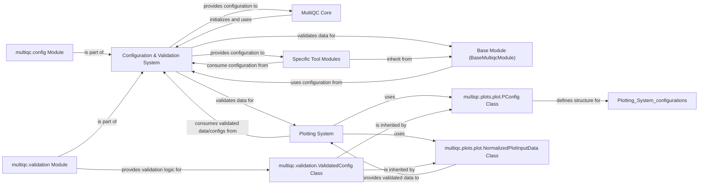

## Details

This analysis focuses on the Configuration & Validation System within the MultiQC project, examining its structure, flow, and purpose in managing application settings and ensuring data integrity.

### Configuration & Validation System [[Expand]](./Configuration_Validation_System.md)
This is the central component responsible for the entire lifecycle of application configuration. It handles loading default settings, merging user-defined YAML files, applying command-line overrides, and providing robust mechanisms for validating configuration settings and data structures against predefined schemas.

**Related Classes/Methods**:

- <a href="https://github.com/MultiQC/MultiQC/multiqc/config.py#L1-L1" target="_blank" rel="noopener noreferrer">`multiqc.config` (1:1)</a>
- <a href="https://github.com/MultiQC/MultiQC/multiqc/multiqc.py#L1-L1" target="_blank" rel="noopener noreferrer">`multiqc.config_defaults` (1:1)</a>
- <a href="https://github.com/MultiQC/MultiQC/multiqc/validation.py#L1-L1" target="_blank" rel="noopener noreferrer">`multiqc.validation` (1:1)</a>

### MultiQC Core [[Expand]](./MultiQC_Core.md)
The main application orchestrator. It initializes the application, manages the overall workflow, and relies on the Configuration & Validation System for all operational settings.

**Related Classes/Methods**:

- <a href="https://github.com/MultiQC/MultiQC/multiqc/multiqc.py#L1-L1" target="_blank" rel="noopener noreferrer">`multiqc.multiqc` (1:1)</a>

### Specific Tool Modules
These are individual modules, each designed to parse and summarize output from a specific bioinformatics tool (e.g., FastQC, Bowtie2). They access configuration settings to tailor their behavior and generate data for the report.

**Related Classes/Methods**:

- <a href="https://github.com/MultiQC/MultiQC/multiqc/modules/fastqc/fastqc.py#L1-L1" target="_blank" rel="noopener noreferrer">`multiqc.modules.fastqc.fastqc` (1:1)</a>

### Base Module (BaseMultiqcModule)
An abstract base class that provides common functionality and a standardized interface for all Specific Tool Modules. It likely includes methods for accessing and utilizing the application's configuration.

**Related Classes/Methods**:

- <a href="https://github.com/MultiQC/MultiQC/multiqc/base_module.py#L1-L1" target="_blank" rel="noopener noreferrer">`multiqc.base_module.BaseMultiqcModule` (1:1)</a>

### Plotting System
This component is responsible for generating various types of plots (e.g., bar graphs, line graphs, heatmaps) based on the processed data. It relies on validated data structures and configuration settings to ensure plots are correctly rendered.

**Related Classes/Methods**:

- <a href="https://github.com/MultiQC/MultiQC/multiqc/plots/plot.py#L1-L1" target="_blank" rel="noopener noreferrer">`multiqc.plots.plot` (1:1)</a>
- <a href="https://github.com/MultiQC/MultiQC/multiqc/plots/bargraph.py#L1-L1" target="_blank" rel="noopener noreferrer">`multiqc.plots.bargraph` (1:1)</a>
- <a href="https://github.com/MultiQC/MultiQC/multiqc/plots/linegraph.py#L1-L1" target="_blank" rel="noopener noreferrer">`multiqc.plots.linegraph` (1:1)</a>

### multiqc.config Module
A sub-component of the Configuration & Validation System specifically dedicated to loading, parsing, and merging configuration settings from various sources (defaults, YAML files, command-line arguments).

**Related Classes/Methods**:

- <a href="https://github.com/MultiQC/MultiQC/multiqc/config.py#L1-L1" target="_blank" rel="noopener noreferrer">`multiqc.config` (1:1)</a>

### multiqc.validation Module
A sub-component of the Configuration & Validation System that provides the core logic and utilities for validating data and configuration structures against defined schemas, ensuring data integrity and consistency.

**Related Classes/Methods**:

- <a href="https://github.com/MultiQC/MultiQC/multiqc/validation.py#L1-L1" target="_blank" rel="noopener noreferrer">`multiqc.validation` (1:1)</a>

### multiqc.validation.ValidatedConfig Class
A foundational class within the multiqc.validation module. It serves as the base for any configuration or data structure that requires schema-based validation, ensuring that data conforms to expected formats and types.

**Related Classes/Methods**:

- <a href="https://github.com/MultiQC/MultiQC/multiqc/validation.py#L1-L1" target="_blank" rel="noopener noreferrer">`multiqc.validation.ValidatedConfig` (1:1)</a>

### multiqc.plots.plot.PConfig Class
A base class for plot-specific configurations. It inherits from multiqc.validation.ValidatedConfig, meaning all plot configurations are inherently validated, ensuring that plotting parameters are correct before rendering.

**Related Classes/Methods**:

- <a href="https://github.com/MultiQC/MultiQC/multiqc/plots/plot.py#L93-L233" target="_blank" rel="noopener noreferrer">`multiqc.plots.plot.PConfig` (93:233)</a>

### multiqc.plots.plot.NormalizedPlotInputData Class
Represents data structures that have been normalized and are ready for plotting. This class also inherits from multiqc.validation.ValidatedConfig (indirectly via PlotType), ensuring that the data fed to the plotting system is valid and consistent.

**Related Classes/Methods**:

- <a href="https://github.com/MultiQC/MultiQC/multiqc/plots/plot.py#L309-L467" target="_blank" rel="noopener noreferrer">`multiqc.plots.plot.NormalizedPlotInputData` (309:467)</a>

### [FAQ](https://github.com/CodeBoarding/GeneratedOnBoardings/tree/main?tab=readme-ov-file#faq)