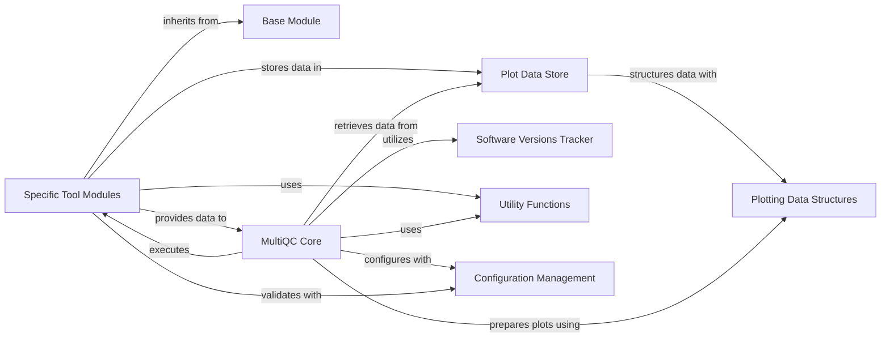

## Details

This subsystem is the backbone of MultiQC, responsible for ingesting raw bioinformatics tool outputs, extracting meaningful data, and structuring it for subsequent reporting and visualization. It encompasses the foundational framework for creating tool-specific parsers, mechanisms for efficient data storage, and utilities crucial for maintaining data integrity and tracking software versions.

### Base Module
This is the abstract base class (BaseMultiqcModule) from which all specific bioinformatics tool modules inherit. It establishes the fundamental structure and common interface for modules to discover files, parse data, and register their extracted information with the MultiQC core. It ensures a consistent approach to data processing across diverse tools.

**Related Classes/Methods**:

- <a href="https://github.com/MultiQC/MultiQC/multiqc/base_module.py#L0-L0" target="_blank" rel="noopener noreferrer">`multiqc.base_module.BaseMultiqcModule` (0:0)</a>

### Specific Tool Modules
These are concrete implementations of BaseMultiqcModule, each designed to parse the output of a particular bioinformatics tool (e.g., FastQC, Picard, Samtools). They contain the specific logic for identifying relevant files, extracting quality control metrics, and structuring this data for MultiQC's aggregation.

**Related Classes/Methods**:

- <a href="https://github.com/MultiQC/MultiQC/multiqc/multiqc.py#L0-L0" target="_blank" rel="noopener noreferrer">`multiqc.modules.*` (0:0)</a>

### MultiQC Core [[Expand]](./MultiQC_Core.md)
This is the central orchestrator of the MultiQC application. It manages the overall data processing workflow, including discovering input files, dynamically loading and executing Specific Tool Modules, aggregating the parsed data, and preparing it for the final report generation and visualization.

**Related Classes/Methods**:

- <a href="https://github.com/MultiQC/MultiQC/multiqc/multiqc.py#L0-L0" target="_blank" rel="noopener noreferrer">`multiqc.multiqc` (0:0)</a>
- <a href="https://github.com/MultiQC/MultiQC/multiqc/core/exec_modules.py#L27-L201" target="_blank" rel="noopener noreferrer">`multiqc.core.exec_modules` (27:201)</a>
- <a href="https://github.com/MultiQC/MultiQC/multiqc/core/write_results.py#L61-L134" target="_blank" rel="noopener noreferrer">`multiqc.core.write_results` (61:134)</a>

### Plot Data Store
This module is dedicated to efficiently storing and managing the aggregated data collected from various modules, specifically data that is intended for plotting. It serves as a centralized repository for processed numerical and categorical data before it is passed to the plotting system.

**Related Classes/Methods**:

- <a href="https://github.com/MultiQC/MultiQC/multiqc/core/plot_data_store.py#L0-L0" target="_blank" rel="noopener noreferrer">`multiqc.core.plot_data_store` (0:0)</a>

### Software Versions Tracker
This utility is responsible for tracking and managing the versions of the bioinformatics tools whose outputs are being processed. It plays a crucial role in reporting the software versions used, which is essential for ensuring reproducibility and aiding in debugging.

**Related Classes/Methods**:

- <a href="https://github.com/MultiQC/MultiQC/multiqc/core/software_versions.py#L0-L0" target="_blank" rel="noopener noreferrer">`multiqc.core.software_versions` (0:0)</a>

### Utility Functions
This component comprises a collection of general-purpose helper functions used across various parts of the MultiQC application, including file handling, string manipulation, data aggregation, and other common tasks that support the modules and core data processing.

**Related Classes/Methods**:

- <a href="https://github.com/MultiQC/MultiQC/multiqc/utils/util_functions.py#L0-L0" target="_blank" rel="noopener noreferrer">`multiqc.utils.util_functions` (0:0)</a>
- <a href="https://github.com/MultiQC/MultiQC/multiqc/utils/mqc_colour.py#L0-L0" target="_blank" rel="noopener noreferrer">`multiqc.utils.mqc_colour` (0:0)</a>

### Configuration Management
This component defines and validates the structure of MultiQC's configuration, ensuring that user-provided settings and internal configurations adhere to expected formats. It also includes the base class for validated configurations, ensuring data integrity throughout the system.

**Related Classes/Methods**:

- <a href="https://github.com/MultiQC/MultiQC/multiqc/utils/config_schema.py#L0-L0" target="_blank" rel="noopener noreferrer">`multiqc.utils.config_schema` (0:0)</a>
- <a href="https://github.com/MultiQC/MultiQC/multiqc/validation.py#L0-L0" target="_blank" rel="noopener noreferrer">`multiqc.validation.ValidatedConfig` (0:0)</a>

### Plotting Data Structures
This component defines the standardized data structures and configuration objects used to represent parsed data in a format suitable for visualization. It includes base classes for plot configurations and datasets, ensuring consistency in how data is prepared for various plot types (e.g., bar graphs, line graphs, heatmaps).

**Related Classes/Methods**:

- <a href="https://github.com/MultiQC/MultiQC/multiqc/plots/plot.py#L93-L233" target="_blank" rel="noopener noreferrer">`multiqc.plots.plot.PConfig` (93:233)</a>
- <a href="https://github.com/MultiQC/MultiQC/multiqc/plots/plot.py#L236-L295" target="_blank" rel="noopener noreferrer">`multiqc.plots.plot.BaseDataset` (236:295)</a>
- <a href="https://github.com/MultiQC/MultiQC/multiqc/plots/bargraph.py#L0-L0" target="_blank" rel="noopener noreferrer">`multiqc.plots.bargraph` (0:0)</a>
- <a href="https://github.com/MultiQC/MultiQC/multiqc/plots/linegraph.py#L0-L0" target="_blank" rel="noopener noreferrer">`multiqc.plots.linegraph` (0:0)</a>
- <a href="https://github.com/MultiQC/MultiQC/multiqc/plots/heatmap.py#L0-L0" target="_blank" rel="noopener noreferrer">`multiqc.plots.heatmap` (0:0)</a>
- <a href="https://github.com/MultiQC/MultiQC/multiqc/plots/scatter.py#L0-L0" target="_blank" rel="noopener noreferrer">`multiqc.plots.scatter` (0:0)</a>
- <a href="https://github.com/MultiQC/MultiQC/multiqc/plots/table_object.py#L0-L0" target="_blank" rel="noopener noreferrer">`multiqc.plots.table_object` (0:0)</a>
- <a href="https://github.com/MultiQC/MultiQC/multiqc/plots/violin.py#L0-L0" target="_blank" rel="noopener noreferrer">`multiqc.plots.violin` (0:0)</a>

### [FAQ](https://github.com/CodeBoarding/GeneratedOnBoardings/tree/main?tab=readme-ov-file#faq)