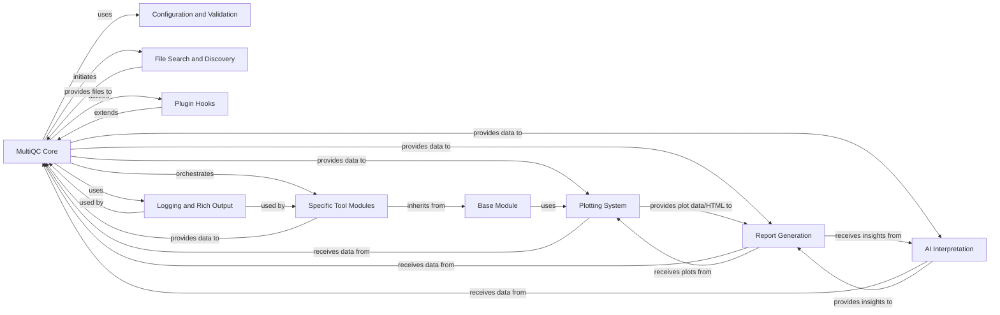

## Details

MultiQC is a bioinformatics tool that aggregates and visualizes quality control metrics from various bioinformatics tools into a single, interactive HTML report. It orchestrates data discovery, module execution, data aggregation, plotting, and report generation, with extensibility via plugins and advanced AI interpretation capabilities.

### MultiQC Core [[Expand]](./MultiQC_Core.md)
This is the central orchestrator of the MultiQC application. It handles command-line argument parsing, initializes the overall workflow, discovers input files, loads relevant analysis modules, aggregates data from these modules, and coordinates the generation of the final report. It acts as the main control flow for the entire process.

**Related Classes/Methods**:

- <a href="https://github.com/MultiQC/MultiQC/multiqc/multiqc.py#L0-L0" target="_blank" rel="noopener noreferrer">`multiqc.multiqc` (0:0)</a>
- <a href="https://github.com/MultiQC/MultiQC/multiqc/__main__.py#L0-L0" target="_blank" rel="noopener noreferrer">`multiqc.__main__` (0:0)</a>
- <a href="https://github.com/MultiQC/MultiQC/multiqc/core/update_config.py#L80-L265" target="_blank" rel="noopener noreferrer">`multiqc.core.update_config` (80:265)</a>
- <a href="https://github.com/MultiQC/MultiQC/multiqc/core/file_search.py#L12-L21" target="_blank" rel="noopener noreferrer">`multiqc.core.file_search` (12:21)</a>
- <a href="https://github.com/MultiQC/MultiQC/multiqc/core/exec_modules.py#L27-L201" target="_blank" rel="noopener noreferrer">`multiqc.core.exec_modules` (27:201)</a>
- <a href="https://github.com/MultiQC/MultiQC/multiqc/core/order_modules_and_sections.py#L10-L108" target="_blank" rel="noopener noreferrer">`multiqc.core.order_modules_and_sections` (10:108)</a>
- <a href="https://github.com/MultiQC/MultiQC/multiqc/core/write_results.py#L61-L134" target="_blank" rel="noopener noreferrer">`multiqc.core.write_results` (61:134)</a>
- <a href="https://github.com/MultiQC/MultiQC/multiqc/core/log_and_rich.py#L0-L0" target="_blank" rel="noopener noreferrer">`multiqc.core.log_and_rich` (0:0)</a>
- <a href="https://github.com/MultiQC/MultiQC/multiqc/core/plot_data_store.py#L0-L0" target="_blank" rel="noopener noreferrer">`multiqc.core.plot_data_store` (0:0)</a>
- <a href="https://github.com/MultiQC/MultiQC/multiqc/core/strict_helpers.py#L0-L0" target="_blank" rel="noopener noreferrer">`multiqc.core.strict_helpers` (0:0)</a>
- <a href="https://github.com/MultiQC/MultiQC/multiqc/core/tmp_dir.py#L0-L0" target="_blank" rel="noopener noreferrer">`multiqc.core.tmp_dir` (0:0)</a>
- <a href="https://github.com/MultiQC/MultiQC/multiqc/core/exceptions.py#L0-L0" target="_blank" rel="noopener noreferrer">`multiqc.core.exceptions` (0:0)</a>
- <a href="https://github.com/MultiQC/MultiQC/multiqc/core/plugin_hooks.py#L0-L0" target="_blank" rel="noopener noreferrer">`multiqc.core.plugin_hooks` (0:0)</a>
- <a href="https://github.com/MultiQC/MultiQC/multiqc/core/software_versions.py#L0-L0" target="_blank" rel="noopener noreferrer">`multiqc.core.software_versions` (0:0)</a>
- <a href="https://github.com/MultiQC/MultiQC/multiqc/core/version_check.py#L0-L0" target="_blank" rel="noopener noreferrer">`multiqc.core.version_check` (0:0)</a>
- <a href="https://github.com/MultiQC/MultiQC/multiqc/core/config_check.py#L0-L0" target="_blank" rel="noopener noreferrer">`multiqc.core.config_check` (0:0)</a>

### Base Module
An abstract base class that provides the foundational structure and common functionalities for all specific bioinformatics tool modules. It defines the interface and shared methods for how individual modules should find, parse, and register their data with the MultiQC Core.

**Related Classes/Methods**:

- <a href="https://github.com/MultiQC/MultiQC/multiqc/base_module.py#L0-L0" target="_blank" rel="noopener noreferrer">`multiqc.base_module.BaseMultiqcModule` (0:0)</a>

### Specific Tool Modules
A collection of specialized modules, each dedicated to parsing and extracting quality control metrics from the output files of a particular bioinformatics tool (e.g., FastQC, Picard, Samtools). Each of these modules inherits from `BaseMultiqcModule` and implements tool-specific data extraction logic.

**Related Classes/Methods**:

- <a href="https://github.com/MultiQC/MultiQC/multiqc/modules/fastqc/fastqc.py#L42-L1444" target="_blank" rel="noopener noreferrer">`multiqc.modules.fastqc.fastqc.MultiqcModule` (42:1444)</a>
- <a href="https://github.com/MultiQC/MultiQC/multiqc/modules/picard/picard.py#L59-L309" target="_blank" rel="noopener noreferrer">`multiqc.modules.picard.picard.MultiqcModule` (59:309)</a>
- <a href="https://github.com/MultiQC/MultiQC/multiqc/modules/samtools/samtools.py#L15-L167" target="_blank" rel="noopener noreferrer">`multiqc.modules.samtools.samtools.MultiqcModule` (15:167)</a>

### Plotting System
This component is responsible for generating various types of interactive data visualizations, such as bar graphs, line graphs, heatmaps, and tables. It takes processed data from the MultiQC Core and renders it into visual elements for the final report.

**Related Classes/Methods**:

- <a href="https://github.com/MultiQC/MultiQC/multiqc/plots/plot.py#L0-L0" target="_blank" rel="noopener noreferrer">`multiqc.plots.plot` (0:0)</a>
- <a href="https://github.com/MultiQC/MultiQC/multiqc/plots/bargraph.py#L0-L0" target="_blank" rel="noopener noreferrer">`multiqc.plots.bargraph` (0:0)</a>
- <a href="https://github.com/MultiQC/MultiQC/multiqc/plots/linegraph.py#L0-L0" target="_blank" rel="noopener noreferrer">`multiqc.plots.linegraph` (0:0)</a>
- <a href="https://github.com/MultiQC/MultiQC/multiqc/plots/heatmap.py#L0-L0" target="_blank" rel="noopener noreferrer">`multiqc.plots.heatmap` (0:0)</a>
- <a href="https://github.com/MultiQC/MultiQC/multiqc/plots/scatter.py#L0-L0" target="_blank" rel="noopener noreferrer">`multiqc.plots.scatter` (0:0)</a>
- <a href="https://github.com/MultiQC/MultiQC/multiqc/plots/table_object.py#L0-L0" target="_blank" rel="noopener noreferrer">`multiqc.plots.table_object` (0:0)</a>
- <a href="https://github.com/MultiQC/MultiQC/multiqc/plots/violin.py#L0-L0" target="_blank" rel="noopener noreferrer">`multiqc.plots.violin` (0:0)</a>
- <a href="https://github.com/MultiQC/MultiQC/multiqc/plots/box.py#L0-L0" target="_blank" rel="noopener noreferrer">`multiqc.plots.box` (0:0)</a>
- <a href="https://github.com/MultiQC/MultiQC/multiqc/plots/utils.py#L0-L0" target="_blank" rel="noopener noreferrer">`multiqc.plots.utils` (0:0)</a>

### AI Interpretation
This component provides an interface for integrating with external Artificial Intelligence services (e.g., AWS Bedrock, Anthropic, OpenAI). Its purpose is to enable automated interpretation and summarization of the quality control results, adding an advanced layer of analysis to the reports.

**Related Classes/Methods**:

- <a href="https://github.com/MultiQC/MultiQC/multiqc/core/ai.py#L176-L285" target="_blank" rel="noopener noreferrer">`multiqc.core.ai.Client` (176:285)</a>
- <a href="https://github.com/MultiQC/MultiQC/multiqc/core/ai.py#L386-L428" target="_blank" rel="noopener noreferrer">`multiqc.core.ai.AWSBedrockClient` (386:428)</a>
- <a href="https://github.com/MultiQC/MultiQC/multiqc/core/ai.py#L347-L383" target="_blank" rel="noopener noreferrer">`multiqc.core.ai.AnthropicClient` (347:383)</a>
- <a href="https://github.com/MultiQC/MultiQC/multiqc/core/ai.py#L288-L344" target="_blank" rel="noopener noreferrer">`multiqc.core.ai.OpenAiClient` (288:344)</a>
- <a href="https://github.com/MultiQC/MultiQC/multiqc/core/ai.py#L431-L513" target="_blank" rel="noopener noreferrer">`multiqc.core.ai.SeqeraClient` (431:513)</a>

### Report Generation
This component manages the structure and content of the final MultiQC HTML report. It uses templating to combine aggregated data, generated plots, and textual summaries into a cohesive, user-friendly, and interactive web-based report.

**Related Classes/Methods**:

- <a href="https://github.com/MultiQC/MultiQC/multiqc/report.py#L0-L0" target="_blank" rel="noopener noreferrer">`multiqc.report` (0:0)</a>
- `multiqc.templates.default.base` (0:0)
- `multiqc.templates.default.assets.js.multiqc` (0:0)
- <a href="https://github.com/MultiQC/MultiQC/multiqc/multiqc.py#L0-L0" target="_blank" rel="noopener noreferrer">`multiqc.templates.sections` (0:0)</a>
- <a href="https://github.com/MultiQC/MultiQC/multiqc/multiqc.py#L0-L0" target="_blank" rel="noopener noreferrer">`multiqc.templates.simple` (0:0)</a>

### Configuration and Validation
This component handles the loading, updating, and validation of MultiQC's configuration settings. It ensures that user-defined parameters and internal configurations are correctly applied and adhere to expected structures, preventing errors and ensuring consistent behavior.

**Related Classes/Methods**:

- <a href="https://github.com/MultiQC/MultiQC/multiqc/core/update_config.py#L80-L265" target="_blank" rel="noopener noreferrer">`multiqc.core.update_config` (80:265)</a>
- <a href="https://github.com/MultiQC/MultiQC/multiqc/core/config_check.py#L0-L0" target="_blank" rel="noopener noreferrer">`multiqc.core.config_check` (0:0)</a>
- <a href="https://github.com/MultiQC/MultiQC/multiqc/validation.py#L0-L0" target="_blank" rel="noopener noreferrer">`multiqc.validation.ValidatedConfig` (0:0)</a>

### File Search and Discovery
This component is responsible for efficiently locating and identifying relevant input files across specified directories. It uses predefined patterns and rules to discover the output files generated by various bioinformatics tools that MultiQC needs to process.

**Related Classes/Methods**:

- <a href="https://github.com/MultiQC/MultiQC/multiqc/core/file_search.py#L12-L21" target="_blank" rel="noopener noreferrer">`multiqc.core.file_search` (12:21)</a>

### Plugin Hooks
This component provides a mechanism for extending MultiQC's functionality through plugins. It defines and manages various "hooks" or points in the MultiQC workflow where external code can be injected, allowing for custom data processing, reporting, or integration with other systems.

**Related Classes/Methods**:

- <a href="https://github.com/MultiQC/MultiQC/multiqc/core/plugin_hooks.py#L0-L0" target="_blank" rel="noopener noreferrer">`multiqc.core.plugin_hooks` (0:0)</a>

### Logging and Rich Output
This component manages the logging of events, warnings, and errors throughout the MultiQC execution. It also handles the generation of rich, formatted output to the console, improving user experience by providing clear and informative feedback during the analysis process.

**Related Classes/Methods**:

- <a href="https://github.com/MultiQC/MultiQC/multiqc/core/log_and_rich.py#L0-L0" target="_blank" rel="noopener noreferrer">`multiqc.core.log_and_rich` (0:0)</a>

### [FAQ](https://github.com/CodeBoarding/GeneratedOnBoardings/tree/main?tab=readme-ov-file#faq)