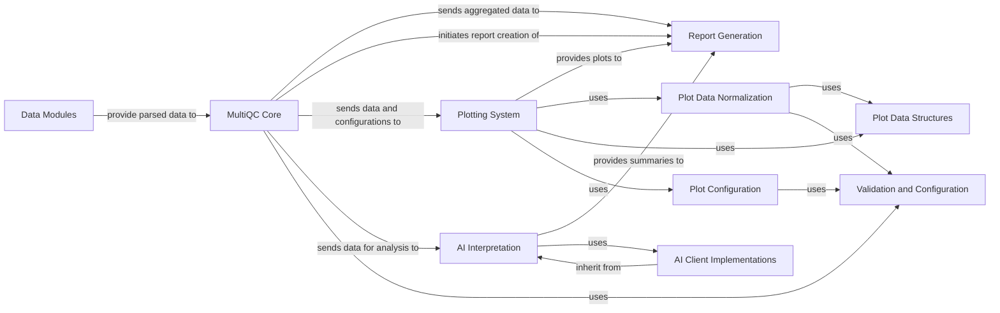

## Details

This analysis details the key components and their relationships within the MultiQC application, particularly focusing on the 'Report & Visualization Engine' subsystem. It covers data processing, interactive plotting, AI-driven interpretation, and the central orchestration by the MultiQC Core, along with supporting components for data validation, normalization, and AI service integration.

### Report Generation
This component is responsible for assembling all the processed data, generated plots, and AI-generated summaries into the final, interactive HTML report. It acts as the presentation layer, orchestrating the layout and content of the user-facing report. It utilizes templating to combine various elements into a cohesive web page.

**Related Classes/Methods**:

- <a href="https://github.com/MultiQC/MultiQC/multiqc/report.py#L1-L9999" target="_blank" rel="noopener noreferrer">`multiqc.report` (1:9999)</a>
- `multiqc.templates.default.base.html` (1:9999)
- `multiqc.templates.default.assets.js.multiqc.js` (1:9999)

### Plotting System
This component is dedicated to creating a variety of interactive data visualizations, including bar graphs, line graphs, heatmaps, scatter plots, tables, and violin plots. It takes structured data and configuration from the `MultiQC Core` and renders it into visual elements that are embedded within the final report. It provides a standardized interface for generating different plot types.

**Related Classes/Methods**:

- <a href="https://github.com/MultiQC/MultiQC/multiqc/plots/plot.py#L1-L9999" target="_blank" rel="noopener noreferrer">`multiqc.plots.plot` (1:9999)</a>
- <a href="https://github.com/MultiQC/MultiQC/multiqc/plots/plot.py#L470-L1305" target="_blank" rel="noopener noreferrer">`multiqc.plots.plot.Plot` (470:1305)</a>
- <a href="https://github.com/MultiQC/MultiQC/multiqc/plots/plot.py#L93-L233" target="_blank" rel="noopener noreferrer">`multiqc.plots.plot.PConfig` (93:233)</a>
- <a href="https://github.com/MultiQC/MultiQC/multiqc/plots/plot.py#L236-L295" target="_blank" rel="noopener noreferrer">`multiqc.plots.plot.BaseDataset` (236:295)</a>
- <a href="https://github.com/MultiQC/MultiQC/multiqc/plots/bargraph.py#L1-L9999" target="_blank" rel="noopener noreferrer">`multiqc.plots.bargraph` (1:9999)</a>
- <a href="https://github.com/MultiQC/MultiQC/multiqc/plots/linegraph.py#L1-L9999" target="_blank" rel="noopener noreferrer">`multiqc.plots.linegraph` (1:9999)</a>
- <a href="https://github.com/MultiQC/MultiQC/multiqc/plots/heatmap.py#L1-L9999" target="_blank" rel="noopener noreferrer">`multiqc.plots.heatmap` (1:9999)</a>
- <a href="https://github.com/MultiQC/MultiQC/multiqc/plots/scatter.py#L1-L9999" target="_blank" rel="noopener noreferrer">`multiqc.plots.scatter` (1:9999)</a>
- <a href="https://github.com/MultiQC/MultiQC/multiqc/plots/table_object.py#L1-L9999" target="_blank" rel="noopener noreferrer">`multiqc.plots.table_object` (1:9999)</a>
- <a href="https://github.com/MultiQC/MultiQC/multiqc/plots/violin.py#L1-L9999" target="_blank" rel="noopener noreferrer">`multiqc.plots.violin` (1:9999)</a>

### AI Interpretation
This component provides an interface and implementation for integrating with various external Artificial Intelligence services (e.g., AWS Bedrock, Anthropic, OpenAI, Seqera). Its primary purpose is to enable automated interpretation and summarization of the quality control results, adding an advanced, interpretive layer to the MultiQC reports.

**Related Classes/Methods**:

- <a href="https://github.com/MultiQC/MultiQC/multiqc/core/ai.py#L1-L9999" target="_blank" rel="noopener noreferrer">`multiqc.core.ai` (1:9999)</a>
- <a href="https://github.com/MultiQC/MultiQC/multiqc/core/ai.py#L176-L285" target="_blank" rel="noopener noreferrer">`multiqc.core.ai.Client` (176:285)</a>

### MultiQC Core [[Expand]](./MultiQC_Core.md)
This component serves as the central orchestrator of the MultiQC application. It is responsible for managing the overall workflow, including data aggregation from various analysis tools, coordinating with the plotting system, and initiating the report generation process. It acts as the backbone, ensuring all other components work together seamlessly.

**Related Classes/Methods**:

- <a href="https://github.com/MultiQC/MultiQC/multiqc/multiqc.py#L1-L9999" target="_blank" rel="noopener noreferrer">`multiqc.multiqc` (1:9999)</a>
- <a href="https://github.com/MultiQC/MultiQC/multiqc/config.py#L1-L9999" target="_blank" rel="noopener noreferrer">`multiqc.config` (1:9999)</a>
- <a href="https://github.com/MultiQC/MultiQC/multiqc/multiqc.py#L1-L9999" target="_blank" rel="noopener noreferrer">`multiqc.utils` (1:9999)</a>

### Data Modules
This component encompasses the various modules responsible for parsing and extracting data from specific bioinformatics tool outputs. Each module is specialized to handle the unique output format of a particular tool, transforming raw data into a standardized structure that can be used by other MultiQC components.

**Related Classes/Methods**:

- <a href="https://github.com/MultiQC/MultiQC/multiqc/base_module.py#L1-L9999" target="_blank" rel="noopener noreferrer">`multiqc.base_module.BaseMultiqcModule` (1:9999)</a>
- <a href="https://github.com/MultiQC/MultiQC/multiqc/multiqc.py#L1-L9999" target="_blank" rel="noopener noreferrer">`multiqc.modules` (1:9999)</a>
- <a href="https://github.com/MultiQC/MultiQC/multiqc/modules/fastqc/fastqc.py#L42-L1444" target="_blank" rel="noopener noreferrer">`multiqc.modules.fastqc.fastqc.MultiqcModule` (42:1444)</a>
- <a href="https://github.com/MultiQC/MultiQC/multiqc/modules/samtools/samtools.py#L15-L167" target="_blank" rel="noopener noreferrer">`multiqc.modules.samtools.samtools.MultiqcModule` (15:167)</a>

### Validation and Configuration
This component handles the validation of configuration settings and data structures throughout the MultiQC application. It ensures that inputs and internal data adhere to predefined schemas, preventing errors and maintaining data integrity. This component is crucial for the robustness and reliability of the system.

**Related Classes/Methods**:

- <a href="https://github.com/MultiQC/MultiQC/multiqc/validation.py#L1-L9999" target="_blank" rel="noopener noreferrer">`multiqc.validation.ValidatedConfig` (1:9999)</a>

### Plot Data Normalization
This component is responsible for normalizing plot input data to a consistent format before it is passed to the plotting system. This ensures that different plot types can consume data in a standardized manner, simplifying the plotting logic and improving reusability.

**Related Classes/Methods**:

- <a href="https://github.com/MultiQC/MultiQC/multiqc/plots/plot.py#L309-L467" target="_blank" rel="noopener noreferrer">`multiqc.plots.plot.NormalizedPlotInputData` (309:467)</a>

### Plot Data Structures
This component defines the fundamental data structures used to represent datasets for various plot types. These structures provide a common interface for organizing and accessing plot-specific data, facilitating data exchange between the `MultiQC Core` and the `Plotting System`.

**Related Classes/Methods**:

- <a href="https://github.com/MultiQC/MultiQC/multiqc/plots/plot.py#L236-L295" target="_blank" rel="noopener noreferrer">`multiqc.plots.plot.BaseDataset` (236:295)</a>

### Plot Configuration
This component defines the configuration parameters for different plot types. It allows for customization of plot appearance and behavior, providing flexibility in how data is visualized in the final report.

**Related Classes/Methods**:

- <a href="https://github.com/MultiQC/MultiQC/multiqc/plots/plot.py#L93-L233" target="_blank" rel="noopener noreferrer">`multiqc.plots.plot.PConfig` (93:233)</a>

### AI Client Implementations
This component provides concrete implementations for interacting with specific AI services. Each class within this component is responsible for handling the unique API calls and data formatting required for a particular AI provider, abstracting these details from the `AI Interpretation` component.

**Related Classes/Methods**:

- <a href="https://github.com/MultiQC/MultiQC/multiqc/core/ai.py#L386-L428" target="_blank" rel="noopener noreferrer">`multiqc.core.ai.AWSBedrockClient` (386:428)</a>
- <a href="https://github.com/MultiQC/MultiQC/multiqc/core/ai.py#L347-L383" target="_blank" rel="noopener noreferrer">`multiqc.core.ai.AnthropicClient` (347:383)</a>
- <a href="https://github.com/MultiQC/MultiQC/multiqc/core/ai.py#L288-L344" target="_blank" rel="noopener noreferrer">`multiqc.core.ai.OpenAiClient` (288:344)</a>
- <a href="https://github.com/MultiQC/MultiQC/multiqc/core/ai.py#L431-L513" target="_blank" rel="noopener noreferrer">`multiqc.core.ai.SeqeraClient` (431:513)</a>

### [FAQ](https://github.com/CodeBoarding/GeneratedOnBoardings/tree/main?tab=readme-ov-file#faq)