```mermaid
graph LR
    MultiQC_Core_Orchestration["MultiQC Core Orchestration"]
    Base_Module_Framework["Base Module Framework"]
    Specific_Tool_Modules["Specific Tool Modules"]
    Plotting_Visualization_System["Plotting & Visualization System"]
    AI_Interpretation_Service["AI Interpretation Service"]
    Report_Generation_Templating["Report Generation & Templating"]
    System_Infrastructure_Interfaces["System Infrastructure & Interfaces"]
    Configuration_Type_Management["Configuration & Type Management"]
    MultiQC_Core_Orchestration -- "Initiates and Manages" --> Specific_Tool_Modules
    MultiQC_Core_Orchestration -- "Initiates and Manages" --> Plotting_Visualization_System
    MultiQC_Core_Orchestration -- "Initiates and Manages" --> Report_Generation_Templating
    MultiQC_Core_Orchestration -- "Initiates and Manages" --> AI_Interpretation_Service
    MultiQC_Core_Orchestration -- "Uses" --> System_Infrastructure_Interfaces
    MultiQC_Core_Orchestration -- "Uses" --> Configuration_Type_Management
    Base_Module_Framework -- "Inherited by" --> Specific_Tool_Modules
    Base_Module_Framework -- "Interacts with" --> MultiQC_Core_Orchestration
    Base_Module_Framework -- "Interacts with" --> Plotting_Visualization_System
    Base_Module_Framework -- "Interacts with" --> Configuration_Type_Management
    Specific_Tool_Modules -- "Inherits from" --> Base_Module_Framework
    Specific_Tool_Modules -- "Provides data to" --> MultiQC_Core_Orchestration
    Specific_Tool_Modules -- "Uses" --> Plotting_Visualization_System
    Plotting_Visualization_System -- "Used by" --> MultiQC_Core_Orchestration
    Plotting_Visualization_System -- "Used by" --> Specific_Tool_Modules
    Plotting_Visualization_System -- "Used by" --> Report_Generation_Templating
    Plotting_Visualization_System -- "Receives data from" --> MultiQC_Core_Orchestration
    Plotting_Visualization_System -- "Receives data from" --> Specific_Tool_Modules
    AI_Interpretation_Service -- "Used by" --> MultiQC_Core_Orchestration
    Report_Generation_Templating -- "Receives data and plots from" --> MultiQC_Core_Orchestration
    Report_Generation_Templating -- "Receives data and plots from" --> Plotting_Visualization_System
    System_Infrastructure_Interfaces -- "Used by" --> MultiQC_Core_Orchestration
    System_Infrastructure_Interfaces -- "Used by" --> Plotting_Visualization_System
    System_Infrastructure_Interfaces -- "Used by" --> Report_Generation_Templating
    System_Infrastructure_Interfaces -- "Used by" --> Base_Module_Framework
    Configuration_Type_Management -- "Used by" --> MultiQC_Core_Orchestration
    Configuration_Type_Management -- "Used by" --> Base_Module_Framework
    Configuration_Type_Management -- "Used by" --> Specific_Tool_Modules
    Configuration_Type_Management -- "Used by" --> Plotting_Visualization_System
    Configuration_Type_Management -- "Used by" --> AI_Interpretation_Service
    Configuration_Type_Management -- "Used by" --> Report_Generation_Templating
    Configuration_Type_Management -- "Used by" --> System_Infrastructure_Interfaces
    click System_Infrastructure_Interfaces href "https://github.com/CodeBoarding/GeneratedOnBoardings/blob/main/MultiQC/System_Infrastructure_Interfaces.md" "Details"
```

## Details

MultiQC is an application designed to aggregate and report quality control metrics from various bioinformatics tools. Its core functionality is driven by several distinct components: MultiQC Core Orchestration, which manages the overall application flow; Base Module Framework, providing a foundational structure for tool-specific modules; Specific Tool Modules, responsible for data extraction from bioinformatics tools; Plotting & Visualization System, for interactive data presentation; AI Interpretation Service, for advanced analytical insights; Report Generation & Templating, for creating the final HTML report; System Infrastructure & Interfaces, offering cross-cutting services like logging and plugins; and Configuration & Type Management, ensuring consistent settings and data structures. These components are crucial for MultiQC's operation, enabling it to process data, generate reports, and provide valuable insights to users.

### MultiQC Core Orchestration
This is the central orchestrator of the MultiQC application. It is responsible for discovering input files, loading relevant analysis modules, aggregating data from these modules, coordinating the generation of the final report, and managing the overall application flow. It acts as the main control flow for the entire process.

**Related Classes/Methods**:

- <a href="https://github.com/MultiQC/MultiQC/multiqc/multiqc.py#L1-L1" target="_blank" rel="noopener noreferrer">`multiqc.py` (1:1)</a>
- <a href="https://github.com/MultiQC/MultiQC/multiqc/modules/cellranger/utils.py#L1-L1" target="_blank" rel="noopener noreferrer">`utils.py` (1:1)</a>
- <a href="https://github.com/MultiQC/MultiQC/multiqc/core/exec_modules.py#L1-L1" target="_blank" rel="noopener noreferrer">`exec_modules.py` (1:1)</a>
- <a href="https://github.com/MultiQC/MultiQC/multiqc/core/file_search.py#L1-L1" target="_blank" rel="noopener noreferrer">`file_search.py` (1:1)</a>
- <a href="https://github.com/MultiQC/MultiQC/multiqc/core/order_modules_and_sections.py#L1-L1" target="_blank" rel="noopener noreferrer">`order_modules_and_sections.py` (1:1)</a>
- <a href="https://github.com/MultiQC/MultiQC/multiqc/core/plot_data_store.py#L1-L1" target="_blank" rel="noopener noreferrer">`plot_data_store.py` (1:1)</a>
- <a href="https://github.com/MultiQC/MultiQC/multiqc/core/software_versions.py#L1-L1" target="_blank" rel="noopener noreferrer">`software_versions.py` (1:1)</a>
- <a href="https://github.com/MultiQC/MultiQC/multiqc/core/update_config.py#L1-L1" target="_blank" rel="noopener noreferrer">`update_config.py` (1:1)</a>
- <a href="https://github.com/MultiQC/MultiQC/multiqc/core/version_check.py#L1-L1" target="_blank" rel="noopener noreferrer">`version_check.py` (1:1)</a>
- <a href="https://github.com/MultiQC/MultiQC/multiqc/core/exceptions.py#L1-L1" target="_blank" rel="noopener noreferrer">`exceptions.py` (1:1)</a>
- <a href="https://github.com/MultiQC/MultiQC/multiqc/core/strict_helpers.py#L1-L1" target="_blank" rel="noopener noreferrer">`strict_helpers.py` (1:1)</a>
- <a href="https://github.com/MultiQC/MultiQC/multiqc/core/write_results.py#L1-L1" target="_blank" rel="noopener noreferrer">`write_results.py` (1:1)</a>

### Base Module Framework
An abstract base class (`BaseMultiqcModule`) that provides the foundational structure and common functionalities for all specific bioinformatics tool modules. It defines the interface and shared methods for how individual modules should find, parse, and register their data with the MultiQC Core.

**Related Classes/Methods**:

- `BaseMultiqcModule` (1:1)

### Specific Tool Modules
A collection of specialized modules, each dedicated to parsing and extracting quality control metrics from the output files of a particular bioinformatics tool (e.g., FastQC, Picard, Samtools). Each of these modules inherits from `BaseMultiqcModule` and implements tool-specific data extraction and processing logic.

**Related Classes/Methods**:

- <a href="https://github.com/MultiQC/MultiQC/multiqc/modules/fastqc/fastqc.py#L1-L1" target="_blank" rel="noopener noreferrer">`fastqc.py` (1:1)</a>
- <a href="https://github.com/MultiQC/MultiQC/multiqc/modules/picard/picard.py#L1-L1" target="_blank" rel="noopener noreferrer">`picard.py` (1:1)</a>

### Plotting & Visualization System
This component is responsible for generating various types of interactive data visualizations, such as bar graphs, line graphs, heatmaps, and tables. It takes processed data from the MultiQC Core and individual modules and renders it into visual elements for the final report.

**Related Classes/Methods**:

- <a href="https://github.com/MultiQC/MultiQC/multiqc/plots/plot.py#L1-L1" target="_blank" rel="noopener noreferrer">`plot.py` (1:1)</a>
- <a href="https://github.com/MultiQC/MultiQC/multiqc/plots/bargraph.py#L1-L1" target="_blank" rel="noopener noreferrer">`bargraph.py` (1:1)</a>
- <a href="https://github.com/MultiQC/MultiQC/multiqc/plots/linegraph.py#L1-L1" target="_blank" rel="noopener noreferrer">`linegraph.py` (1:1)</a>
- <a href="https://github.com/MultiQC/MultiQC/multiqc/plots/heatmap.py#L1-L1" target="_blank" rel="noopener noreferrer">`heatmap.py` (1:1)</a>
- <a href="https://github.com/MultiQC/MultiQC/multiqc/plots/scatter.py#L1-L1" target="_blank" rel="noopener noreferrer">`scatter.py` (1:1)</a>
- <a href="https://github.com/MultiQC/MultiQC/multiqc/plots/table_object.py#L1-L1" target="_blank" rel="noopener noreferrer">`table_object.py` (1:1)</a>
- <a href="https://github.com/MultiQC/MultiQC/multiqc/plots/violin.py#L1-L1" target="_blank" rel="noopener noreferrer">`violin.py` (1:1)</a>
- <a href="https://github.com/MultiQC/MultiQC/multiqc/plots/box.py#L1-L1" target="_blank" rel="noopener noreferrer">`box.py` (1:1)</a>
- <a href="https://github.com/MultiQC/MultiQC/multiqc/modules/cellranger/utils.py#L1-L1" target="_blank" rel="noopener noreferrer">`utils.py` (1:1)</a>

### AI Interpretation Service
This component provides an interface for integrating with external Artificial Intelligence services (e.g., AWS Bedrock, Anthropic, OpenAI, Seqera). Its purpose is to enable automated interpretation and summarization of the quality control results, adding an advanced layer of analysis to the reports.

**Related Classes/Methods**:

- <a href="https://github.com/MultiQC/MultiQC/multiqc/core/ai.py#L1-L1" target="_blank" rel="noopener noreferrer">`ai.py` (1:1)</a>

### Report Generation & Templating
This component manages the structure and content of the final MultiQC HTML report. It uses templating to combine aggregated data, generated plots, and textual summaries into a cohesive, user-friendly, and interactive web-based report.

**Related Classes/Methods**:

- <a href="https://github.com/MultiQC/MultiQC/multiqc/report.py#L1-L1" target="_blank" rel="noopener noreferrer">`report.py` (1:1)</a>
- `base.html` (1:1)
- <a href="https://github.com/MultiQC/MultiQC/multiqc/multiqc.py#L1-L1" target="_blank" rel="noopener noreferrer">`multiqc.js` (1:1)</a>
- `sections.py` (1:1)
- `simple.py` (1:1)

### System Infrastructure & Interfaces [[Expand]](./System_Infrastructure_Interfaces.md)
Provides foundational cross-cutting services essential for MultiQC's operation, including robust logging, temporary file management, a flexible plugin system for extensibility, and an interactive API for programmatic interaction with MultiQC.

**Related Classes/Methods**:

- <a href="https://github.com/MultiQC/MultiQC/multiqc/core/log_and_rich.py#L1-L1" target="_blank" rel="noopener noreferrer">`log_and_rich.py` (1:1)</a>
- <a href="https://github.com/MultiQC/MultiQC/multiqc/core/tmp_dir.py#L1-L1" target="_blank" rel="noopener noreferrer">`tmp_dir.py` (1:1)</a>
- <a href="https://github.com/MultiQC/MultiQC/multiqc/core/plugin_hooks.py#L1-L1" target="_blank" rel="noopener noreferrer">`plugin_hooks.py` (1:1)</a>
- <a href="https://github.com/MultiQC/MultiQC/multiqc/interactive.py#L1-L1" target="_blank" rel="noopener noreferrer">`interactive.py` (1:1)</a>

### Configuration & Type Management
This component is responsible for managing application-wide configuration settings and defining data types used throughout the MultiQC system, ensuring consistency and validation of data structures.

**Related Classes/Methods**:

- <a href="https://github.com/MultiQC/MultiQC/multiqc/config.py#L1-L1" target="_blank" rel="noopener noreferrer">`config.py` (1:1)</a>
- <a href="https://github.com/MultiQC/MultiQC/multiqc/types.py#L1-L1" target="_blank" rel="noopener noreferrer">`types.py` (1:1)</a>
- <a href="https://github.com/MultiQC/MultiQC/multiqc/validation.py#L1-L1" target="_blank" rel="noopener noreferrer">`validation.py` (1:1)</a>

### [FAQ](https://github.com/CodeBoarding/GeneratedOnBoardings/tree/main?tab=readme-ov-file#faq)