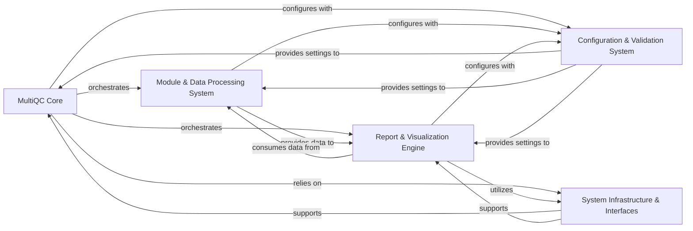

## Details

Final Abstract Components Overview for MultiQC

### MultiQC Core [[Expand]](./MultiQC_Core.md)
The central orchestrator of the MultiQC application. It handles command-line argument parsing, initializes the overall workflow, and coordinates the main stages of execution, including module execution and report generation.

**Related Classes/Methods**:

- <a href="https://github.com/MultiQC/MultiQC/multiqc/multiqc.py#L0-L0" target="_blank" rel="noopener noreferrer">`multiqc/multiqc.py` (0:0)</a>
- <a href="https://github.com/MultiQC/MultiQC/multiqc/__main__.py#L0-L0" target="_blank" rel="noopener noreferrer">`multiqc/__main__.py` (0:0)</a>
- <a href="https://github.com/MultiQC/MultiQC/multiqc/core/update_config.py#L0-L0" target="_blank" rel="noopener noreferrer">`multiqc/core/update_config.py` (0:0)</a>
- <a href="https://github.com/MultiQC/MultiQC/multiqc/core/file_search.py#L0-L0" target="_blank" rel="noopener noreferrer">`multiqc/core/file_search.py` (0:0)</a>
- <a href="https://github.com/MultiQC/MultiQC/multiqc/core/exec_modules.py#L0-L0" target="_blank" rel="noopener noreferrer">`multiqc/core/exec_modules.py` (0:0)</a>
- <a href="https://github.com/MultiQC/MultiQC/multiqc/core/order_modules_and_sections.py#L0-L0" target="_blank" rel="noopener noreferrer">`multiqc/core/order_modules_and_sections.py` (0:0)</a>
- <a href="https://github.com/MultiQC/MultiQC/multiqc/core/write_results.py#L0-L0" target="_blank" rel="noopener noreferrer">`multiqc/core/write_results.py` (0:0)</a>

### Module & Data Processing System [[Expand]](./Module_Data_Processing_System.md)
Responsible for parsing raw bioinformatics tool output, extracting relevant data, and preparing it for reporting and visualization. This includes the foundational module framework, tool-specific data parsers, and utilities for efficient data storage and software version tracking.

**Related Classes/Methods**:

- <a href="https://github.com/MultiQC/MultiQC/multiqc/base_module.py#L0-L0" target="_blank" rel="noopener noreferrer">`multiqc/base_module.py` (0:0)</a>
- `multiqc/modules/*/*.py` (0:0)
- <a href="https://github.com/MultiQC/MultiQC/multiqc/core/plot_data_store.py#L0-L0" target="_blank" rel="noopener noreferrer">`multiqc/core/plot_data_store.py` (0:0)</a>
- <a href="https://github.com/MultiQC/MultiQC/multiqc/core/software_versions.py#L0-L0" target="_blank" rel="noopener noreferrer">`multiqc/core/software_versions.py` (0:0)</a>
- <a href="https://github.com/MultiQC/MultiQC/multiqc/utils/util_functions.py#L0-L0" target="_blank" rel="noopener noreferrer">`multiqc/utils/util_functions.py` (0:0)</a>
- <a href="https://github.com/MultiQC/MultiQC/multiqc/utils/mqc_colour.py#L0-L0" target="_blank" rel="noopener noreferrer">`multiqc/utils/mqc_colour.py` (0:0)</a>
- <a href="https://github.com/MultiQC/MultiQC/multiqc/utils/config_schema.py#L0-L0" target="_blank" rel="noopener noreferrer">`multiqc/utils/config_schema.py` (0:0)</a>

### Report & Visualization Engine [[Expand]](./Report_Visualization_Engine.md)
Generates the final interactive HTML report. It integrates processed data, various interactive plots (bar graphs, line graphs, heatmaps, etc.), and AI-generated interpretive summaries into a cohesive and user-friendly web page.

**Related Classes/Methods**:

- <a href="https://github.com/MultiQC/MultiQC/multiqc/report.py#L0-L0" target="_blank" rel="noopener noreferrer">`multiqc/report.py` (0:0)</a>
- `multiqc/plots/*.py` (0:0)
- <a href="https://github.com/MultiQC/MultiQC/multiqc/core/ai.py#L0-L0" target="_blank" rel="noopener noreferrer">`multiqc/core/ai.py` (0:0)</a>

### Configuration & Validation System [[Expand]](./Configuration_Validation_System.md)
Manages all application configuration settings. It handles loading default settings, merging user-defined YAML files, and applying command-line overrides. It also provides mechanisms for validating configuration settings and data structures against predefined schemas.

**Related Classes/Methods**:

- <a href="https://github.com/MultiQC/MultiQC/multiqc/config.py#L0-L0" target="_blank" rel="noopener noreferrer">`multiqc/config.py` (0:0)</a>
- `multiqc/config_defaults.yaml` (0:0)
- <a href="https://github.com/MultiQC/MultiQC/multiqc/validation.py#L0-L0" target="_blank" rel="noopener noreferrer">`multiqc/validation.py` (0:0)</a>

### System Infrastructure & Interfaces [[Expand]](./System_Infrastructure_Interfaces.md)
Provides foundational cross-cutting services such as robust logging, temporary file management, and a flexible plugin system for extensibility. It also offers an interactive API for programmatic interaction with MultiQC, enabling use in environments like Jupyter notebooks.

**Related Classes/Methods**:

- <a href="https://github.com/MultiQC/MultiQC/multiqc/core/log_and_rich.py#L0-L0" target="_blank" rel="noopener noreferrer">`multiqc/core/log_and_rich.py` (0:0)</a>
- <a href="https://github.com/MultiQC/MultiQC/multiqc/core/tmp_dir.py#L0-L0" target="_blank" rel="noopener noreferrer">`multiqc/core/tmp_dir.py` (0:0)</a>
- <a href="https://github.com/MultiQC/MultiQC/multiqc/core/plugin_hooks.py#L0-L0" target="_blank" rel="noopener noreferrer">`multiqc/core/plugin_hooks.py` (0:0)</a>
- <a href="https://github.com/MultiQC/MultiQC/multiqc/interactive.py#L0-L0" target="_blank" rel="noopener noreferrer">`multiqc/interactive.py` (0:0)</a>

### [FAQ](https://github.com/CodeBoarding/GeneratedOnBoardings/tree/main?tab=readme-ov-file#faq)