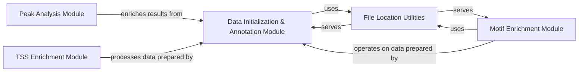

## Details

The `ATAC-seq Specific Analysis` subsystem is primarily defined by the `muon._atac.tools` module, located in `muon/_atac/tools.py`. This subsystem provides specialized tools and workflows tailored for ATAC-seq data analysis.

### Peak Analysis Module
Handles differential accessibility analysis, peak ranking, and enriching peak group data with gene information. This module is crucial for interpreting the biological significance of identified accessible chromatin regions.

**Related Classes/Methods**:

- <a href="https://github.com/KellerJordan/Muon/blob/main/muon/_atac/tools.py" target="_blank" rel="noopener noreferrer">`muon._atac.tools:rank_peaks_groups`</a>
- <a href="https://github.com/KellerJordan/Muon/blob/main/muon/_atac/tools.py" target="_blank" rel="noopener noreferrer">`muon._atac.tools:add_genes_peaks_groups`</a>

### Motif Enrichment Module
Manages the entire motif enrichment workflow, including preparing the motif scanner, parsing motif data, and extracting genomic sequences for scanning. This module identifies potential transcription factor binding sites within accessible regions.

**Related Classes/Methods**:

- <a href="https://github.com/KellerJordan/Muon/blob/main/muon/_atac/tools.py" target="_blank" rel="noopener noreferrer">`muon._atac.tools:scan_sequences`</a>
- <a href="https://github.com/KellerJordan/Muon/blob/main/muon/_atac/tools.py" target="_blank" rel="noopener noreferrer">`muon._atac.tools:_prepare_motif_scanner`</a>
- <a href="https://github.com/KellerJordan/Muon/blob/main/muon/_atac/tools.py" target="_blank" rel="noopener noreferrer">`muon._atac.tools:_parse_motif_ids`</a>
- <a href="https://github.com/KellerJordan/Muon/blob/main/muon/_atac/tools.py" target="_blank" rel="noopener noreferrer">`muon._atac.tools:_parse_motif_matrices`</a>
- <a href="https://github.com/KellerJordan/Muon/blob/main/muon/_atac/tools.py" target="_blank" rel="noopener noreferrer">`muon._atac.tools:get_sequences`</a>

### TSS Enrichment Module
Focuses on quality control and identifying active regulatory regions by calculating and analyzing Transcription Start Site (TSS) enrichment scores. This is a key metric for assessing the quality of ATAC-seq data.

**Related Classes/Methods**:

- <a href="https://github.com/KellerJordan/Muon/blob/main/muon/_atac/tools.py" target="_blank" rel="noopener noreferrer">`muon._atac.tools:tss_enrichment`</a>
- <a href="https://github.com/KellerJordan/Muon/blob/main/muon/_atac/tools.py" target="_blank" rel="noopener noreferrer">`muon._atac.tools:_tss_pileup`</a>
- <a href="https://github.com/KellerJordan/Muon/blob/main/muon/_atac/tools.py" target="_blank" rel="noopener noreferrer">`muon._atac.tools:_calculate_tss_score`</a>

### Data Initialization & Annotation Module
Responsible for setting up default input files and enriching peak data with various annotations, including gene names. This module ensures that raw data is properly prepared and contextualized for downstream analysis.

**Related Classes/Methods**:

- <a href="https://github.com/KellerJordan/Muon/blob/main/muon/_atac/tools.py" target="_blank" rel="noopener noreferrer">`muon._atac.tools:initialise_default_files`</a>
- <a href="https://github.com/KellerJordan/Muon/blob/main/muon/_atac/tools.py" target="_blank" rel="noopener noreferrer">`muon._atac.tools:add_peak_annotation`</a>
- <a href="https://github.com/KellerJordan/Muon/blob/main/muon/_atac/tools.py" target="_blank" rel="noopener noreferrer">`muon._atac.tools:add_peak_annotation_gene_names`</a>

### File Location Utilities
Provides helper functions for locating essential data files such as genome assembly files and raw fragment data. This abstracts the underlying file system details from the analytical modules.

**Related Classes/Methods**:

- <a href="https://github.com/KellerJordan/Muon/blob/main/muon/_atac/tools.py" target="_blank" rel="noopener noreferrer">`muon._atac.tools:locate_genome`</a>
- <a href="https://github.com/KellerJordan/Muon/blob/main/muon/_atac/tools.py" target="_blank" rel="noopener noreferrer">`muon._atac.tools:locate_fragments`</a>
- <a href="https://github.com/KellerJordan/Muon/blob/main/muon/_atac/tools.py" target="_blank" rel="noopener noreferrer">`muon._atac.tools:locate_file`</a>

### [FAQ](https://github.com/CodeBoarding/GeneratedOnBoardings/tree/main?tab=readme-ov-file#faq)