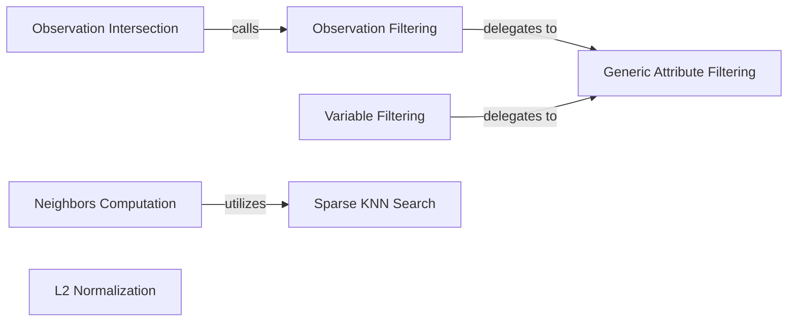

## Details

The muon._core.preproc subsystem provides a comprehensive set of preprocessing functionalities for single-cell omics data, primarily operating on AnnData and MuData objects.

### Neighbors Computation
Computes k-nearest neighbors (KNN) graphs.

**Related Classes/Methods**: _None_

### Observation Filtering
Filters observations from data objects based on criteria.

**Related Classes/Methods**: _None_

### Variable Filtering
Filters variables from data objects based on criteria.

**Related Classes/Methods**: _None_

### Observation Intersection
Identifies and retains common observations across different data modalities.

**Related Classes/Methods**: _None_

### L2 Normalization
Applies L2 normalization to data; Scales data vectors to unit length.

**Related Classes/Methods**: _None_

### Generic Attribute Filtering
A generalized internal mechanism that abstracts common filtering logic; Provides reusable filtering implementation for Observation Filtering and Variable Filtering.

**Related Classes/Methods**: _None_

### Sparse KNN Search
An optimized internal function for efficiently finding k-nearest neighbors in sparse matrix formats; Supports Neighbors Computation by providing efficient KNN search.

**Related Classes/Methods**: _None_

### [FAQ](https://github.com/CodeBoarding/GeneratedOnBoardings/tree/main?tab=readme-ov-file#faq)