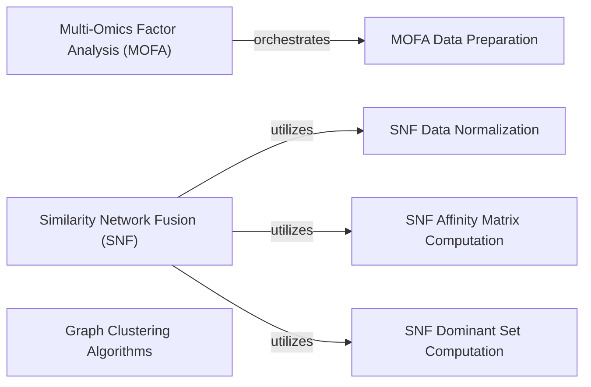

## Details

The muon project provides a suite of tools for multi-omics data analysis, with a strong focus on integration and dimensionality reduction. The core of the system revolves around the Multi-Omics Factor Analysis (MOFA) and Similarity Network Fusion (SNF) components, which are responsible for integrating diverse omics datasets. MOFA orchestrates the data preparation through MOFA Data Preparation and then leverages an external mofapy2 library for its core algorithmic execution. SNF relies on several helper components: SNF Data Normalization for data scaling, SNF Affinity Matrix Computation for similarity calculations, and SNF Dominant Set Computation for refining network structures. Additionally, the Graph Clustering Algorithms component offers community detection functionalities, including Leiden and Louvain algorithms, which are crucial for identifying distinct biological populations within the integrated data. This modular design ensures clear separation of concerns, allowing for flexible and extensible multi-omics data analysis workflows.

### Multi-Omics Factor Analysis (MOFA)
Implements the core Multi-Omics Factor Analysis algorithm, a powerful method for dimensionality reduction and integration of multi-omics datasets. It identifies latent factors that explain variation across different data modalities.

**Related Classes/Methods**:

- <a href="https://github.com/KellerJordan/Muon/blob/main/muon/_atac/plot.py#L206-L212" target="_blank" rel="noopener noreferrer">`mofa`:206-212</a>

### Similarity Network Fusion (SNF)
Provides functionalities for integrating multiple data types by constructing and fusing similarity networks. This component enables robust and comprehensive multi-omics data integration by leveraging information from various modalities.

**Related Classes/Methods**:

- <a href="https://github.com/KellerJordan/Muon/blob/main/muon/_core/tools.py#L717-L921" target="_blank" rel="noopener noreferrer">`snf`:717-921</a>

### Graph Clustering Algorithms
Encapsulates community detection functionalities, specifically implementing both the Leiden and Louvain clustering algorithms. These are typically used for identifying distinct cell populations or communities within single-cell omics data. This component centralizes the common graph-based clustering logic.

**Related Classes/Methods**:

- <a href="https://github.com/KellerJordan/Muon/blob/main/muon/_core/tools.py#L1058-L1131" target="_blank" rel="noopener noreferrer">`leiden`:1058-1131</a>
- <a href="https://github.com/KellerJordan/Muon/blob/main/muon/_core/tools.py#L1134-L1207" target="_blank" rel="noopener noreferrer">`louvain`:1134-1207</a>
- <a href="https://github.com/KellerJordan/Muon/blob/main/muon/_core/tools.py#L929-L1055" target="_blank" rel="noopener noreferrer">`_cluster`:929-1055</a>

### MOFA Data Preparation
A dedicated helper component responsible for pre-processing and structuring multi-omics data into the specific format required by the MOFA algorithm. This ensures data compatibility and optimal performance for the MOFA analysis.

**Related Classes/Methods**:

- <a href="https://github.com/KellerJordan/Muon/blob/main/muon/_core/tools.py#L52-L287" target="_blank" rel="noopener noreferrer">`_set_mofa_data_from_mudata`:52-287</a>

### SNF Data Normalization
A specialized helper component for normalizing data inputs, a critical preliminary step for the Similarity Network Fusion (SNF) algorithm to ensure consistent scaling across different data types.

**Related Classes/Methods**:

- <a href="https://github.com/KellerJordan/Muon/blob/main/muon/_core/tools.py#L845-L851" target="_blank" rel="noopener noreferrer">`_normalize`:845-851</a>

### SNF Affinity Matrix Computation
A helper component focused on computing affinity matrices, which represent the similarity between data points within each omics modality. This is a fundamental step in the SNF process.

**Related Classes/Methods**:

- <a href="https://github.com/KellerJordan/Muon/blob/main/muon/_core/tools.py#L794-L833" target="_blank" rel="noopener noreferrer">`_affinity_matrix`:794-833</a>

### SNF Dominant Set Computation
A helper component responsible for calculating dominant sets, an internal computational step within the Similarity Network Fusion (SNF) algorithm that refines the similarity networks.

**Related Classes/Methods**:

- <a href="https://github.com/KellerJordan/Muon/blob/main/muon/_core/tools.py#L853-L862" target="_blank" rel="noopener noreferrer">`_dominateset`:853-862</a>

### [FAQ](https://github.com/CodeBoarding/GeneratedOnBoardings/tree/main?tab=readme-ov-file#faq)