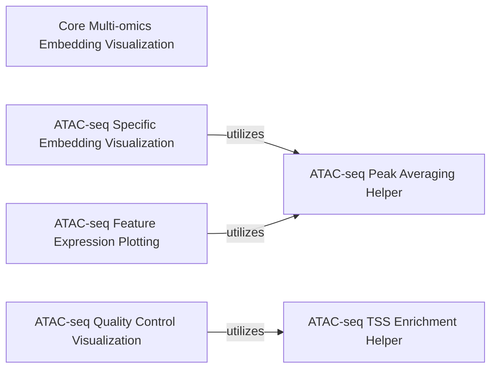

## Details

The `Visualization Layer` subsystem provides a comprehensive set of plotting and visualization capabilities for exploring multi-omics data and analysis results from the MuData object.

### Core Multi-omics Embedding Visualization
This component provides the foundational logic and public interfaces for visualizing dimensionality reduction embeddings (e.g., UMAP, MOFA) applicable to general multi-omics data stored in a MuData object. It serves as the primary entry point for generic embedding plots.

**Related Classes/Methods**:

- <a href="https://github.com/KellerJordan/Muon/blob/main/muon/_core/plot.py#L98-L266" target="_blank" rel="noopener noreferrer">`muon._core.plot.embedding`:98-266</a>
- <a href="https://github.com/KellerJordan/Muon/blob/main/muon/_core/plot.py#L269-L275" target="_blank" rel="noopener noreferrer">`muon._core.plot.mofa`:269-275</a>
- <a href="https://github.com/KellerJordan/Muon/blob/main/muon/_core/plot.py#L278-L284" target="_blank" rel="noopener noreferrer">`muon._core.plot.umap`:278-284</a>

### ATAC-seq Specific Embedding Visualization
This component handles the core visualization logic and provides specialized entry points for ATAC-seq specific dimensionality reduction embeddings (e.g., PCA, LSI, UMAP, MOFA). It adapts the general embedding plotting for ATAC-seq data nuances and offers dedicated functions for various ATAC-seq embeddings.

**Related Classes/Methods**:

- <a href="https://github.com/KellerJordan/Muon/blob/main/muon/_atac/plot.py#L133-L176" target="_blank" rel="noopener noreferrer">`muon._atac.plot.embedding`:133-176</a>
- <a href="https://github.com/KellerJordan/Muon/blob/main/muon/_atac/plot.py#L179-L185" target="_blank" rel="noopener noreferrer">`muon._atac.plot.pca`:179-185</a>
- <a href="https://github.com/KellerJordan/Muon/blob/main/muon/_atac/plot.py#L188-L194" target="_blank" rel="noopener noreferrer">`muon._atac.plot.lsi`:188-194</a>
- <a href="https://github.com/KellerJordan/Muon/blob/main/muon/_atac/plot.py#L197-L203" target="_blank" rel="noopener noreferrer">`muon._atac.plot.umap`:197-203</a>
- <a href="https://github.com/KellerJordan/Muon/blob/main/muon/_atac/plot.py#L206-L212" target="_blank" rel="noopener noreferrer">`muon._atac.plot.mofa`:206-212</a>

### ATAC-seq Feature Expression Plotting
This component is responsible for generating dot plots specifically tailored for ATAC-seq data, commonly used to visualize feature expression across different groups or conditions.

**Related Classes/Methods**:

- <a href="https://github.com/KellerJordan/Muon/blob/main/muon/_atac/plot.py#L215-L255" target="_blank" rel="noopener noreferrer">`muon._atac.plot.dotplot`:215-255</a>

### ATAC-seq Quality Control Visualization
This component focuses on visualizing Transcription Start Site (TSS) enrichment, a crucial quality control metric specific to ATAC-seq data.

**Related Classes/Methods**:

- <a href="https://github.com/KellerJordan/Muon/blob/main/muon/_atac/plot.py#L258-L299" target="_blank" rel="noopener noreferrer">`muon._atac.plot.tss_enrichment`:258-299</a>

### ATAC-seq Peak Averaging Helper
Helper component for ATAC-seq peak averaging, used for data preprocessing.

**Related Classes/Methods**:

- <a href="https://github.com/KellerJordan/Muon/blob/main/muon/_atac/plot.py#L19-L130" target="_blank" rel="noopener noreferrer">`muon._atac.plot._average_peaks`:19-130</a>

### ATAC-seq TSS Enrichment Helper
Helper component for calculating ATAC-seq Transcription Start Site (TSS) enrichment values.

**Related Classes/Methods**:

- <a href="https://github.com/KellerJordan/Muon/blob/main/muon/_atac/plot.py#L302-L313" target="_blank" rel="noopener noreferrer">`muon._atac.plot._tss_enrichment_single`:302-313</a>

### [FAQ](https://github.com/CodeBoarding/GeneratedOnBoardings/tree/main?tab=readme-ov-file#faq)