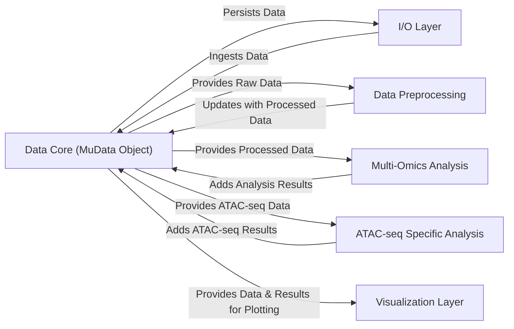

## Details

The Muon project is architected around a central `MuData Object` that serves as the core data structure for multi-omics data. This object facilitates a streamlined data flow, from ingestion and preprocessing to advanced analysis and visualization. The architecture emphasizes modularity, with distinct components handling specific aspects of the data lifecycle, ensuring clear separation of concerns and efficient data processing.

### Data Core (MuData Object)
The central data structure that encapsulates and manages multi-omics data. All data ingestion, processing, and analysis operations revolve around this core object.

**Related Classes/Methods**:

- <a href="https://github.com/KellerJordan/Muon/blob/main/muon/_core/__init__.py" target="_blank" rel="noopener noreferrer">`muon._core.MuData`</a>

### I/O Layer
Handles the reading and writing of multi-omics data from/to various file formats, transforming raw data into the MuData object structure and vice-versa.

**Related Classes/Methods**:

- <a href="https://github.com/KellerJordan/Muon/blob/main/muon/_core/io.py" target="_blank" rel="noopener noreferrer">`muon._core.io`</a>

### Data Preprocessing [[Expand]](./Data_Preprocessing.md)
Contains general-purpose functions for cleaning, normalizing, and transforming multi-omics data within the MuData object or its constituent AnnData objects.

**Related Classes/Methods**:

- <a href="https://github.com/KellerJordan/Muon/blob/main/muon/_core/preproc.py" target="_blank" rel="noopener noreferrer">`muon._core.preproc`</a>

### Multi-Omics Analysis [[Expand]](./Multi_Omics_Analysis.md)
Implements core analytical algorithms that operate on integrated multi-omics data, such as multi-factor analysis (MOFA), clustering (Leiden, Louvain), and data integration techniques (SNF).

**Related Classes/Methods**:

- <a href="https://github.com/KellerJordan/Muon/blob/main/muon/_core/tools.py" target="_blank" rel="noopener noreferrer">`muon._core.tools`</a>

### ATAC-seq Specific Analysis [[Expand]](./ATAC_seq_Specific_Analysis.md)
Provides specialized tools and workflows tailored for ATAC-seq data analysis, including peak calling, motif enrichment, and TSS enrichment.

**Related Classes/Methods**:

- <a href="https://github.com/KellerJordan/Muon/blob/main/muon/_atac/tools.py" target="_blank" rel="noopener noreferrer">`muon._atac.tools`</a>

### Visualization Layer [[Expand]](./Visualization_Layer.md)
Offers a comprehensive set of plotting and visualization capabilities for exploring multi-omics data and analysis results from the MuData object.

**Related Classes/Methods**:

- <a href="https://github.com/KellerJordan/Muon/blob/main/muon/_core/plot.py" target="_blank" rel="noopener noreferrer">`muon._core.plot`</a>
- <a href="https://github.com/KellerJordan/Muon/blob/main/muon/_atac/plot.py" target="_blank" rel="noopener noreferrer">`muon._atac.plot`</a>

### [FAQ](https://github.com/CodeBoarding/GeneratedOnBoardings/tree/main?tab=readme-ov-file#faq)