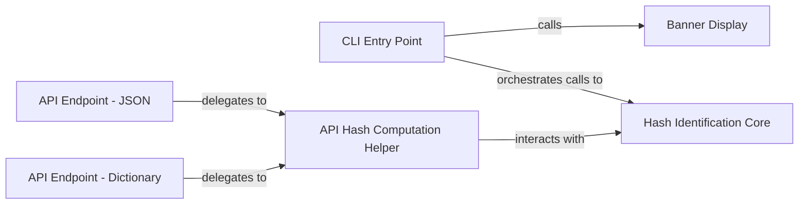

## Details

The Name-That-Hash application provides both a command-line interface (CLI) and programmatic API access for identifying hash types. The CLI Entry Point serves as the primary interface for command-line users, handling argument parsing and orchestrating the hash identification process. For programmatic access, dedicated API Endpoint - JSON and API Endpoint - Dictionary components offer structured output formats. Both API endpoints leverage the API Hash Computation Helper to standardize hash computation for API requests. At the heart of the system, the Hash Identification Core component performs the actual hash analysis, utilizing predefined patterns to identify hash types. A Banner Display component provides a welcome message for CLI users. This architecture ensures a clear separation of concerns, with distinct components for user interaction, API handling, and core hash identification logic.

### CLI Entry Point
This component is the main entry point for the command-line application. It initializes the CLI environment, displays the application's welcome banner, parses command-line arguments, and orchestrates the overall hash identification process based on user input.

**Related Classes/Methods**:

- <a href="https://github.com/bee-san/Name-That-Hash/blob/main/name_that_hash/runner.py#L33-L142" target="_blank" rel="noopener noreferrer">`name_that_hash.runner.main`:33-142</a>

### API Endpoint - JSON
This component functions as an API endpoint designed to receive requests, process input data for hash identification, and format the results into a JSON response. It is primarily used for integration with external systems or web applications requiring structured data.

**Related Classes/Methods**:

- <a href="https://github.com/bee-san/Name-That-Hash/blob/main/name_that_hash/runner.py#L156-L164" target="_blank" rel="noopener noreferrer">`name_that_hash.runner.api_return_hashes_as_json`:156-164</a>

### API Endpoint - Dictionary
Similar to the JSON API endpoint, this component provides hash identification results, but specifically as a Python dictionary. This endpoint is suitable for internal programmatic access or scenarios where a direct Python object representation is preferred over JSON.

**Related Classes/Methods**:

- <a href="https://github.com/bee-san/Name-That-Hash/blob/main/name_that_hash/runner.py#L167-L172" target="_blank" rel="noopener noreferrer">`name_that_hash.runner.api_return_hashes_as_dict`:167-172</a>

### API Hash Computation Helper
This internal utility component within the runner module acts as a common bridge between the various API endpoints and the core hash identification logic. It encapsulates the shared functionality required to compute hashes specifically for API requests, ensuring consistency and reusability.

**Related Classes/Methods**:

- <a href="https://github.com/bee-san/Name-That-Hash/blob/main/name_that_hash/runner.py#L175-L183" target="_blank" rel="noopener noreferrer">`name_that_hash.runner.compute_hashes_for_api`:175-183</a>

### Banner Display
A simple utility component responsible for generating and displaying the application's welcome banner, including its name and version information, at the start of the CLI execution.

**Related Classes/Methods**:

- <a href="https://github.com/bee-san/Name-That-Hash/blob/main/name_that_hash/runner.py#L18-L30" target="_blank" rel="noopener noreferrer">`name_that_hash.runner.banner`:18-30</a>

### Hash Identification Core
This is the central component responsible for the core logic of hash identification. It takes a hash string as input and, using a collection of predefined hash prototypes (regular expressions and modes), identifies and returns all matching hash types.

**Related Classes/Methods**:

- <a href="https://github.com/bee-san/Name-That-Hash/blob/main/name_that_hash/hash_namer.py#L4-L31" target="_blank" rel="noopener noreferrer">`name_that_hash.hash_namer.Name_That_Hash`:4-31</a>

### [FAQ](https://github.com/CodeBoarding/GeneratedOnBoardings/tree/main?tab=readme-ov-file#faq)