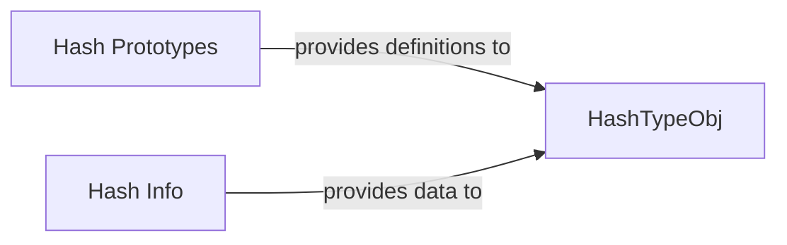

## Details

The Hash Definitions & Models subsystem defines, stores, and enriches hash type information, critical for hash identification.

### HashTypeObj
This component serves as the primary data model for a single hash type. It encapsulates all relevant attributes (e.g., name, properties, identification rules) and methods necessary for organizing and manipulating individual hash definitions, such as sorting. It is the concrete representation of a hash definition within the system.

**Related Classes/Methods**:

- <a href="https://github.com/bee-san/Name-That-Hash/blob/main/name_that_hash/HashTypeObj.py" target="_blank" rel="noopener noreferrer">`HashTypeObj`</a>

### Hash Prototypes
This component acts as the authoritative source and comprehensive collection of all predefined hash type definitions. It functions as a registry or factory, providing the foundational data from which HashTypeObj instances are created or derived. It embodies the "rules" for identifying different hash types.

**Related Classes/Methods**:

- <a href="https://github.com/bee-san/Name-That-Hash/blob/main/name_that_hash/HashTypeObj.py#L23-L24" target="_blank" rel="noopener noreferrer">`prototypes`:23-24</a>

### Hash Info
This component provides supplementary, non-essential but valuable data related to hash types, such as popularity metrics. This data is used to enhance the utility and presentation of HashTypeObj instances, potentially influencing sorting or display order in the CLI.

**Related Classes/Methods**:

- <a href="https://github.com/bee-san/Name-That-Hash/blob/main/name_that_hash/hash_info.py" target="_blank" rel="noopener noreferrer">`popular`</a>

### [FAQ](https://github.com/CodeBoarding/GeneratedOnBoardings/tree/main?tab=readme-ov-file#faq)