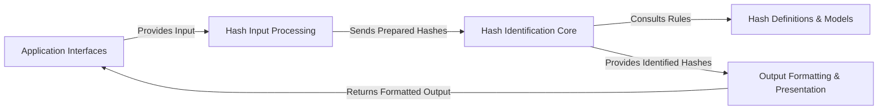

## Details

The `Name-That-Hash` project is structured around a clear data processing pipeline, starting from user interaction and culminating in formatted hash identification results. The `Application Interfaces` component serves as the primary entry point, handling both CLI and API requests. Raw hash input from these interfaces is directed to `Hash Input Processing`, which is responsible for cleaning and preparing the data. Once prepared, the data is passed to the `Hash Identification Core`, the project's central intelligence, which identifies hash types by consulting the `Hash Definitions & Models` component for rules and patterns. Finally, the identified hash data is sent to `Output Formatting & Presentation` for conversion into user-friendly formats before being returned to the `Application Interfaces` for display or API response. This modular design ensures a clear separation of concerns, facilitating maintainability and scalability.

### Application Interfaces [[Expand]](./Application_Interfaces.md)
This component encompasses both the CLI and API entry points, serving as the primary interaction layers for users and other systems. It handles initial input and presents final results.

**Related Classes/Methods**:

- <a href="https://github.com/bee-san/Name-That-Hash/blob/main/name_that_hash/runner.py" target="_blank" rel="noopener noreferrer">`name_that_hash.runner:main`</a>
- <a href="https://github.com/bee-san/Name-That-Hash/blob/main/name_that_hash/runner.py" target="_blank" rel="noopener noreferrer">`name_that_hash.runner:api_return_hashes_as_json`</a>
- <a href="https://github.com/bee-san/Name-That-Hash/blob/main/name_that_hash/runner.py" target="_blank" rel="noopener noreferrer">`name_that_hash.runner:api_return_hashes_as_dict`</a>

### Hash Input Processing
Responsible for ingesting and preparing raw hash data from various sources (e.g., single string, file). It performs initial cleaning and decoding before passing to the core identification logic.

**Related Classes/Methods**:

- <a href="https://github.com/bee-san/Name-That-Hash/blob/main/name_that_hash/check_hashes.py" target="_blank" rel="noopener noreferrer">`name_that_hash.check_hashes:HashChecker`</a>
- <a href="https://github.com/bee-san/Name-That-Hash/blob/main/name_that_hash/check_hashes.py" target="_blank" rel="noopener noreferrer">`name_that_hash.check_hashes:file_input`</a>
- <a href="https://github.com/bee-san/Name-That-Hash/blob/main/name_that_hash/check_hashes.py" target="_blank" rel="noopener noreferrer">`name_that_hash.check_hashes:single_hash`</a>

### Hash Identification Core
The central processing unit and intellectual property of the project. It contains the algorithms and logic for identifying hash types by matching against known patterns and rules.

**Related Classes/Methods**:

- <a href="https://github.com/bee-san/Name-That-Hash/blob/main/name_that_hash/hash_namer.py" target="_blank" rel="noopener noreferrer">`name_that_hash.hash_namer:Name_That_Hash.identify`</a>
- <a href="https://github.com/bee-san/Name-That-Hash/blob/main/name_that_hash/hash_namer.py" target="_blank" rel="noopener noreferrer">`name_that_hash.hash_namer:Name_That_Hash.identify_all`</a>

### Hash Definitions & Models [[Expand]](./Hash_Definitions_Models.md)
A critical data component that stores comprehensive definitions, properties, and identification rules for various hash types. It includes the `HashTypeObj` which encapsulates identified hash attributes.

**Related Classes/Methods**:

- <a href="https://github.com/bee-san/Name-That-Hash/blob/main/name_that_hash/hashes.py" target="_blank" rel="noopener noreferrer">`name_that_hash.hashes:prototypes`</a>
- <a href="https://github.com/bee-san/Name-That-Hash/blob/main/name_that_hash/HashTypeObj.py" target="_blank" rel="noopener noreferrer">`name_that_hash.HashTypeObj:HashType`</a>
- <a href="https://github.com/bee-san/Name-That-Hash/blob/main/name_that_hash/hash_info.py" target="_blank" rel="noopener noreferrer">`name_that_hash.hash_info:popular`</a>

### Output Formatting & Presentation
Handles the transformation of identified hash data into various consumable formats, including human-readable output for the CLI and structured data (e.g., JSON, dictionaries) for API responses.

**Related Classes/Methods**:

- <a href="https://github.com/bee-san/Name-That-Hash/blob/main/name_that_hash/prettifier.py" target="_blank" rel="noopener noreferrer">`name_that_hash.prettifier:Prettifier`</a>
- <a href="https://github.com/bee-san/Name-That-Hash/blob/main/name_that_hash/prettifier.py" target="_blank" rel="noopener noreferrer">`name_that_hash.prettifier:greppable_output`</a>
- <a href="https://github.com/bee-san/Name-That-Hash/blob/main/name_that_hash/prettifier.py" target="_blank" rel="noopener noreferrer">`name_that_hash.prettifier:pretty_print`</a>

### [FAQ](https://github.com/CodeBoarding/GeneratedOnBoardings/tree/main?tab=readme-ov-file#faq)