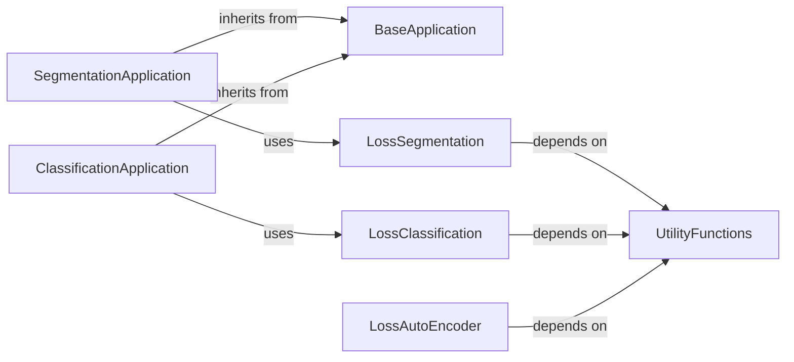

## Details

The NiftyNet application architecture is built around a core `BaseApplication` component, which establishes a standardized lifecycle for various medical imaging tasks. Specialized applications like `SegmentationApplication` and `ClassificationApplication` extend this base, tailoring the data pipeline and network integration for their specific domains. These applications interact with dedicated loss components, such as `LossSegmentation`, `LossClassification`, and `LossAutoEncoder`, which encapsulate the mathematical formulations for evaluating model performance. A shared `UtilityFunctions` component provides essential data preprocessing capabilities, which are leveraged by the loss functions to prepare data for computation. This modular design promotes reusability and clear separation of concerns, facilitating the development and extension of diverse medical imaging applications.

### BaseApplication
Defines the abstract interface and common lifecycle management (training, inference, evaluation states) for all NiftyNet applications. It ensures a standardized operational framework across different medical imaging tasks.

**Related Classes/Methods**:

- <a href="https://github.com/NifTK/NiftyNet/blob/dev/niftynet/application/base_application.py#L40-L260" target="_blank" rel="noopener noreferrer">`niftynet.application.base_application.BaseApplication`:40-260</a>

### SegmentationApplication
Specializes BaseApplication to define the high-level control flow, data pipeline setup (samplers, aggregators), and network integration specific to segmentation tasks. It orchestrates the entire process from data input to model output, including the training and inference loops.

**Related Classes/Methods**:

- <a href="https://github.com/NifTK/NiftyNet/blob/dev/niftynet/application/segmentation_application.py#L39-L497" target="_blank" rel="noopener noreferrer">`niftynet.application.segmentation_application.SegmentationApplication`:39-497</a>

### ClassificationApplication
Specializes BaseApplication to define the high-level control flow, data pipeline setup (samplers, aggregators), and network integration specific to classification tasks. It orchestrates the entire process from data input to model output, including the training and inference loops.

**Related Classes/Methods**:

- <a href="https://github.com/NifTK/NiftyNet/blob/dev/niftynet/application/classification_application.py#L39-L371" target="_blank" rel="noopener noreferrer">`niftynet.application.classification_application.ClassificationApplication`:39-371</a>

### LossSegmentation
Encapsulates the mathematical formulations for calculating the discrepancy between model predictions and ground truth for segmentation tasks. It provides various loss metrics tailored to different task types and prepares callable functions for use in the training loop.

**Related Classes/Methods**:

- <a href="https://github.com/NifTK/NiftyNet/blob/dev/niftynet/layer/loss_segmentation.py#L1-L9999" target="_blank" rel="noopener noreferrer">`niftynet.layer.loss_segmentation.LossSegmentation`:1-9999</a>

### LossClassification
Encapsulates the mathematical formulations for calculating the discrepancy between model predictions and ground truth for classification tasks. It provides various loss metrics tailored to different task types and prepares callable functions for use in the training loop.

**Related Classes/Methods**:

- <a href="https://github.com/NifTK/NiftyNet/blob/dev/niftynet/layer/loss_classification.py#L1-L9999" target="_blank" rel="noopener noreferrer">`niftynet.layer.loss_classification.LossClassification`:1-9999</a>

### LossAutoEncoder
Encapsulates the mathematical formulations for calculating the discrepancy between model predictions and ground truth for autoencoder tasks. It provides various loss metrics tailored to different task types and prepares callable functions for use in the training loop.

**Related Classes/Methods**:

- <a href="https://github.com/NifTK/NiftyNet/blob/dev/niftynet/layer/loss_autoencoder.py#L1-L9999" target="_blank" rel="noopener noreferrer">`niftynet.layer.loss_autoencoder.LossAutoEncoder`:1-9999</a>

### UtilityFunctions
Provides utility functions for data preprocessing, such as one-hot encoding of labels, required by loss functions before computation.

**Related Classes/Methods**:

- <a href="https://github.com/NifTK/NiftyNet/blob/dev/niftynet/utilities/util_common.py#L1-L9999" target="_blank" rel="noopener noreferrer">`niftynet.utilities.util_common`:1-9999</a>

### [FAQ](https://github.com/CodeBoarding/GeneratedOnBoardings/tree/main?tab=readme-ov-file#faq)