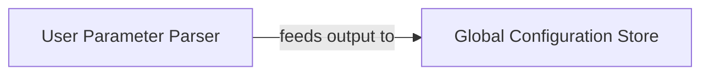

## Details

The Configuration Manager subsystem is responsible for handling all application settings, user parameters, and global configurations. Its boundaries are defined by the modules that parse, validate, and store these configurations, primarily niftynet.utilities.user_parameters_parser and niftynet.utilities.niftynet_global_config.

### User Parameter Parser
This component is the primary interface for ingesting and validating user-defined parameters. It parses configuration from command-line arguments and configuration files, ensuring data integrity and consistency before it's used by other parts of the system. It acts as the initial gatekeeper for all operational parameters.

**Related Classes/Methods**:

- <a href="https://github.com/NifTK/NiftyNet/blob/dev/niftynet/utilities/user_parameters_parser.py" target="_blank" rel="noopener noreferrer">`niftynet.utilities.user_parameters_parser`</a>
- <a href="https://github.com/NifTK/NiftyNet/blob/dev/niftynet/utilities/user_parameters_helper.py" target="_blank" rel="noopener noreferrer">`niftynet.utilities.user_parameters_helper`</a>

### Global Configuration Store
This component serves as the centralized repository for all global configuration settings. It initializes, loads, and provides access to the system's operational parameters, including data sources, model specifications, and training/inference options, making them accessible throughout the application lifecycle.

**Related Classes/Methods**:

- <a href="https://github.com/NifTK/NiftyNet/blob/dev/niftynet/utilities/niftynet_global_config.py" target="_blank" rel="noopener noreferrer">`niftynet.utilities.niftynet_global_config`</a>

### [FAQ](https://github.com/CodeBoarding/GeneratedOnBoardings/tree/main?tab=readme-ov-file#faq)