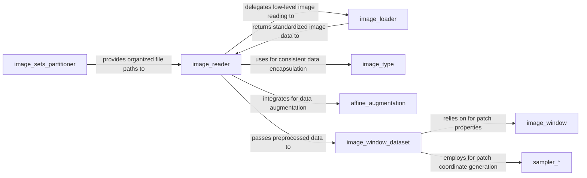

## Details

The NiftyNet input pipeline subsystem is designed to efficiently load, preprocess, and prepare medical image data for deep learning models. It orchestrates a flow from raw image file paths to network-ready data tensors. The `image_sets_partitioner` initiates the process by organizing file paths. The `image_reader` then acts as a central data ingestion hub, utilizing `image_loader` for low-level file reading and `image_type` for consistent data representation. Data augmentation is handled by `affine_augmentation`. Finally, `image_window_dataset` prepares the data into TensorFlow datasets, relying on `image_window` for patch definitions and `sampler_*` components for generating patch coordinates.

### image_sets_partitioner
Manages the initial organization and partitioning of raw image file paths into distinct datasets (e.g., training, validation, inference).

**Related Classes/Methods**:

- <a href="https://github.com/NifTK/NiftyNet/blob/dev/niftynet/io/image_sets_partitioner.py" target="_blank" rel="noopener noreferrer">`niftynet.io.image_sets_partitioner`</a>

### image_reader
Acts as the primary interface for loading image data, managing input sources, and orchestrating initial preprocessing layers. It serves as a central hub for data ingestion.

**Related Classes/Methods**:

- <a href="https://github.com/NifTK/NiftyNet/blob/dev/niftynet/io/image_reader.py" target="_blank" rel="noopener noreferrer">`niftynet.io.image_reader`</a>

### image_loader
Provides low-level functionality for reading diverse image file formats and standardizing them into a consistent `nibabel` format. It's a utility component supporting `image_reader`. It includes functions like `load_image_obj` and the `ImageAsNibabel` class for wrapping image data.

**Related Classes/Methods**:

- <a href="https://github.com/NifTK/NiftyNet/blob/dev/niftynet/io/image_loader.py" target="_blank" rel="noopener noreferrer">`niftynet.io.image_loader`</a>

### image_type
Encapsulates image data and its associated metadata, ensuring a standardized and consistent representation of image volumes throughout the pipeline. Key classes include `Loadable`, `DataFromFile`, and `SpatialImage2D`, which manage file paths, data types, and image properties.

**Related Classes/Methods**:

- <a href="https://github.com/NifTK/NiftyNet/blob/dev/niftynet/io/image_type.py" target="_blank" rel="noopener noreferrer">`niftynet.io.image_type`</a>

### affine_augmentation
Applies random affine transformations (e.g., rotation, scaling, shearing) to image data, serving as a key preprocessing step for data augmentation.

**Related Classes/Methods**:

- <a href="https://github.com/NifTK/NiftyNet/blob/dev/niftynet/layer/affine_augmentation.py" target="_blank" rel="noopener noreferrer">`niftynet.layer.affine_augmentation`</a>

### image_window
Defines and manages the properties and structure of image windows or patches that are extracted from larger images, crucial for processing large medical volumes. This component is responsible for handling spatial and temporal dimensions of image patches.

**Related Classes/Methods**:

- <a href="https://github.com/NifTK/NiftyNet/blob/dev/niftynet/engine/image_window.py" target="_blank" rel="noopener noreferrer">`niftynet.engine.image_window`</a>

### sampler_*
A set of specialized components responsible for generating spatial coordinates for extracting image patches/windows based on various sampling strategies (e.g., uniform, weighted). These samplers provide the coordinates to `image_window_dataset` for patch extraction.

**Related Classes/Methods**:

- <a href="https://github.com/NifTK/NiftyNet/blob/dev/niftynet/engine/sampler_balanced_v2.py" target="_blank" rel="noopener noreferrer">`niftynet.engine.sampler_*`</a>
- <a href="https://github.com/NifTK/NiftyNet/blob/dev/niftynet/engine/sampler_grid_v2.py" target="_blank" rel="noopener noreferrer">`niftynet.engine.sampler_*`</a>
- <a href="https://github.com/NifTK/NiftyNet/blob/dev/niftynet/engine/sampler_linear_interpolate_v2.py" target="_blank" rel="noopener noreferrer">`niftynet.engine.sampler_*`</a>
- <a href="https://github.com/NifTK/NiftyNet/blob/dev/niftynet/engine/sampler_random_vector_v2.py" target="_blank" rel="noopener noreferrer">`niftynet.engine.sampler_*`</a>
- <a href="https://github.com/NifTK/NiftyNet/blob/dev/niftynet/engine/sampler_resize_v2.py" target="_blank" rel="noopener noreferrer">`niftynet.engine.sampler_*`</a>
- <a href="https://github.com/NifTK/NiftyNet/blob/dev/niftynet/engine/sampler_uniform_v2.py" target="_blank" rel="noopener noreferrer">`niftynet.engine.sampler_*`</a>
- <a href="https://github.com/NifTK/NiftyNet/blob/dev/niftynet/engine/sampler_weighted_v2.py" target="_blank" rel="noopener noreferrer">`niftynet.engine.sampler_*`</a>

### image_window_dataset
The final stage of the input pipeline, responsible for creating a TensorFlow dataset from the preprocessed image data. It handles patch extraction, padding, and batching to produce efficient, network-ready data tensors.

**Related Classes/Methods**:

- <a href="https://github.com/NifTK/NiftyNet/blob/dev/niftynet/engine/image_window_dataset.py" target="_blank" rel="noopener noreferrer">`niftynet.engine.image_window_dataset`</a>

### [FAQ](https://github.com/CodeBoarding/GeneratedOnBoardings/tree/main?tab=readme-ov-file#faq)