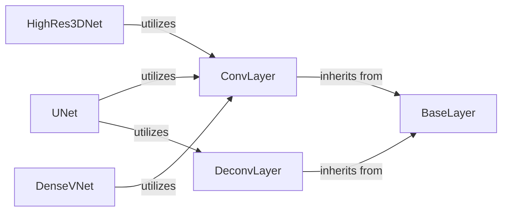

## Details

The Network Architectures (Model Zoo) subsystem in NiftyNet is responsible for providing a collection of pre-defined deep learning models and fundamental building blocks for constructing various network architectures, primarily for medical imaging tasks.

### UNet
Implements the U-Net convolutional network architecture, commonly used for biomedical image segmentation. It composes UNetBlocks, which in turn utilize fundamental layers.

**Related Classes/Methods**:

- <a href="https://github.com/NifTK/NiftyNet/blob/dev/demos/PyTorchNiftyNet/libs/model.py#L11-L257" target="_blank" rel="noopener noreferrer">`UNet`:11-257</a>

### HighRes3DNet
Implements the HighRes3DNet architecture, designed for high-resolution 3D medical image analysis. It composes HighResBlocks, which utilize fundamental layers.

**Related Classes/Methods**:

- <a href="https://github.com/NifTK/NiftyNet/blob/dev/niftynet/network/highres3dnet.py#L16-L200" target="_blank" rel="noopener noreferrer">`HighRes3DNet`:16-200</a>

### DenseVNet
Implements the DenseVNet architecture, characterized by dense connectivity patterns for efficient feature reuse. It composes DenseFeatureStackBlocks, which utilize fundamental layers.

**Related Classes/Methods**:

- <a href="https://github.com/NifTK/NiftyNet/blob/dev/niftynet/network/dense_vnet.py#L21-L303" target="_blank" rel="noopener noreferrer">`DenseVNet`:21-303</a>

### ConvLayer
A fundamental building block for N-dimensional convolution operations, serving as a core component for feature extraction in most network architectures.

**Related Classes/Methods**:

- <a href="https://github.com/NifTK/NiftyNet/blob/dev/niftynet/layer/channel_sparse_convolution.py#L22-L111" target="_blank" rel="noopener noreferrer">`ConvLayer`:22-111</a>

### DeconvLayer
A fundamental building block for N-dimensional deconvolution (transposed convolution) operations, typically used for upsampling in network architectures like U-Net.

**Related Classes/Methods**:

- <a href="https://github.com/NifTK/NiftyNet/blob/dev/niftynet/layer/channel_sparse_convolution.py#L22-L111" target="_blank" rel="noopener noreferrer">`DeconvLayer`:22-111</a>

### BaseLayer
Provides a common interface and shared functionalities for all custom layers within the framework, ensuring consistency and extensibility across different network building blocks.

**Related Classes/Methods**:

- <a href="https://github.com/NifTK/NiftyNet/blob/dev/niftynet/layer/base_layer.py#L1-L1000" target="_blank" rel="noopener noreferrer">`BaseLayer`:1-1000</a>

### [FAQ](https://github.com/CodeBoarding/GeneratedOnBoardings/tree/main?tab=readme-ov-file#faq)