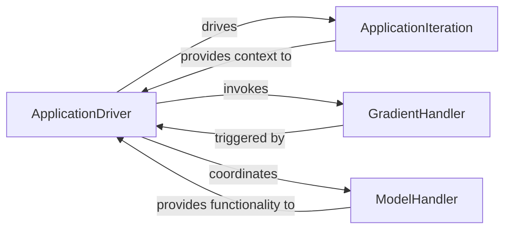

## Details

The Training/Inference Engine subsystem is the core orchestrator for executing the deep learning workflow within NiftyNet. Its boundaries encompass the components responsible for managing TensorFlow sessions, handling model checkpoints, computing gradients during training, and driving both the training and inference loops. It is central to the execution phase of any deep learning task.

### ApplicationDriver
The primary orchestrator of the deep learning process. It is responsible for setting up the TensorFlow graph, initializing the application, and managing the main training and inference loops. It ensures the correct sequence of operations for model training and evaluation.

**Related Classes/Methods**:

- <a href="https://github.com/NifTK/NiftyNet/blob/dev/niftynet/engine/application_driver.py#L39-L366" target="_blank" rel="noopener noreferrer">`ApplicationDriver`:39-366</a>

### ApplicationIteration
Manages the dynamic state of the current deep learning iteration. This includes tracking the current phase (e.g., training, validation, inference), the iteration number, and collecting output variables relevant to the current step. It also formats this information for various logging or reporting purposes.

**Related Classes/Methods**:

- <a href="https://github.com/NifTK/NiftyNet/blob/dev/niftynet/engine/application_iteration.py" target="_blank" rel="noopener noreferrer">`ApplicationIteration`</a>

### GradientHandler
Encapsulates the logic for computing gradients with respect to the model's loss and applying these gradients to update the model's parameters. It is responsible for the core optimization step during training.

**Related Classes/Methods**:

- <a href="https://github.com/NifTK/NiftyNet/blob/dev/niftynet/engine/handler_gradient.py" target="_blank" rel="noopener noreferrer">`GradientHandler`</a>

### ModelHandler
Manages the complete lifecycle of the deep learning model within the TensorFlow graph. This includes initializing model variables, saving the model's state (checkpoints) at specified intervals, and restoring a model from a previously saved state.

**Related Classes/Methods**:

- <a href="https://github.com/NifTK/NiftyNet/blob/dev/niftynet/engine/handler_model.py" target="_blank" rel="noopener noreferrer">`ModelHandler`</a>

### [FAQ](https://github.com/CodeBoarding/GeneratedOnBoardings/tree/main?tab=readme-ov-file#faq)