```mermaid
graph LR
    Configuration_Manager["Configuration Manager"]
    Data_Pipeline["Data Pipeline"]
    Network_Architectures_Model_Zoo_["Network Architectures (Model Zoo)"]
    Application_Logic_Loss_Functions["Application Logic & Loss Functions"]
    Training_Inference_Engine["Training/Inference Engine"]
    Evaluation_Module["Evaluation Module"]
    Configuration_Manager -- "configures" --> Data_Pipeline
    Configuration_Manager -- "configures" --> Application_Logic_Loss_Functions
    Data_Pipeline -- "provides batches to" --> Application_Logic_Loss_Functions
    Data_Pipeline -- "provides batches to" --> Training_Inference_Engine
    Application_Logic_Loss_Functions -- "defines task with" --> Network_Architectures_Model_Zoo_
    Application_Logic_Loss_Functions -- "provides loss to" --> Training_Inference_Engine
    Network_Architectures_Model_Zoo_ -- "outputs predictions to" --> Application_Logic_Loss_Functions
    Network_Architectures_Model_Zoo_ -- "outputs predictions to" --> Evaluation_Module
    Training_Inference_Engine -- "interacts with" --> Network_Architectures_Model_Zoo_
    Training_Inference_Engine -- "requests data from" --> Data_Pipeline
    Training_Inference_Engine -- "sends outputs to" --> Evaluation_Module
    click Configuration_Manager href "https://github.com/CodeBoarding/GeneratedOnBoardings/blob/main/NiftyNet/Configuration_Manager.md" "Details"
    click Data_Pipeline href "https://github.com/CodeBoarding/GeneratedOnBoardings/blob/main/NiftyNet/Data_Pipeline.md" "Details"
    click Network_Architectures_Model_Zoo_ href "https://github.com/CodeBoarding/GeneratedOnBoardings/blob/main/NiftyNet/Network_Architectures_Model_Zoo_.md" "Details"
    click Application_Logic_Loss_Functions href "https://github.com/CodeBoarding/GeneratedOnBoardings/blob/main/NiftyNet/Application_Logic_Loss_Functions.md" "Details"
    click Training_Inference_Engine href "https://github.com/CodeBoarding/GeneratedOnBoardings/blob/main/NiftyNet/Training_Inference_Engine.md" "Details"
```

## Details

The NiftyNet deep learning system is structured around a core set of interconnected components designed for medical image analysis. The `Configuration Manager` acts as the central hub, initializing and distributing system parameters to both the `Data Pipeline` and the `Application Logic & Loss Functions`. The `Data Pipeline` is responsible for preparing raw medical image data into network-ready batches, which it then provides to both the `Application Logic & Loss Functions` and the `Training/Inference Engine`. The `Application Logic & Loss Functions` defines the specific task, leveraging `Network Architectures (Model Zoo)` for model structures and providing task-specific loss functions to the `Training/Inference Engine`. The `Training/Inference Engine` orchestrates the entire deep learning workflow, interacting with `Network Architectures (Model Zoo)` for model execution, requesting data from the `Data Pipeline`, and sending processed outputs to the `Evaluation Module`. Finally, the `Evaluation Module` quantifies and reports model performance, providing critical insights into the system's effectiveness.

### Configuration Manager [[Expand]](./Configuration_Manager.md)
Centralized control for application settings, user parameters, and global configurations. It initializes the system's operational parameters, including data sources, model specifications, and training/inference options.

**Related Classes/Methods**:

- <a href="https://github.com/NifTK/NiftyNet/blob/dev/niftynet/utilities/user_parameters_parser.py" target="_blank" rel="noopener noreferrer">`niftynet/utilities/user_parameters_parser.py`</a>
- <a href="https://github.com/NifTK/NiftyNet/blob/dev/niftynet/utilities/niftynet_global_config.py" target="_blank" rel="noopener noreferrer">`niftynet/utilities/niftynet_global_config.py`</a>

### Data Pipeline [[Expand]](./Data_Pipeline.md)
Manages the entire data flow from raw input to network-ready batches. This includes loading, partitioning, preprocessing (normalization, augmentation, padding), and sampling (patch/window extraction and batching) of medical image data.

**Related Classes/Methods**:

- <a href="https://github.com/NifTK/NiftyNet/blob/dev/niftynet/io/image_sets_partitioner.py" target="_blank" rel="noopener noreferrer">`niftynet/io/image_sets_partitioner.py`</a>
- <a href="https://github.com/NifTK/NiftyNet/blob/dev/niftynet/io/image_reader.py" target="_blank" rel="noopener noreferrer">`niftynet/io/image_reader.py`</a>
- <a href="https://github.com/NifTK/NiftyNet/blob/dev/niftynet/layer/affine_augmentation.py" target="_blank" rel="noopener noreferrer">`niftynet/layer/affine_augmentation.py`</a>
- <a href="https://github.com/NifTK/NiftyNet/blob/dev/niftynet/engine/image_window_dataset.py" target="_blank" rel="noopener noreferrer">`niftynet/engine/image_window_dataset.py`</a>

### Network Architectures (Model Zoo) [[Expand]](./Network_Architectures_Model_Zoo_.md)
Houses a collection of pre-defined deep learning models (e.g., UNet, HighRes3DNet, DenseVNet) and fundamental building blocks (convolution, deconvolution layers). It provides reusable and pluggable network structures for various medical imaging tasks.

**Related Classes/Methods**:

- <a href="https://github.com/NifTK/NiftyNet/blob/dev/niftynet/network/unet.py" target="_blank" rel="noopener noreferrer">`niftynet/network/unet.py`</a>
- <a href="https://github.com/NifTK/NiftyNet/blob/dev/niftynet/network/highres3dnet.py" target="_blank" rel="noopener noreferrer">`niftynet/network/highres3dnet.py`</a>
- <a href="https://github.com/NifTK/NiftyNet/blob/dev/niftynet/network/dense_vnet.py" target="_blank" rel="noopener noreferrer">`niftynet/network/dense_vnet.py`</a>
- <a href="https://github.com/NifTK/NiftyNet/blob/dev/niftynet/layer/convolution.py" target="_blank" rel="noopener noreferrer">`niftynet/layer/convolution.py`</a>

### Application Logic & Loss Functions [[Expand]](./Application_Logic_Loss_Functions.md)
Defines the high-level logic for specific medical imaging tasks (e.g., segmentation, classification, GANs). It connects the data pipeline, network architectures, and incorporates appropriate loss functions to guide model training.

**Related Classes/Methods**:

- <a href="https://github.com/NifTK/NiftyNet/blob/dev/niftynet/application/segmentation_application.py" target="_blank" rel="noopener noreferrer">`niftynet/application/segmentation_application.py`</a>
- <a href="https://github.com/NifTK/NiftyNet/blob/dev/niftynet/application/classification_application.py" target="_blank" rel="noopener noreferrer">`niftynet/application/classification_application.py`</a>
- <a href="https://github.com/NifTK/NiftyNet/blob/dev/niftynet/application/base_application.py" target="_blank" rel="noopener noreferrer">`niftynet/application/base_application.py`</a>
- <a href="https://github.com/NifTK/NiftyNet/blob/dev/niftynet/layer/loss_segmentation.py" target="_blank" rel="noopener noreferrer">`niftynet/layer/loss_segmentation.py`</a>

### Training/Inference Engine [[Expand]](./Training_Inference_Engine.md)
The core orchestrator responsible for executing the deep learning workflow. It manages TensorFlow sessions, handles model checkpoints, computes gradients during training, and drives both training and inference loops.

**Related Classes/Methods**:

- <a href="https://github.com/NifTK/NiftyNet/blob/dev/niftynet/engine/application_driver.py" target="_blank" rel="noopener noreferrer">`niftynet/engine/application_driver.py`</a>
- <a href="https://github.com/NifTK/NiftyNet/blob/dev/niftynet/engine/application_iteration.py" target="_blank" rel="noopener noreferrer">`niftynet/engine/application_iteration.py`</a>
- <a href="https://github.com/NifTK/NiftyNet/blob/dev/niftynet/engine/handler_gradient.py" target="_blank" rel="noopener noreferrer">`niftynet/engine/handler_gradient.py`</a>
- <a href="https://github.com/NifTK/NiftyNet/blob/dev/niftynet/engine/handler_model.py" target="_blank" rel="noopener noreferrer">`niftynet/engine/handler_model.py`</a>

### Evaluation Module
Quantifies and reports the performance of trained models using various metrics. It processes model outputs and ground truth to provide insights into accuracy and effectiveness.

**Related Classes/Methods**:

- <a href="https://github.com/NifTK/NiftyNet/blob/dev/niftynet/evaluation/base_evaluator.py" target="_blank" rel="noopener noreferrer">`niftynet/evaluation/base_evaluator.py`</a>
- <a href="https://github.com/NifTK/NiftyNet/blob/dev/niftynet/evaluation/segmentation_evaluations.py" target="_blank" rel="noopener noreferrer">`niftynet/evaluation/segmentation_evaluations.py`</a>
- <a href="https://github.com/NifTK/NiftyNet/blob/dev/niftynet/evaluation/pairwise_measures.py" target="_blank" rel="noopener noreferrer">`niftynet/evaluation/pairwise_measures.py`</a>

### [FAQ](https://github.com/CodeBoarding/GeneratedOnBoardings/tree/main?tab=readme-ov-file#faq)