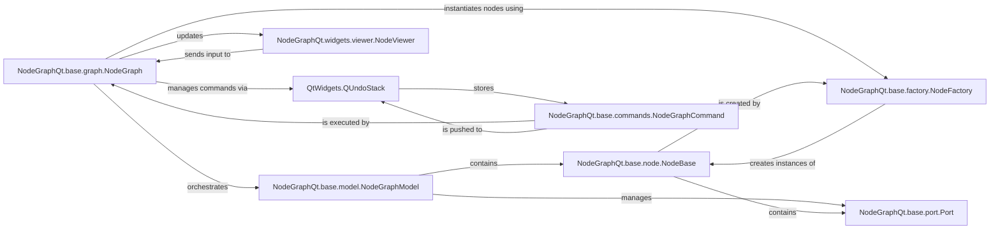

## Details

The NodeGraphQt subsystem is designed around a Model-View-Controller (MVC) pattern, with NodeGraph acting as the central controller. It orchestrates interactions between the NodeGraphModel, which manages the graph's data (nodes and connections), and the NodeViewer, responsible for visual representation and user input. NodeBase and Port define the fundamental building blocks of the graph's content. Undo/redo functionality is supported through NodeGraphCommand objects managed by QtWidgets.QUndoStack, ensuring transactional changes. The NodeFactory provides a flexible mechanism for creating new node types.

### NodeGraphQt.base.graph.NodeGraph
The central controller and orchestrator of the node graph. It manages the graph's structure, node and connection lifecycle, session persistence (save/load), undo/redo functionality, and high-level user interactions. It acts as the primary interface for manipulating the graph's data model and coordinating with its visual representation.

**Related Classes/Methods**:

- <a href="https://github.com/jchanvfx/NodeGraphQt/blob/main/NodeGraphQt/base/graph.py#L39-L2508" target="_blank" rel="noopener noreferrer">`NodeGraphQt.base.graph.NodeGraph`:39-2508</a>

### NodeGraphQt.base.model.NodeGraphModel
The data model for the node graph. It stores the actual node objects, their properties, and connection data, serving as the single source of truth for the graph's state.

**Related Classes/Methods**:

- <a href="https://github.com/jchanvfx/NodeGraphQt/blob/main/NodeGraphQt/base/model.py#L441-L612" target="_blank" rel="noopener noreferrer">`NodeGraphQt.base.model.NodeGraphModel`:441-612</a>

### NodeGraphQt.widgets.viewer.NodeViewer
The view component responsible for rendering the node graph visually. It captures user input events (e.g., mouse clicks, drag-and-drop, node movements) and translates them for the NodeGraph controller.

**Related Classes/Methods**:

- <a href="https://github.com/jchanvfx/NodeGraphQt/blob/main/NodeGraphQt/widgets/viewer.py#L30-L1649" target="_blank" rel="noopener noreferrer">`NodeGraphQt.widgets.viewer.NodeViewer`:30-1649</a>

### NodeGraphQt.base.node.NodeBase
The abstract base class for all node objects within the graph. It defines the fundamental properties (e.g., name, ID, position) and behaviors common to all nodes, serving as the building block for graph content.

**Related Classes/Methods**:

- <a href="https://github.com/jchanvfx/NodeGraphQt/blob/main/NodeGraphQt/base/node.py" target="_blank" rel="noopener noreferrer">`NodeGraphQt.base.node.NodeBase`</a>

### NodeGraphQt.base.port.Port
Represents a connection point (input or output) on a node. It facilitates the establishment and management of connections between nodes, defining how data flows through the graph.

**Related Classes/Methods**:

- <a href="https://github.com/jchanvfx/NodeGraphQt/blob/main/NodeGraphQt/base/port.py" target="_blank" rel="noopener noreferrer">`NodeGraphQt.base.port.Port`</a>

### NodeGraphQt.base.commands.NodeGraphCommand
An abstract base class for commands that modify the graph state. These commands encapsulate graph operations (e.g., node creation, deletion, connection changes), enabling transactional changes and supporting undo/redo functionality.

**Related Classes/Methods**:

- <a href="https://github.com/jchanvfx/NodeGraphQt/blob/main/NodeGraphQt/base/commands.py" target="_blank" rel="noopener noreferrer">`NodeGraphQt.base.commands.NodeGraphCommand`</a>

### QtWidgets.QUndoStack
A Qt-provided stack that stores QUndoCommand (or NodeGraphCommand instances) for managing undo and redo operations within the graph. It provides the core mechanism for transactional changes.

**Related Classes/Methods**:

### NodeGraphQt.base.factory.NodeFactory
Responsible for registering and instantiating different types of NodeBase objects. It provides a centralized and extensible mechanism for creating new nodes based on their registered types.

**Related Classes/Methods**:

- <a href="https://github.com/jchanvfx/NodeGraphQt/blob/main/NodeGraphQt/base/factory.py#L5-L102" target="_blank" rel="noopener noreferrer">`NodeGraphQt.base.factory.NodeFactory`:5-102</a>

### [FAQ](https://github.com/CodeBoarding/GeneratedOnBoardings/tree/main?tab=readme-ov-file#faq)