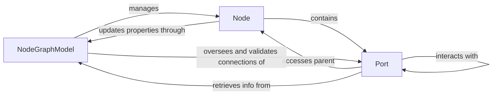

## Details

The `Graph Data Model` subsystem is a core part of the `NodeGraphQt` project, embodying the "Model" aspect of an MVC/MVVM architectural pattern. It is responsible for maintaining the abstract data structures that define the graph's state, independent of its visual representation.

### NodeGraphModel
The central repository and orchestrator for all graph data. It manages the collection of nodes and their connections, ensuring data consistency and integrity across the graph. It provides the primary API for manipulating the graph's structure and state, including adding, removing, and querying graph elements. It also handles the serialization and deserialization of the entire graph's state. This component is chosen for its fundamental role as the "Model" in the UI framework, holding the entire graph's state.

**Related Classes/Methods**:

- <a href="https://github.com/jchanvfx/NodeGraphQt/blob/main/NodeGraphQt/base/model.py#L441-L612" target="_blank" rel="noopener noreferrer">`NodeGraphQt.base.model.NodeGraphModel`:441-612</a>

### Node
Represents the abstract data for a single node within the graph. It encapsulates node-specific properties such as name, unique identifier, position (x, y), color, disabled state, and selection status. It acts as a logical container for `Port` objects, defining the node's interface for connections. This component is essential as the primary building block of the graph's structure.

**Related Classes/Methods**:

- <a href="https://github.com/jchanvfx/NodeGraphQt/blob/main/NodeGraphQt/base/node.py" target="_blank" rel="noopener noreferrer">`NodeGraphQt.base.node.Node`</a>

### Port
Represents the abstract data and connection logic for an input or output port of a node. It manages the rules and state for establishing and breaking connections with other ports, including defining accepted/rejected connection types. It also holds properties like visibility and locked status. This component is crucial for defining the connectivity points of nodes and managing connection rules.

**Related Classes/Methods**:

- <a href="https://github.com/jchanvfx/NodeGraphQt/blob/main/NodeGraphQt/base/port.py" target="_blank" rel="noopener noreferrer">`NodeGraphQt.base.port.Port`</a>

### [FAQ](https://github.com/CodeBoarding/GeneratedOnBoardings/tree/main?tab=readme-ov-file#faq)