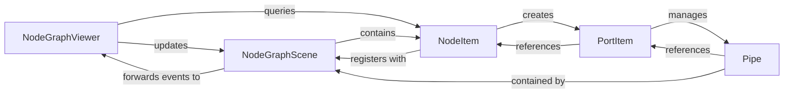

## Details

The Graph View & Rendering subsystem encompasses the core visual components responsible for displaying and interacting with the node graph.

### NodeGraphViewer
The primary interactive view component, acting as a QGraphicsView wrapper. It manages user input such as mouse events, zooming, and panning, and orchestrates the display of all graph elements. It also handles the visual logic for drawing connections (pipes).

**Related Classes/Methods**:

- <a href="https://github.com/jchanvfx/NodeGraphQt/blob/main/NodeGraphQt/widgets/viewer.py" target="_blank" rel="noopener noreferrer">`NodeGraphQt.widgets.viewer`</a>

### NodeGraphScene
The underlying QGraphicsScene container that serves as the canvas for all graphical items. It manages item rendering, collision detection, and draws the background elements like grids or dots.

**Related Classes/Methods**:

- <a href="https://github.com/jchanvfx/NodeGraphQt/blob/main/NodeGraphQt/widgets/scene.py" target="_blank" rel="noopener noreferrer">`NodeGraphQt.widgets.scene`</a>

### NodeItem
The base graphical representation of a node within the QGraphicsScene. It defines the node's visual appearance, manages the layout of its internal elements (ports, widgets), and handles basic node-specific interactions like selection and movement.

**Related Classes/Methods**:

- <a href="https://github.com/jchanvfx/NodeGraphQt/blob/main/NodeGraphQt/qgraphics/node_base.py" target="_blank" rel="noopener noreferrer">`NodeGraphQt.qgraphics.node_base`</a>

### PortItem
The graphical representation of a node's input or output port. It renders the port, manages its connection status, and provides visual feedback for potential connections.

**Related Classes/Methods**:

- <a href="https://github.com/jchanvfx/NodeGraphQt/blob/main/NodeGraphQt/qgraphics/port.py" target="_blank" rel="noopener noreferrer">`NodeGraphQt.qgraphics.port`</a>

### Pipe
The graphical representation of a connection (edge) between two PortItem instances. It is responsible for drawing the connection path and handling visual highlighting (e.g., on hover or selection).

**Related Classes/Methods**:

- <a href="https://github.com/jchanvfx/NodeGraphQt/blob/main/NodeGraphQt/qgraphics/pipe.py" target="_blank" rel="noopener noreferrer">`NodeGraphQt.qgraphics.pipe`</a>

### [FAQ](https://github.com/CodeBoarding/GeneratedOnBoardings/tree/main?tab=readme-ov-file#faq)