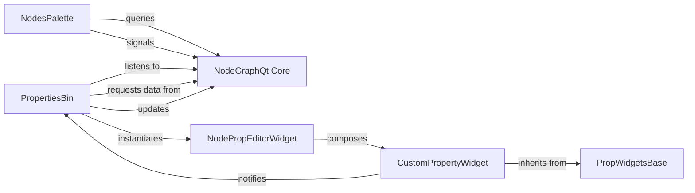

## Details

The `UI Panels & Widgets` subsystem in `NodeGraphQt` is responsible for providing auxiliary user interface elements that complement the main graph view, enabling user interaction for node creation and property editing.

### NodesPalette
Acts as a view and controller for browsing and creating new nodes. It organizes available node types, typically in a categorized or searchable list, and initiates the creation of new nodes in the graph.

**Related Classes/Methods**:

- <a href="https://github.com/jchanvfx/NodeGraphQt/blob/main/NodeGraphQt/custom_widgets/nodes_palette.py#L165-L346" target="_blank" rel="noopener noreferrer">`NodeGraphQt.custom_widgets.nodes_palette.NodesPalette`:165-346</a>

### PropertiesBin
Functions as a dynamic view and controller for displaying and editing properties of selected nodes. It adapts its content based on the properties of the currently active node.

**Related Classes/Methods**:

- <a href="https://github.com/jchanvfx/NodeGraphQt/blob/main/NodeGraphQt/custom_widgets/properties_bin/node_property_widgets.py#L609-L893" target="_blank" rel="noopener noreferrer">`NodeGraphQt.custom_widgets.properties_bin.node_property_widgets.PropertiesBin`:609-893</a>

### NodePropEditorWidget
A specific wrapper widget used by `PropertiesBin` to encapsulate and manage a single property's UI, including its label and the actual `CustomPropertyWidget`.

**Related Classes/Methods**:

- <a href="https://github.com/jchanvfx/NodeGraphQt/blob/main/NodeGraphQt/custom_widgets/properties_bin/node_property_widgets.py#L298-L606" target="_blank" rel="noopener noreferrer">`NodeGraphQt.custom_widgets.properties_bin.node_property_widgets.NodePropEditorWidget`:298-606</a>

### CustomPropertyWidget
Concrete implementations of UI controls for specific data types (e.g., string, integer, boolean, color, file path). These are the actual interactive elements where users modify property values.

**Related Classes/Methods**:

- <a href="https://github.com/jchanvfx/NodeGraphQt/blob/main/NodeGraphQt/custom_widgets/properties_bin/node_property_widgets.py#L1-L9999" target="_blank" rel="noopener noreferrer">`NodeGraphQt.custom_widgets.properties_bin.node_property_widgets.CustomPropertyWidget`:1-9999</a>

### PropWidgetsBase
An abstract base class that defines the common interface and foundational functionalities for all individual property editor widgets. It ensures consistency across various property types.

**Related Classes/Methods**:

- <a href="https://github.com/jchanvfx/NodeGraphQt/blob/main/NodeGraphQt/custom_widgets/properties_bin/prop_widgets_base.py#L1-L9999" target="_blank" rel="noopener noreferrer">`NodeGraphQt.custom_widgets.properties_bin.prop_widgets_base.PropWidgetsBase`:1-9999</a>

### NodeGraphQt Core
The core component of NodeGraphQt, responsible for managing graph data, node selection, and providing data to UI components.

**Related Classes/Methods**:

- <a href="https://github.com/jchanvfx/NodeGraphQt/blob/main/NodeGraphQt/__init__.py#L1-L9999" target="_blank" rel="noopener noreferrer">`NodeGraphQt`:1-9999</a>

### [FAQ](https://github.com/CodeBoarding/GeneratedOnBoardings/tree/main?tab=readme-ov-file#faq)