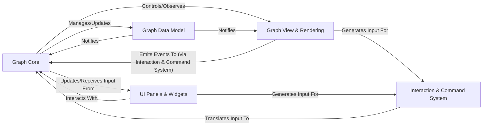

## Details

The NodeGraphQt architecture is designed as a highly modular UI framework, primarily following an MVC-like pattern to manage complex visual programming graphs. At its heart, the Graph Core acts as the central controller, orchestrating all operations and maintaining the integrity of the graph's state. This state is meticulously stored within the Graph Data Model, which serves as the single source of truth for all graph elements (nodes, ports, connections). The visual representation and user interaction are handled by the Graph View & Rendering component, which displays the graph and captures user input. Auxiliary UI Panels & Widgets provide additional interactive elements for property editing and node creation. All user interactions from the view and panels are funneled through the Interaction & Command System, which translates them into discrete commands for the Graph Core. This clear separation ensures that data logic, presentation, and user interaction are distinct, promoting extensibility, maintainability, and a responsive user experience, making it ideal for visual diagram generation that highlights data and control flow between these well-defined components.

### Graph Core [[Expand]](./Graph_Core.md)
The central controller and orchestrator of the node graph. Manages graph structure, node/connection lifecycle, session persistence, and high-level operations.

**Related Classes/Methods**:

- <a href="https://github.com/jchanvfx/NodeGraphQt/blob/main/NodeGraphQt/base/graph.py" target="_blank" rel="noopener noreferrer">`NodeGraphQt/base/graph.py`</a>
- <a href="https://github.com/jchanvfx/NodeGraphQt/blob/main/NodeGraphQt/base/commands.py" target="_blank" rel="noopener noreferrer">`NodeGraphQt/base/commands.py`</a>
- <a href="https://github.com/jchanvfx/NodeGraphQt/blob/main/NodeGraphQt/base/menu.py" target="_blank" rel="noopener noreferrer">`NodeGraphQt/base/menu.py`</a>

### Graph Data Model [[Expand]](./Graph_Data_Model.md)
Represents the abstract data structures for the graph, including nodes, ports, and connections. Holds the graph's state independent of its visual representation.

**Related Classes/Methods**:

- <a href="https://github.com/jchanvfx/NodeGraphQt/blob/main/NodeGraphQt/base/model.py" target="_blank" rel="noopener noreferrer">`NodeGraphQt/base/model.py`</a>
- <a href="https://github.com/jchanvfx/NodeGraphQt/blob/main/NodeGraphQt/base/node.py" target="_blank" rel="noopener noreferrer">`NodeGraphQt/base/node.py`</a>
- <a href="https://github.com/jchanvfx/NodeGraphQt/blob/main/NodeGraphQt/base/port.py" target="_blank" rel="noopener noreferrer">`NodeGraphQt/base/port.py`</a>

### Graph View & Rendering [[Expand]](./Graph_View_Rendering.md)
The primary graphical view component. Responsible for displaying graph elements (nodes, ports, pipes) within a QGraphicsScene and QGraphicsView, handling rendering, visual layout, and low-level user interactions.

**Related Classes/Methods**:

- <a href="https://github.com/jchanvfx/NodeGraphQt/blob/main/NodeGraphQt/widgets/viewer.py" target="_blank" rel="noopener noreferrer">`NodeGraphQt/widgets/viewer.py`</a>
- <a href="https://github.com/jchanvfx/NodeGraphQt/blob/main/NodeGraphQt/widgets/scene.py" target="_blank" rel="noopener noreferrer">`NodeGraphQt/widgets/scene.py`</a>
- <a href="https://github.com/jchanvfx/NodeGraphQt/blob/main/NodeGraphQt/qgraphics/node_base.py" target="_blank" rel="noopener noreferrer">`NodeGraphQt/qgraphics/node_base.py`</a>
- <a href="https://github.com/jchanvfx/NodeGraphQt/blob/main/NodeGraphQt/qgraphics/port.py" target="_blank" rel="noopener noreferrer">`NodeGraphQt/qgraphics/port.py`</a>
- <a href="https://github.com/jchanvfx/NodeGraphQt/blob/main/NodeGraphQt/qgraphics/pipe.py" target="_blank" rel="noopener noreferrer">`NodeGraphQt/qgraphics/pipe.py`</a>

### UI Panels & Widgets [[Expand]](./UI_Panels_Widgets.md)
Auxiliary user interface elements that complement the main graph view, such as the Properties Bin for editing node properties and the Node Palette for creating new nodes.

**Related Classes/Methods**:

- <a href="https://github.com/jchanvfx/NodeGraphQt/blob/main/NodeGraphQt/custom_widgets/properties_bin/node_property_widgets.py" target="_blank" rel="noopener noreferrer">`NodeGraphQt/custom_widgets/properties_bin/node_property_widgets.py`</a>
- <a href="https://github.com/jchanvfx/NodeGraphQt/blob/main/NodeGraphQt/custom_widgets/properties_bin/prop_widgets_base.py" target="_blank" rel="noopener noreferrer">`NodeGraphQt/custom_widgets/properties_bin/prop_widgets_base.py`</a>
- <a href="https://github.com/jchanvfx/NodeGraphQt/blob/main/NodeGraphQt/custom_widgets/nodes_palette.py" target="_blank" rel="noopener noreferrer">`NodeGraphQt/custom_widgets/nodes_palette.py`</a>

### Interaction & Command System
Handles user input, translates it into actionable commands, and manages the execution and undo/redo of these commands, bridging raw user input with the Graph Core's operations.

**Related Classes/Methods**:

- <a href="https://github.com/jchanvfx/NodeGraphQt/blob/main/NodeGraphQt/widgets/actions.py" target="_blank" rel="noopener noreferrer">`NodeGraphQt/widgets/actions.py`</a>
- <a href="https://github.com/jchanvfx/NodeGraphQt/blob/main/NodeGraphQt/widgets/viewer.py" target="_blank" rel="noopener noreferrer">`NodeGraphQt/widgets/viewer.py`</a>
- <a href="https://github.com/jchanvfx/NodeGraphQt/blob/main/NodeGraphQt/widgets/scene.py" target="_blank" rel="noopener noreferrer">`NodeGraphQt/widgets/scene.py`</a>

### [FAQ](https://github.com/CodeBoarding/GeneratedOnBoardings/tree/main?tab=readme-ov-file#faq)