```mermaid
graph LR
    CLI_Entry_Point["CLI Entry Point"]
    API_Entry_Point["API Entry Point"]
    CLI_Pipeline_Orchestrator["CLI Pipeline Orchestrator"]
    Exception_Handling_Wrapper["Exception Handling Wrapper"]
    Core_OCR_Pipeline["Core OCR Pipeline"]
    CLI_Entry_Point -- "delegates execution to" --> CLI_Pipeline_Orchestrator
    API_Entry_Point -- "delegates execution to" --> Core_OCR_Pipeline
    CLI_Pipeline_Orchestrator -- "delegates execution to" --> Exception_Handling_Wrapper
    Exception_Handling_Wrapper -- "executes and protects" --> Core_OCR_Pipeline
    Core_OCR_Pipeline -- "is executed by" --> API_Entry_Point
    Core_OCR_Pipeline -- "is executed by" --> Exception_Handling_Wrapper
```

## Component Details

This subsystem serves as the primary user-facing layer of OCRmyPDF, handling all initial interactions, whether through the command-line interface (CLI) or a programmatic API. It is responsible for parsing inputs, validating them, and orchestrating the initiation of the OCR processing workflow.

### CLI Entry Point
This component is the primary interface for users interacting with OCRmyPDF via the command line. It is responsible for parsing command-line arguments, validating initial inputs, and setting up the environment for the OCR processing workflow. It acts as the initial gateway for all terminal-based user interactions.

**Related Classes/Methods**:

- <a href="https://github.com/ocrmypdf/OCRmyPDF/blob/master/src/ocrmypdf/cli.py#L1-L1" target="_blank" rel="noopener noreferrer">`ocrmypdf.cli` (1:1)</a>
- <a href="https://github.com/ocrmypdf/OCRmyPDF/blob/master/src/ocrmypdf/__main__.py#L1-L1" target="_blank" rel="noopener noreferrer">`ocrmypdf.__main__` (1:1)</a>

### API Entry Point
This component provides a programmatic interface, allowing other Python applications or scripts to integrate and utilize OCRmyPDF's functionalities. It handles API calls, validates the provided inputs, and directly initiates the core OCR processing pipelines.

**Related Classes/Methods**:

- <a href="https://github.com/ocrmypdf/OCRmyPDF/blob/master/src/ocrmypdf/api.py#L1-L1" target="_blank" rel="noopener noreferrer">`ocrmypdf.api` (1:1)</a>

### CLI Pipeline Orchestrator
This component acts as an intermediary specifically for the command-line execution flow. Its main responsibility is to prepare the necessary command-line options and the plugin manager, then delegate the execution to an exception-handling wrapper. This ensures that the core OCR process, when initiated from the CLI, is always run within a controlled and error-resilient environment.

**Related Classes/Methods**:

- <a href="https://github.com/ocrmypdf/OCRmyPDF/blob/master/src/ocrmypdf/_pipelines/ocr.py#L1-L1" target="_blank" rel="noopener noreferrer">`ocrmypdf._pipelines.ocr` (1:1)</a>

### Exception Handling Wrapper
This component is critical for the application's stability and user experience, particularly for CLI operations. It acts as a protective wrapper around the core OCR pipeline, catching various types of exceptions (e.g., KeyboardInterrupt, ExitCodeException, PIL.Image.DecompressionBombError, process pool errors). It translates these exceptions into user-friendly error messages printed to stderr and ensures the program exits with appropriate non-zero exit codes, facilitating robust scripting and automation.

**Related Classes/Methods**:

- <a href="https://github.com/ocrmypdf/OCRmyPDF/blob/master/src/ocrmypdf/_pipelines/_common.py#L1-L1" target="_blank" rel="noopener noreferrer">`ocrmypdf._pipelines._common` (1:1)</a>

### Core OCR Pipeline
This component encapsulates the core functionality of OCRmyPDF, responsible for performing the actual OCR processing on PDF documents. It takes the prepared options and plugin manager to execute tasks such as image preprocessing, text recognition, and PDF manipulation. It is the functional heart of the application, performing the primary value-add operation.

**Related Classes/Methods**:

- <a href="https://github.com/ocrmypdf/OCRmyPDF/blob/master/src/ocrmypdf/_pipelines/ocr.py#L1-L1" target="_blank" rel="noopener noreferrer">`ocrmypdf._pipelines.ocr` (1:1)</a>
- <a href="https://github.com/ocrmypdf/OCRmyPDF/blob/master/src/ocrmypdf/_pipeline.py#L1-L1" target="_blank" rel="noopener noreferrer">`ocrmypdf._pipeline` (1:1)</a>

### [FAQ](https://github.com/CodeBoarding/GeneratedOnBoardings/tree/main?tab=readme-ov-file#faq)