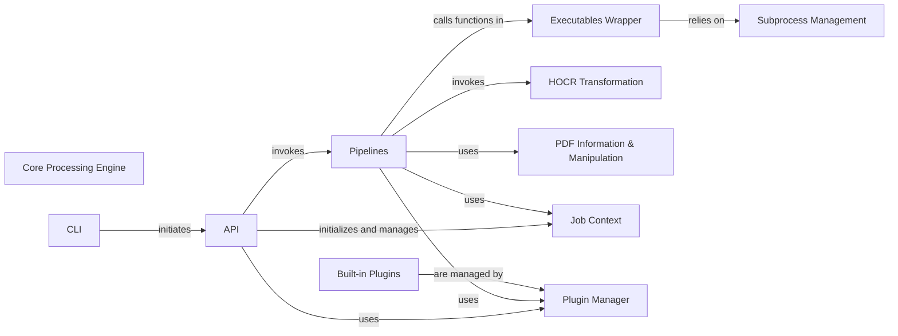

## Component Details

This analysis focuses on the core components of `OCRmyPDF`, detailing their structure, flow, and purpose. The selection of these components is based on their fundamental role in orchestrating the OCR workflow, handling external dependencies, managing data, and providing extensibility.

### Core Processing Engine
This is the central orchestrator of the OCR workflow. It manages the sequence of operations including input preparation, OCR execution, HOCR generation, transformation of HOCR into a searchable text layer, and final PDF assembly and optimization. It coordinates various sub-processes to achieve the final OCR'd PDF.

**Related Classes/Methods**:

- <a href="https://github.com/ocrmypdf/OCRmyPDF/blob/master/src/ocrmypdf/api.py#L230-L379" target="_blank" rel="noopener noreferrer">`ocrmypdf.api:ocr` (230:379)</a>
- <a href="https://github.com/ocrmypdf/OCRmyPDF/blob/master/src/ocrmypdf/_pipeline.py#L0-L0" target="_blank" rel="noopener noreferrer">`ocrmypdf._pipeline:run_pipeline` (0:0)</a>

### CLI
The command-line interface for OCRmyPDF. It parses user arguments, validates inputs, and initiates the main OCR process by calling the API component.

**Related Classes/Methods**:

- <a href="https://github.com/ocrmypdf/OCRmyPDF/blob/master/src/ocrmypdf/cli.py#L0-L0" target="_blank" rel="noopener noreferrer">`ocrmypdf.cli` (0:0)</a>
- <a href="https://github.com/ocrmypdf/OCRmyPDF/blob/master/src/ocrmypdf/__main__.py#L0-L0" target="_blank" rel="noopener noreferrer">`ocrmypdf.__main__` (0:0)</a>

### API
Provides a programmatic interface for OCRmyPDF, allowing other Python applications to use its functionality. It serves as the main entry point for the core OCR logic and orchestrates the execution of different OCR pipelines.

**Related Classes/Methods**:

- <a href="https://github.com/ocrmypdf/OCRmyPDF/blob/master/src/ocrmypdf/api.py#L0-L0" target="_blank" rel="noopener noreferrer">`ocrmypdf.api` (0:0)</a>

### Pipelines
Defines and orchestrates the sequence of steps involved in the OCR process (e.g., converting PDF pages to images, performing OCR, embedding text). These are the high-level workflows.

**Related Classes/Methods**:

- `ocrmypdf._pipelines` (0:0)
- <a href="https://github.com/ocrmypdf/OCRmyPDF/blob/master/src/ocrmypdf/_pipelines/_common.py#L0-L0" target="_blank" rel="noopener noreferrer">`ocrmypdf._pipelines._common` (0:0)</a>
- <a href="https://github.com/ocrmypdf/OCRmyPDF/blob/master/src/ocrmypdf/_pipelines/ocr.py#L0-L0" target="_blank" rel="noopener noreferrer">`ocrmypdf._pipelines.ocr` (0:0)</a>
- <a href="https://github.com/ocrmypdf/OCRmyPDF/blob/master/src/ocrmypdf/_pipelines/pdf_to_hocr.py#L0-L0" target="_blank" rel="noopener noreferrer">`ocrmypdf._pipelines.pdf_to_hocr` (0:0)</a>
- <a href="https://github.com/ocrmypdf/OCRmyPDF/blob/master/src/ocrmypdf/_pipelines/hocr_to_ocr_pdf.py#L0-L0" target="_blank" rel="noopener noreferrer">`ocrmypdf._pipelines.hocr_to_ocr_pdf` (0:0)</a>
- <a href="https://github.com/ocrmypdf/OCRmyPDF/blob/master/src/ocrmypdf/_pipeline.py#L0-L0" target="_blank" rel="noopener noreferrer">`ocrmypdf._pipeline` (0:0)</a>

### Executables Wrapper
Provides Python wrappers for external command-line tools like Tesseract (OCR engine), Ghostscript (PDF processing), and other image utilities. It handles the execution of these external programs and their input/output.

**Related Classes/Methods**:

- <a href="https://github.com/ocrmypdf/OCRmyPDF/blob/master/src/ocrmypdf/_exec/ghostscript.py#L0-L0" target="_blank" rel="noopener noreferrer">`ocrmypdf._exec.ghostscript` (0:0)</a>
- <a href="https://github.com/ocrmypdf/OCRmyPDF/blob/master/src/ocrmypdf/_exec/tesseract.py#L0-L0" target="_blank" rel="noopener noreferrer">`ocrmypdf._exec.tesseract` (0:0)</a>
- <a href="https://github.com/ocrmypdf/OCRmyPDF/blob/master/src/ocrmypdf/_exec/jbig2enc.py#L0-L0" target="_blank" rel="noopener noreferrer">`ocrmypdf._exec.jbig2enc` (0:0)</a>
- <a href="https://github.com/ocrmypdf/OCRmyPDF/blob/master/src/ocrmypdf/_exec/pngquant.py#L0-L0" target="_blank" rel="noopener noreferrer">`ocrmypdf._exec.pngquant` (0:0)</a>
- <a href="https://github.com/ocrmypdf/OCRmyPDF/blob/master/src/ocrmypdf/_exec/unpaper.py#L0-L0" target="_blank" rel="noopener noreferrer">`ocrmypdf._exec.unpaper` (0:0)</a>

### HOCR Transformation
A dedicated module for processing HOCR (HTML-based OCR output) and embedding it as an invisible text layer into a PDF. This involves parsing HOCR, rendering text, and handling font embedding.

**Related Classes/Methods**:

- `ocrmypdf.hocrtransform` (0:0)
- <a href="https://github.com/ocrmypdf/OCRmyPDF/blob/master/src/ocrmypdf/hocrtransform/_hocr.py#L0-L0" target="_blank" rel="noopener noreferrer">`ocrmypdf.hocrtransform._hocr` (0:0)</a>
- <a href="https://github.com/ocrmypdf/OCRmyPDF/blob/master/src/ocrmypdf/hocrtransform/_font.py#L0-L0" target="_blank" rel="noopener noreferrer">`ocrmypdf.hocrtransform._font` (0:0)</a>

### PDF Information & Manipulation
Provides utilities for extracting information from PDFs (e.g., page count, metadata, layout) and performing basic manipulations.

**Related Classes/Methods**:

- <a href="https://github.com/ocrmypdf/OCRmyPDF/blob/master/src/ocrmypdf/pdfinfo/info.py#L0-L0" target="_blank" rel="noopener noreferrer">`ocrmypdf.pdfinfo.info` (0:0)</a>
- <a href="https://github.com/ocrmypdf/OCRmyPDF/blob/master/src/ocrmypdf/pdfinfo/layout.py#L0-L0" target="_blank" rel="noopener noreferrer">`ocrmypdf.pdfinfo.layout` (0:0)</a>
- <a href="https://github.com/ocrmypdf/OCRmyPDF/blob/master/src/ocrmypdf/imageops.py#L0-L0" target="_blank" rel="noopener noreferrer">`ocrmypdf.imageops` (0:0)</a>

### Built-in Plugins
A collection of default plugins that extend OCRmyPDF's functionality, such as concurrency handling, default image filters, and Tesseract OCR integration. These plugins can be dynamically loaded and configured.

**Related Classes/Methods**:

- <a href="https://github.com/ocrmypdf/OCRmyPDF/blob/master/src/ocrmypdf/builtin_plugins/concurrency.py#L0-L0" target="_blank" rel="noopener noreferrer">`ocrmypdf.builtin_plugins.concurrency` (0:0)</a>
- <a href="https://github.com/ocrmypdf/OCRmyPDF/blob/master/src/ocrmypdf/builtin_plugins/default_filters.py#L0-L0" target="_blank" rel="noopener noreferrer">`ocrmypdf.builtin_plugins.default_filters` (0:0)</a>
- <a href="https://github.com/ocrmypdf/OCRmyPDF/blob/master/src/ocrmypdf/builtin_plugins/ghostscript.py#L0-L0" target="_blank" rel="noopener noreferrer">`ocrmypdf.builtin_plugins.ghostscript` (0:0)</a>
- <a href="https://github.com/ocrmypdf/OCRmyPDF/blob/master/src/ocrmypdf/builtin_plugins/optimize.py#L0-L0" target="_blank" rel="noopener noreferrer">`ocrmypdf.builtin_plugins.optimize` (0:0)</a>
- <a href="https://github.com/ocrmypdf/OCRmyPDF/blob/master/src/ocrmypdf/builtin_plugins/tesseract_ocr.py#L0-L0" target="_blank" rel="noopener noreferrer">`ocrmypdf.builtin_plugins.tesseract_ocr` (0:0)</a>

### Subprocess Management
A low-level utility for executing external commands securely and efficiently, capturing their output and handling errors.

**Related Classes/Methods**:

- `ocrmypdf.subprocess` (0:0)
- <a href="https://github.com/ocrmypdf/OCRmyPDF/blob/master/src/ocrmypdf/subprocess/_windows.py#L0-L0" target="_blank" rel="noopener noreferrer">`ocrmypdf.subprocess._windows` (0:0)</a>

### Job Context
A central object that holds all the configuration, state, and shared resources for a single OCR job. This ensures that all parts of the pipeline have access to the necessary information.

**Related Classes/Methods**:

- <a href="https://github.com/ocrmypdf/OCRmyPDF/blob/master/src/ocrmypdf/_jobcontext.py#L0-L0" target="_blank" rel="noopener noreferrer">`ocrmypdf._jobcontext` (0:0)</a>

### Plugin Manager
Manages the loading, registration, and execution of plugins, allowing for dynamic extension of OCRmyPDF's capabilities.

**Related Classes/Methods**:

- <a href="https://github.com/ocrmypdf/OCRmyPDF/blob/master/src/ocrmypdf/_plugin_manager.py#L0-L0" target="_blank" rel="noopener noreferrer">`ocrmypdf._plugin_manager` (0:0)</a>
- <a href="https://github.com/ocrmypdf/OCRmyPDF/blob/master/src/ocrmypdf/pluginspec.py#L0-L0" target="_blank" rel="noopener noreferrer">`ocrmypdf.pluginspec` (0:0)</a>

### [FAQ](https://github.com/CodeBoarding/GeneratedOnBoardings/tree/main?tab=readme-ov-file#faq)