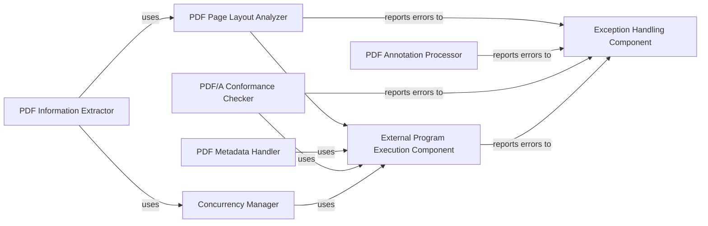

## Component Details

This component specializes in extracting detailed structural and content information from PDF documents. This includes identifying pages, images, existing text layers, and analyzing their layout, which is critical for determining the necessity and strategy for OCR processing. It also handles the parsing of PDF metadata and ensures the integrity of the PDF structure.

### PDF Information Extractor
This component is responsible for extracting high-level summary information about a PDF document, including page count, minimum PDF version required for rendering, presence of AcroForms, digital signatures, and whether the document is tagged. It performs a detailed analysis of each page to gather `PageInfo` objects concurrently.

**Related Classes/Methods**:

- <a href="https://github.com/ocrmypdf/OCRmyPDF/blob/master/src/ocrmypdf/pdfinfo/info.py#L1139-L1257" target="_blank" rel="noopener noreferrer">`ocrmypdf.pdfinfo.info.PdfInfo` (1139:1257)</a>

### PDF Page Layout Analyzer
This component focuses on analyzing the layout of individual PDF pages. It identifies text layers, images, and other visual elements, determining if OCR is necessary for a given page based on the presence and quality of existing text.

**Related Classes/Methods**:

- <a href="https://github.com/ocrmypdf/OCRmyPDF/blob/master/src/ocrmypdf/pdfinfo/layout.py#L1-L1" target="_blank" rel="noopener noreferrer">`ocrmypdf.pdfinfo.layout` (1:1)</a>

### PDF Metadata Handler
This component is responsible for reading, parsing, and potentially modifying the metadata embedded within a PDF document. This includes information like author, title, creation date, and other document properties.

**Related Classes/Methods**:

- <a href="https://github.com/ocrmypdf/OCRmyPDF/blob/master/src/ocrmypdf/_metadata.py#L1-L1" target="_blank" rel="noopener noreferrer">`ocrmypdf._metadata` (1:1)</a>

### PDF Annotation Processor
This component handles the processing and manipulation of annotations within PDF documents. Annotations can include text highlights, comments, links, and form fields, which are part of the PDF's structural information.

**Related Classes/Methods**:

- <a href="https://github.com/ocrmypdf/OCRmyPDF/blob/master/src/ocrmypdf/_annots.py#L1-L1" target="_blank" rel="noopener noreferrer">`ocrmypdf._annots` (1:1)</a>

### PDF/A Conformance Checker
This component is dedicated to ensuring the integrity and archival quality of PDF documents by checking and potentially enforcing compliance with the PDF/A standard. This involves validating fonts, colors, metadata, and other elements to ensure long-term readability.

**Related Classes/Methods**:

- <a href="https://github.com/ocrmypdf/OCRmyPDF/blob/master/src/ocrmypdf/pdfa.py#L1-L1" target="_blank" rel="noopener noreferrer">`ocrmypdf.pdfa` (1:1)</a>

### Concurrency Manager
This component provides utilities for managing concurrent execution of tasks, such as processing multiple PDF pages simultaneously, to improve performance.

**Related Classes/Methods**:

- <a href="https://github.com/ocrmypdf/OCRmyPDF/blob/master/src/ocrmypdf/_concurrent.py#L1-L1" target="_blank" rel="noopener noreferrer">`ocrmypdf._concurrent` (1:1)</a>

### External Program Execution Component
Handles the execution of external programs (e.g., Ghostscript, Tesseract, pdfminer.six) required for various PDF processing tasks, including layout analysis, metadata handling, and PDF/A conformance.

**Related Classes/Methods**:

- `ocrmypdf._exec` (1:1)
- `ocrmypdf.subprocess` (1:1)

### Exception Handling Component
Manages and reports exceptions and errors that occur throughout the system, providing a centralized mechanism for error handling and logging.

**Related Classes/Methods**:

- <a href="https://github.com/ocrmypdf/OCRmyPDF/blob/master/src/ocrmypdf/exceptions.py#L1-L1" target="_blank" rel="noopener noreferrer">`ocrmypdf.exceptions` (1:1)</a>
- <a href="https://github.com/ocrmypdf/OCRmyPDF/blob/master/src/ocrmypdf/_logging.py#L1-L1" target="_blank" rel="noopener noreferrer">`ocrmypdf._logging` (1:1)</a>

### [FAQ](https://github.com/CodeBoarding/GeneratedOnBoardings/tree/main?tab=readme-ov-file#faq)