```mermaid
graph LR
    Configuration_Defaults_Component["Configuration & Defaults Component"]
    Validation_Component["Validation Component"]
    Exception_Handling_Component["Exception Handling Component"]
    Logging_Component["Logging Component"]
    Helper_Utilities_Component["Helper Utilities Component"]
    Job_Context_Management_Component["Job Context Management Component"]
    Concurrency_Control_Component["Concurrency Control Component"]
    Plugin_Management_Component["Plugin Management Component"]
    PDF_Metadata_Management_Component["PDF Metadata Management Component"]
    Configuration_Defaults_Component -- "Used by" --> Validation_Component
    Configuration_Defaults_Component -- "Used by" --> PDF_Metadata_Management_Component
    Validation_Component -- "Uses" --> Configuration_Defaults_Component
    Validation_Component -- "Uses" --> Exception_Handling_Component
    Validation_Component -- "Uses" --> Helper_Utilities_Component
    Exception_Handling_Component -- "Used by" --> Validation_Component
    Exception_Handling_Component -- "Used by" --> Job_Context_Management_Component
    Exception_Handling_Component -- "Used by" --> Helper_Utilities_Component
    Exception_Handling_Component -- "Used by" --> Concurrency_Control_Component
    Logging_Component -- "Used by" --> Job_Context_Management_Component
    Helper_Utilities_Component -- "Used by" --> Validation_Component
    Helper_Utilities_Component -- "Used by" --> Job_Context_Management_Component
    Helper_Utilities_Component -- "Used by" --> Plugin_Management_Component
    Helper_Utilities_Component -- "Used by" --> Concurrency_Control_Component
    Helper_Utilities_Component -- "Used by" --> PDF_Metadata_Management_Component
    Job_Context_Management_Component -- "Used by" --> PDF_Metadata_Management_Component
    Job_Context_Management_Component -- "Used by" --> Plugin_Management_Component
    Concurrency_Control_Component -- "Used by" --> Plugin_Management_Component
    Plugin_Management_Component -- "Uses" --> Helper_Utilities_Component
    Plugin_Management_Component -- "Uses" --> Job_Context_Management_Component
    Plugin_Management_Component -- "Uses" --> Concurrency_Control_Component
    PDF_Metadata_Management_Component -- "Uses" --> Job_Context_Management_Component
    PDF_Metadata_Management_Component -- "Uses" --> Configuration_Defaults_Component
    PDF_Metadata_Management_Component -- "Uses" --> Helper_Utilities_Component
```

## Component Details

The `System Utilities & Framework` forms the foundational layer of OCRmyPDF, providing essential cross-cutting concerns and general-purpose functionalities. This includes robust input validation, efficient PDF metadata handling, sophisticated concurrency control, comprehensive job context management (for temporary files and logging), a suite of general helper utilities, and a flexible plugin management system. These components collectively ensure the application's stability, extensibility, and efficient operation.

### Configuration & Defaults Component
Manages application-wide default settings, constants, and configurations, serving as a centralized source for configurable parameters. This ensures consistent behavior and simplifies modifications to baseline settings.

**Related Classes/Methods**:

- <a href="https://github.com/ocrmypdf/OCRmyPDF/blob/master/src/ocrmypdf/_defaults.py#L1-L1" target="_blank" rel="noopener noreferrer">`src/ocrmypdf/_defaults.py` (1:1)</a>

### Validation Component
Ensures the integrity and correctness of all command-line options and internal arguments. It rigorously checks inputs against defined rules, preventing invalid or inconsistent configurations and enhancing application robustness.

**Related Classes/Methods**:

- <a href="https://github.com/ocrmypdf/OCRmyPDF/blob/master/src/ocrmypdf/_validation.py#L1-L1" target="_blank" rel="noopener noreferrer">`src/ocrmypdf/_validation.py` (1:1)</a>

### Exception Handling Component
Defines a hierarchy of custom exceptions for specific error conditions within the application. This enables precise error reporting, structured error handling, and improved debugging capabilities.

**Related Classes/Methods**:

- <a href="https://github.com/ocrmypdf/OCRmyPDF/blob/master/src/ocrmypdf/exceptions.py#L1-L1" target="_blank" rel="noopener noreferrer">`src/ocrmypdf/exceptions.py` (1:1)</a>

### Logging Component
Manages the application's logging infrastructure, including configuration, message formatting, and output destinations. It provides critical insights into execution flow, debugging information, and operational monitoring.

**Related Classes/Methods**:

- <a href="https://github.com/ocrmypdf/OCRmyPDF/blob/master/src/ocrmypdf/_logging.py#L1-L1" target="_blank" rel="noopener noreferrer">`src/ocrmypdf/_logging.py` (1:1)</a>

### Helper Utilities Component
A collection of general-purpose, reusable utility functions that provide common functionalities such as file operations, string manipulation, and path handling. This promotes code reusability and reduces redundancy across the project.

**Related Classes/Methods**:

- <a href="https://github.com/ocrmypdf/OCRmyPDF/blob/master/src/ocrmypdf/helpers.py#L1-L1" target="_blank" rel="noopener noreferrer">`src/ocrmypdf/helpers.py` (1:1)</a>

### Job Context Management Component
Manages the lifecycle of temporary files, directories, and other runtime context specific to an OCRmyPDF processing job. It ensures proper cleanup and isolation for each job, preventing resource leaks.

**Related Classes/Methods**:

- <a href="https://github.com/ocrmypdf/OCRmyPDF/blob/master/src/ocrmypdf/_jobcontext.py#L1-L1" target="_blank" rel="noopener noreferrer">`src/ocrmypdf/_jobcontext.py` (1:1)</a>

### Concurrency Control Component
Provides mechanisms for managing concurrent operations (e.g., thread pools) and visual feedback through progress bars. This optimizes performance for long-running tasks and enhances the user experience.

**Related Classes/Methods**:

- <a href="https://github.com/ocrmypdf/OCRmyPDF/blob/master/src/ocrmypdf/_concurrent.py#L1-L1" target="_blank" rel="noopener noreferrer">`src/ocrmypdf/_concurrent.py` (1:1)</a>
- <a href="https://github.com/ocrmypdf/OCRmyPDF/blob/master/src/ocrmypdf/_progressbar.py#L1-L1" target="_blank" rel="noopener noreferrer">`src/ocrmypdf/_progressbar.py` (1:1)</a>

### Plugin Management Component
Implements the core logic for discovering, loading, and managing external and built-in plugins. It provides a flexible and extensible mechanism for adding new functionalities to OCRmyPDF without modifying the core codebase.

**Related Classes/Methods**:

- <a href="https://github.com/ocrmypdf/OCRmyPDF/blob/master/src/ocrmypdf/_plugin_manager.py#L1-L1" target="_blank" rel="noopener noreferrer">`src/ocrmypdf/_plugin_manager.py` (1:1)</a>
- <a href="https://github.com/ocrmypdf/OCRmyPDF/blob/master/src/ocrmypdf/pluginspec.py#L1-L1" target="_blank" rel="noopener noreferrer">`src/ocrmypdf/pluginspec.py` (1:1)</a>

### PDF Metadata Management Component
Provides functionalities for extracting, modifying, and embedding metadata (e.g., title, author, dates) and annotations within PDF documents. This ensures the preservation and enhancement of document information.

**Related Classes/Methods**:

- <a href="https://github.com/ocrmypdf/OCRmyPDF/blob/master/src/ocrmypdf/_metadata.py#L1-L1" target="_blank" rel="noopener noreferrer">`src/ocrmypdf/_metadata.py` (1:1)</a>
- <a href="https://github.com/ocrmypdf/OCRmyPDF/blob/master/src/ocrmypdf/_annots.py#L1-L1" target="_blank" rel="noopener noreferrer">`src/ocrmypdf/_annots.py` (1:1)</a>

### [FAQ](https://github.com/CodeBoarding/GeneratedOnBoardings/tree/main?tab=readme-ov-file#faq)