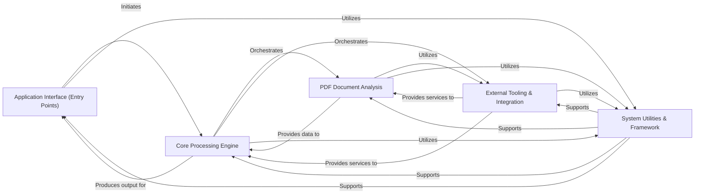

## Component Details

One paragraph explaining the functionality which is represented by this graph. What the main flow is and what is its purpose.

### Application Interface (Entry Points)
This component serves as the primary user-facing layer, responsible for parsing command-line arguments or API calls, validating initial inputs, and orchestrating the initiation of the OCR processing workflow. It acts as the gateway for all user interactions with OCRmyPDF.

**Related Classes/Methods**:

- `numeric` (0:0)
- `str_to_int` (0:0)
- `ArgumentParser` (0:0)
- `LanguageSetAction` (0:0)
- `get_parser` (0:0)
- `run` (0:0)
- `get_parser_options_plugins` (0:0)

### Core Processing Engine
This is the central orchestrator of the OCR workflow. It manages the sequence of operations including input preparation, OCR execution, HOCR generation, transformation of HOCR into a searchable text layer, and final PDF assembly and optimization. It coordinates various sub-processes to achieve the final OCR'd PDF.

**Related Classes/Methods**:

- `run_pipeline_cli` (0:0)

### External Tooling & Integration
This component provides an abstracted and standardized interface for interacting with external command-line tools (e.g., Tesseract, Ghostscript, jbig2enc). It handles subprocess execution, argument formatting, and error reporting, encapsulating the specifics of each external tool's integration.

**Related Classes/Methods**: _None_

### PDF Document Analysis
This component specializes in extracting detailed structural and content information from PDF documents. This includes identifying pages, images, existing text layers, and analyzing their layout, which is critical for determining the necessity and strategy for OCR processing.

**Related Classes/Methods**: _None_

### System Utilities & Framework
This is a foundational layer providing cross-cutting concerns and general-purpose functionalities. This includes input/option validation, PDF metadata management, concurrency control, job context management (temporary files, logging), general helper utilities, and the plugin management system that allows for extending OCRmyPDF's capabilities.

**Related Classes/Methods**:

- `check_options` (0:0)
- `configure_logging` (0:0)

### [FAQ](https://github.com/CodeBoarding/GeneratedOnBoardings/tree/main?tab=readme-ov-file#faq)