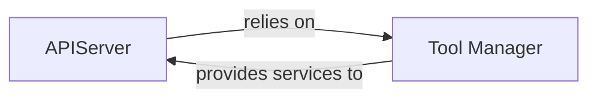

## Details

The OS-Copilot's tool management subsystem is primarily composed of two high-level components: the `APIServer` and the `Tool Manager`. The `APIServer` acts as the external interface, handling all incoming API requests, routing them, and orchestrating the overall flow. It relies heavily on the `Tool Manager` to access and execute the various agent tools. The `Tool Manager`, in turn, provides the essential services of tool registration, discovery, and execution to the `APIServer`, effectively abstracting the complexities of tool interaction. This clear separation of concerns ensures that the `APIServer` focuses on request handling and response generation, while the `Tool Manager` specializes in the lifecycle and execution of the underlying tools, forming a robust and scalable architecture for exposing OS-Copilot's capabilities.

### APIServer
The core component of the API Service Layer. It initializes the FastAPI application, defines API routes, handles incoming HTTP requests, parses and validates requests, orchestrates the invocation of agent tools, and generates appropriate responses. It acts as the primary interface for external systems to interact with the OS-Copilot's tool capabilities.

**Related Classes/Methods**:

- <a href="https://github.com/OS-Copilot/OS-Copilot/blob/main/oscopilot/tool_repository/manager/api_server.py" target="_blank" rel="noopener noreferrer">`oscopilot.tool_repository.manager.api_server.APIServer`</a>

### Tool Manager
Manages the lifecycle and execution of the underlying tools. It provides the actual capabilities that the APIServer exposes via its API, handling the registration, discovery, and execution of various agent tools.

**Related Classes/Methods**:

- <a href="https://github.com/OS-Copilot/OS-Copilot/blob/main/oscopilot/tool_repository/manager/tool_manager.py" target="_blank" rel="noopener noreferrer">`oscopilot.tool_repository.manager.tool_manager.ToolManager`</a>

### [FAQ](https://github.com/CodeBoarding/GeneratedOnBoardings/tree/main?tab=readme-ov-file#faq)