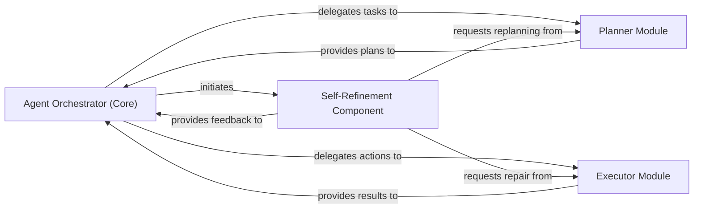

## Details

The `Agent Core (Orchestrator)` subsystem is the central intelligence and control unit of the OS-Copilot project. It orchestrates the overall workflow, manages task execution, and drives the self-refinement process.

### Agent Orchestrator (Core)
The central control unit responsible for initiating and coordinating the agent's operational flow, including planning, execution, and self-refinement cycles. It acts as the primary decision-maker and task delegator.

**Related Classes/Methods**:

- <a href="https://github.com/OS-Copilot/OS-Copilot/blob/main/oscopilot/agents/base_agent.py" target="_blank" rel="noopener noreferrer">`oscopilot/agents/base_agent.py`</a>
- <a href="https://github.com/OS-Copilot/OS-Copilot/blob/main/oscopilot/agents/friday_agent.py" target="_blank" rel="noopener noreferrer">`oscopilot/agents/friday_agent.py`</a>
- <a href="https://github.com/OS-Copilot/OS-Copilot/blob/main/oscopilot/agents/friday2_agent.py" target="_blank" rel="noopener noreferrer">`oscopilot/agents/friday2_agent.py`</a>

### Planner Module
Responsible for generating initial task plans, decomposing complex tasks, and revising existing plans based on feedback or new requirements from the orchestrator or self-refinement component.

**Related Classes/Methods**:

- <a href="https://github.com/OS-Copilot/OS-Copilot/blob/main/oscopilot/modules/planner/friday_planner.py" target="_blank" rel="noopener noreferrer">`oscopilot/modules/planner/friday_planner.py`</a>
- <a href="https://github.com/OS-Copilot/OS-Copilot/blob/main/oscopilot/modules/planner/basic_planner.py" target="_blank" rel="noopener noreferrer">`oscopilot/modules/planner/basic_planner.py`</a>

### Executor Module
Facilitates the execution of planned actions, including generating necessary tools or code, and handling the repair of execution failures.

**Related Classes/Methods**:

- <a href="https://github.com/OS-Copilot/OS-Copilot/blob/main/oscopilot/modules/executor/friday_executor.py" target="_blank" rel="noopener noreferrer">`oscopilot.modules.executor.friday_executor.py`</a>

### Self-Refinement Component
Provides adaptive capabilities by evaluating outcomes, judging performance against objectives, and triggering corrective actions such as replanning or repairing execution issues.

**Related Classes/Methods**:

- <a href="https://github.com/OS-Copilot/OS-Copilot/blob/main/oscopilot/agents/friday_agent.py" target="_blank" rel="noopener noreferrer">`oscopilot/agents/friday_agent.py`</a>
- <a href="https://github.com/OS-Copilot/OS-Copilot/blob/main/oscopilot/agents/friday2_agent.py" target="_blank" rel="noopener noreferrer">`oscopilot/agents/friday2_agent.py`</a>

### [FAQ](https://github.com/CodeBoarding/GeneratedOnBoardings/tree/main?tab=readme-ov-file#faq)