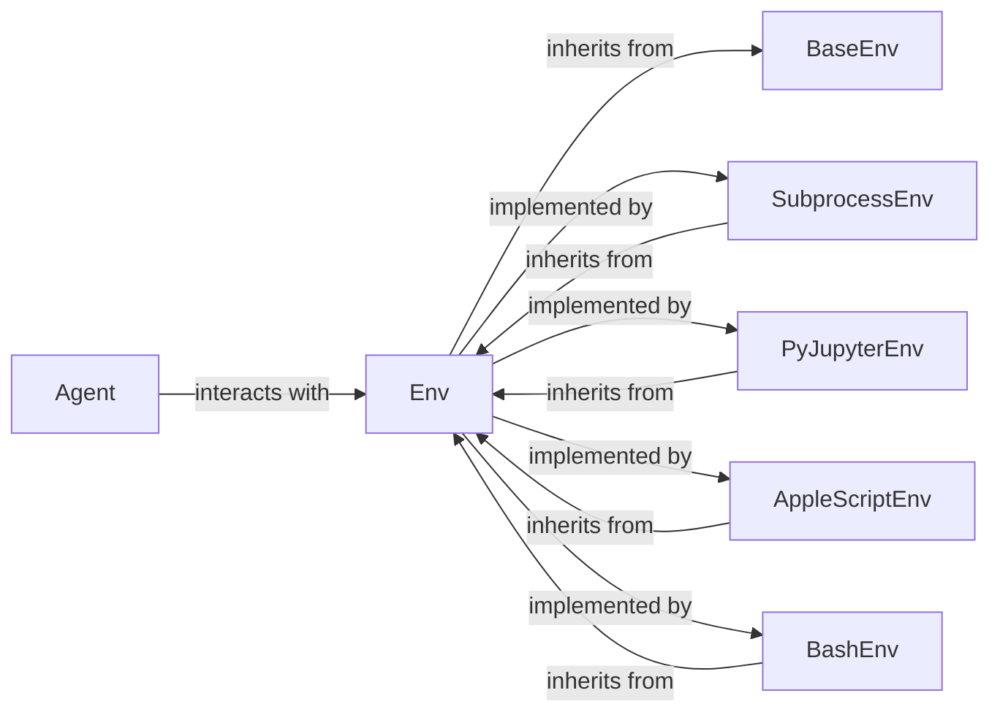

## Details

The `oscopilot.environments` subsystem provides a robust and extensible framework for interacting with various execution environments. At its core, `BaseEnv` establishes the fundamental interface for all environment interactions. `Env` extends this foundation, defining a higher-level, abstract orchestration layer that agents interact with. Concrete environment implementations such as `SubprocessEnv`, `PyJupyterEnv`, `AppleScriptEnv`, and `BashEnv` inherit from `Env`, providing specialized execution capabilities for different operating system contexts and programming environments. This inheritance hierarchy ensures a consistent interface for agents while allowing for diverse underlying execution mechanisms.

### BaseEnv
Foundational abstract base class establishing the core interface and common properties for all environment interactions. Serves as the root of the environment hierarchy, ensuring a consistent baseline for all environment types.

**Related Classes/Methods**:

- <a href="https://github.com/OS-Copilot/OS-Copilot/blob/main/oscopilot/environments/base_env.py#L7-L151" target="_blank" rel="noopener noreferrer">`BaseEnv`:7-151</a>

### Env
Abstract class extending `BaseEnv`, defining higher-level orchestration of execution steps within an environment, including methods for stepping through code and handling streaming output. Acts as the primary interface for the agent to interact with any specific environment, with concrete implementations providing the actual execution logic.

**Related Classes/Methods**:

- <a href="https://github.com/OS-Copilot/OS-Copilot/blob/main/oscopilot/environments/base_env.py#L7-L151" target="_blank" rel="noopener noreferrer">`Env`:7-151</a>

### SubprocessEnv
Concrete implementation for managing generic operating system subprocesses, handling the lifecycle of external processes and output streams. It provides a general-purpose execution environment by implementing the abstract methods defined in `Env`.

**Related Classes/Methods**:

- <a href="https://github.com/OS-Copilot/OS-Copilot/blob/main/oscopilot/environments/subprocess_env.py#L10-L264" target="_blank" rel="noopener noreferrer">`SubprocessEnv`:10-264</a>

### PyJupyterEnv
Specialized concrete implementation for interacting with Python Jupyter kernels, handling code execution and output capture within that specific environment by implementing the abstract methods defined in `Env`.

**Related Classes/Methods**:

- <a href="https://github.com/OS-Copilot/OS-Copilot/blob/main/oscopilot/environments/py_jupyter_env.py" target="_blank" rel="noopener noreferrer">`PyJupyterEnv`</a>

### AppleScriptEnv
Specialized concrete implementation for interacting with AppleScript environments, focusing on code preprocessing for tracking and execution within macOS by implementing the abstract methods defined in `Env`.

**Related Classes/Methods**:

- <a href="https://github.com/OS-Copilot/OS-Copilot/blob/main/oscopilot/environments/applescript_env.py" target="_blank" rel="noopener noreferrer">`AppleScriptEnv`</a>

### BashEnv
Specialized concrete implementation for interacting with Bash shell environments, handling command preprocessing and multiline commands for robust shell interaction by implementing the abstract methods defined in `Env`.

**Related Classes/Methods**:

- <a href="https://github.com/OS-Copilot/OS-Copilot/blob/main/oscopilot/environments/bash_env.py" target="_blank" rel="noopener noreferrer">`BashEnv`</a>

### [FAQ](https://github.com/CodeBoarding/GeneratedOnBoardings/tree/main?tab=readme-ov-file#faq)