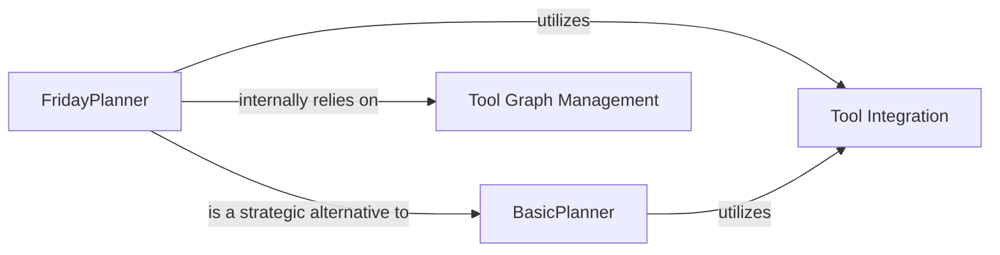

## Details

The `planner` subsystem in `oscopilot` is designed to manage and execute complex task plans, primarily through two distinct planning strategies: `FridayPlanner` and `BasicPlanner`. `FridayPlanner` offers advanced capabilities for complex task decomposition, leveraging `Tool Graph Management` to build and resolve dependencies among tools, ensuring a logical and ordered execution flow. In contrast, `BasicPlanner` provides a more streamlined approach for simpler plan adjustments and tool integration. Both planners interact with the `Tool Integration` component, which serves as a common interface for incorporating new tools or steps into an existing plan. This architecture allows for flexible planning strategies, from basic tool addition to sophisticated dependency-aware plan generation, all while maintaining clear component responsibilities and interactions.

### FridayPlanner
Advanced planning engine for complex task decomposition and sophisticated plan revision, handling intricate tool dependencies and ensuring logical execution flow. It builds and manages a tool dependency graph for robust dependency resolution and topological sorting.

**Related Classes/Methods**:

- <a href="https://github.com/OS-Copilot/OS-Copilot/blob/main/oscopilot/modules/planner/friday_planner.py" target="_blank" rel="noopener noreferrer">`oscopilot.modules.planner.friday_planner.FridayPlanner:create_tool_graph`</a>
- <a href="https://github.com/OS-Copilot/OS-Copilot/blob/main/oscopilot/modules/planner/friday_planner.py" target="_blank" rel="noopener noreferrer">`oscopilot.modules.planner.friday_planner.FridayPlanner:topological_sort`</a>
- <a href="https://github.com/OS-Copilot/OS-Copilot/blob/main/oscopilot/modules/planner/friday_planner.py" target="_blank" rel="noopener noreferrer">`oscopilot.modules.planner.friday_planner.FridayPlanner:add_new_tool`</a>

### BasicPlanner
Provides a straightforward and faster mechanism for task replanning and basic plan adjustments, primarily integrating new tools or steps into an existing plan without complex dependency resolution.

**Related Classes/Methods**:

- <a href="https://github.com/OS-Copilot/OS-Copilot/blob/main/oscopilot/modules/planner/basic_planner.py" target="_blank" rel="noopener noreferrer">`oscopilot.modules.planner.basic_planner.BasicPlanner:add_new_tool`</a>

### Tool Integration
Represents the shared mechanism for incorporating new tools or steps into an existing plan, utilized by different planner implementations.

**Related Classes/Methods**:

- <a href="https://github.com/OS-Copilot/OS-Copilot/blob/main/oscopilot/modules/planner/friday_planner.py" target="_blank" rel="noopener noreferrer">`oscopilot.modules.planner.friday_planner.FridayPlanner:add_new_tool`</a>
- <a href="https://github.com/OS-Copilot/OS-Copilot/blob/main/oscopilot/modules/planner/basic_planner.py" target="_blank" rel="noopener noreferrer">`oscopilot.modules.planner.basic_planner.BasicPlanner:add_new_tool`</a>

### Tool Graph Management
Encapsulates the logic for building, managing, and resolving dependencies within a tool graph, enabling topological sorting of tools. This functionality is critical for advanced planning.

**Related Classes/Methods**:

- <a href="https://github.com/OS-Copilot/OS-Copilot/blob/main/oscopilot/modules/planner/friday_planner.py" target="_blank" rel="noopener noreferrer">`oscopilot.modules.planner.friday_planner.FridayPlanner:create_tool_graph`</a>
- <a href="https://github.com/OS-Copilot/OS-Copilot/blob/main/oscopilot/modules/planner/friday_planner.py" target="_blank" rel="noopener noreferrer">`oscopilot.modules.planner.friday_planner.FridayPlanner:topological_sort`</a>

### [FAQ](https://github.com/CodeBoarding/GeneratedOnBoardings/tree/main?tab=readme-ov-file#faq)